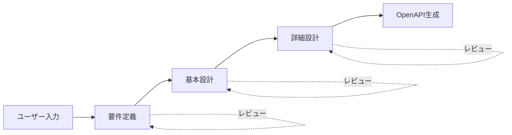

# AI駆動 RESTful API 自動生成システム

[](https://opensource.org/licenses/MIT)

## 概要

本システムは、ユーザーからの自然言語入力を元に、ウォーターフォール開発のベストプラクティスに従い、要件定義からOpenAPI仕様書の生成までを自動化するAI駆動開発システムです。

## 特徴

- 🤖 **AI駆動**: 自然言語入力からドキュメントを自動生成
- 📋 **ウォーターフォール準拠**: 要件定義→基本設計→詳細設計→仕様書の順次生成
- 📄 **標準化されたテンプレート**: 一貫性のあるドキュメント生成
- 🔄 **反復可能**: レビュー・修正サイクルをサポート
- 📊 **Mermaid図表**: 視覚的なダイアグラム自動生成

## ディレクトリ構造

```
auto_deploy/
├── docs/
│   ├── overview.md          # システム概要
│   └── guidelines/          # 開発ガイドライン
├── requirements/            # 要件定義書
│   ├── _template.md         # テンプレート
│   └── projects/            # プロジェクト別
├── design/
│   ├── basic/              # 基本設計書
│   │   ├── _template.md
│   │   └── projects/
│   └── detailed/           # 詳細設計書
│       ├── _template.md
│       └── projects/
├── specs/
│   └── openapi/            # OpenAPI仕様書
│       ├── _template.yaml
│       └── projects/
├── ai/
│   ├── prompts/            # AIプロンプトテンプレート
│   │   ├── requirements.md
│   │   ├── basic_design.md
│   │   ├── detailed_design.md
│   │   └── openapi_gen.md
│   └── instructions/       # AI指示ファイル
│       └── workflow.md
├── scripts/                # 自動化スクリプト
├── CHANGELOG.md            # 変更履歴
└── README.md               # 本ファイル
```

## 使い方

### 1. 新規プロジェクト開始

AIに以下の形式でリクエストしてください：

```
プロジェクト「{プロジェクト名}」を開始してください。

要件:
- {要件1}
- {要件2}
- ...
```

### 2. フェーズ実行

各フェーズは順番に実行されます：

| フェーズ | コマンド | 成果物 |
|---------|---------|--------|
| 1. 要件定義 | `Phase 1を実行` | requirements.md |
| 2. 基本設計 | `Phase 2を実行` | basic_design.md |
| 3. 詳細設計 | `Phase 3を実行` | detailed_design.md |
| 4. OpenAPI生成 | `Phase 4を実行` | openapi.yaml |

### 3. レビュー・修正

各フェーズ完了後、生成されたドキュメントをレビューし、必要に応じて修正を依頼してください：

```
以下の修正を反映してください:
- {修正内容}
```

## ワークフロー



## テンプレート

### 要件定義書テンプレート
`requirements/_template.md` - 機能要件、非機能要件、ユースケースを定義

### 基本設計書テンプレート
`design/basic/_template.md` - API構成、データモデル、認証設計を定義

### 詳細設計書テンプレート
`design/detailed/_template.md` - エンドポイント詳細、スキーマ、バリデーションを定義

### OpenAPI仕様書テンプレート
`specs/openapi/_template.yaml` - OpenAPI 3.1形式の仕様書

## 今後の拡張予定

- [ ] 実装コード自動生成
- [ ] 自動テスト生成
- [ ] CI/CD パイプライン自動構築
- [ ] デプロイ自動化

## ライセンス

MIT License

## 変更履歴

[CHANGELOG.md](./CHANGELOG.md) を参照してください。
