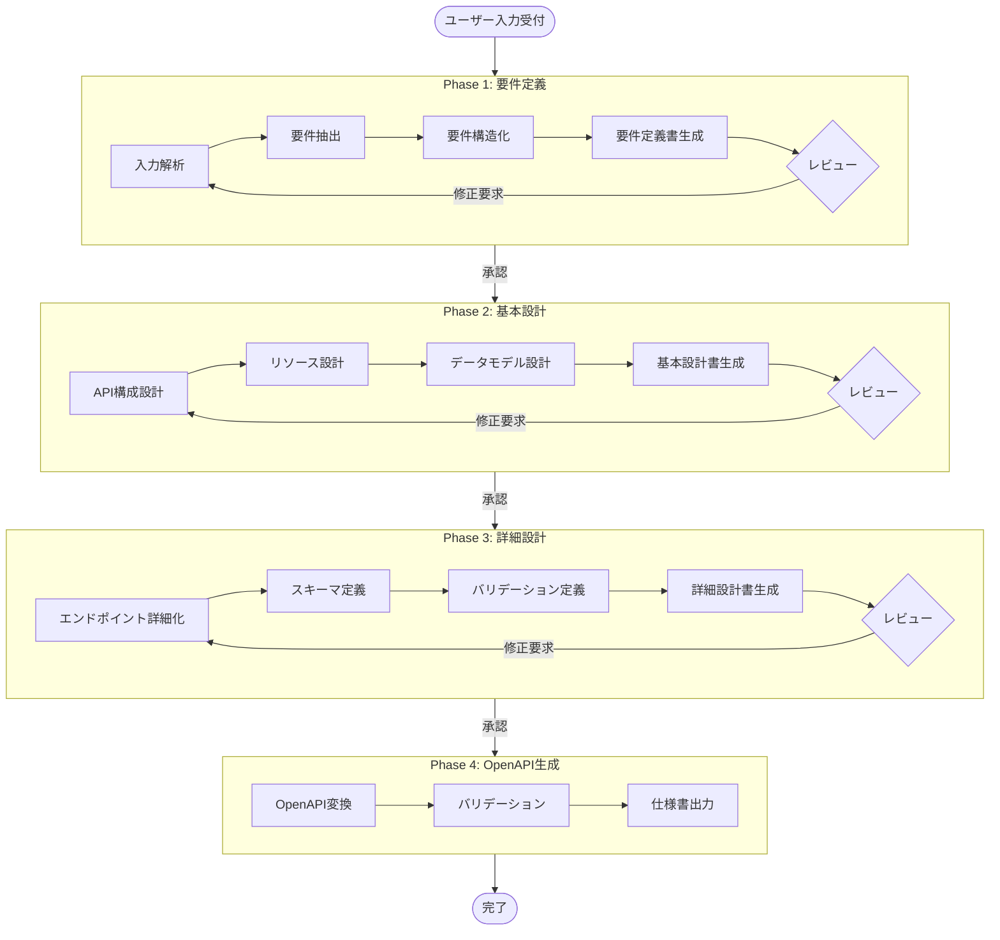

# AI駆動開発ワークフロー指示書

## 概要

本ドキュメントは、AIがユーザー入力からOpenAPI仕様書を自動生成するまでのワークフローを定義します。

## ワークフロー全体像



## 各フェーズの詳細

### Phase 1: 要件定義

**入力**: ユーザーからの自然言語による要求

**処理手順**:
1. ユーザー入力を解析し、キーワードとコンテキストを抽出
2. 機能要件と非機能要件を分離
3. ユースケースを特定
4. `requirements/_template.md`を使用して要件定義書を生成
5. ユーザーにレビューを依頼

**出力**: `requirements/projects/{project_name}/requirements.md`

**使用プロンプト**: `ai/prompts/requirements.md`

---

### Phase 2: 基本設計

**入力**: 承認済み要件定義書

**処理手順**:
1. 要件からリソースを特定
2. RESTful設計原則に基づきAPI構成を設計
3. データモデルの概要を設計
4. `design/basic/_template.md`を使用して基本設計書を生成
5. ユーザーにレビューを依頼

**出力**: `design/basic/projects/{project_name}/basic_design.md`

**使用プロンプト**: `ai/prompts/basic_design.md`

---

### Phase 3: 詳細設計

**入力**: 承認済み基本設計書

**処理手順**:
1. 各エンドポイントの詳細仕様を定義
2. リクエスト/レスポンススキーマを定義
3. バリデーションルールを定義
4. `design/detailed/_template.md`を使用して詳細設計書を生成
5. ユーザーにレビューを依頼

**出力**: `design/detailed/projects/{project_name}/detailed_design.md`

**使用プロンプト**: `ai/prompts/detailed_design.md`

---

### Phase 4: OpenAPI仕様書生成

**入力**: 承認済み詳細設計書

**処理手順**:
1. 詳細設計書をOpenAPI形式に変換
2. `specs/openapi/_template.yaml`をベースに仕様書を生成
3. OpenAPIバリデーションを実行
4. 仕様書を出力

**出力**: `specs/openapi/projects/{project_name}/openapi.yaml`

**使用プロンプト**: `ai/prompts/openapi_gen.md`

---

## AI実行コマンド

### 新規プロジェクト開始

```
@ai プロジェクト「{プロジェクト名}」を開始してください。
要件: {ユーザーの要求内容}
```

### 各フェーズ実行

```
@ai Phase 1（要件定義）を実行してください。
@ai Phase 2（基本設計）を実行してください。
@ai Phase 3（詳細設計）を実行してください。
@ai Phase 4（OpenAPI生成）を実行してください。
```

### レビュー対応

```
@ai 以下の修正を反映してください: {修正内容}
```

---

## ファイル命名規則

| ドキュメント | パス | ファイル名 |
|-------------|------|-----------|
| 要件定義書 | requirements/projects/{project}/ | requirements.md |
| 基本設計書 | design/basic/projects/{project}/ | basic_design.md |
| 詳細設計書 | design/detailed/projects/{project}/ | detailed_design.md |
| OpenAPI仕様 | specs/openapi/projects/{project}/ | openapi.yaml |

---

## 品質チェックリスト

### 要件定義フェーズ
- [ ] 機能要件が明確に定義されている
- [ ] 非機能要件が定義されている
- [ ] ユースケースが網羅されている
- [ ] 用語が統一されている

### 基本設計フェーズ
- [ ] RESTful設計原則に準拠している
- [ ] リソースが適切に設計されている
- [ ] HTTPメソッドが適切に選択されている
- [ ] データモデルが定義されている

### 詳細設計フェーズ
- [ ] 全エンドポイントが詳細定義されている
- [ ] スキーマが完全に定義されている
- [ ] バリデーションルールが定義されている
- [ ] エラーハンドリングが網羅されている

### OpenAPI生成フェーズ
- [ ] OpenAPI 3.0/3.1 仕様に準拠している
- [ ] バリデーションエラーがない
- [ ] セキュリティ定義が含まれている
- [ ] サンプルデータが含まれている

---

## トラブルシューティング

### よくある問題と対処法

| 問題 | 原因 | 対処法 |
|------|------|--------|
| 要件が曖昧 | ユーザー入力が不十分 | 追加質問を行う |
| リソース設計の不整合 | 要件理解の誤り | 要件定義に立ち戻る |
| OpenAPIバリデーションエラー | スキーマ定義の誤り | 詳細設計を修正 |

---

## 更新履歴

| 日付 | バージョン | 変更内容 |
|------|-----------|---------|
| 2024-12-29 | 1.0.0 | 初版作成 |
