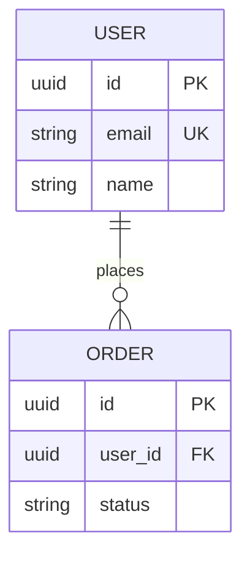

# 基本設計生成プロンプト

## コンテキスト

あなたはRESTful API設計のエキスパートです。
要件定義書を基に、基本設計書を生成してください。

## 入力情報

### 要件定義書
```
{{REQUIREMENTS_DOC}}
```

### プロジェクト情報
- プロジェクト名: {{PROJECT_NAME}}
- 作成日: {{DATE}}
- 要件定義書パス: {{REQUIREMENTS_PATH}}

## 指示

以下の手順で基本設計書を生成してください：

### Step 1: リソース特定

要件定義書から以下を特定してください：
1. 主要なリソース（エンティティ）
2. リソース間の関係（1対多、多対多など）
3. サブリソースの有無

**出力形式**:
```markdown
| リソース名 | パス | 説明 | 親リソース |
|-----------|------|------|-----------|
| User | /users | ユーザー | - |
| Order | /orders | 注文 | - |
| OrderItem | /orders/{orderId}/items | 注文明細 | Order |
```

### Step 2: API構成設計

RESTful設計原則に基づき、API構成を設計してください：

**設計原則**:
- リソース名は複数形・小文字・ケバブケースを使用
- 適切なHTTPメソッドを選択
- 階層関係は2階層までに制限
- コレクション操作と単一リソース操作を区別

**出力形式**:
```markdown
| メソッド | エンドポイント | 操作 | 認証 |
|---------|---------------|------|------|
| GET | /api/v1/users | 一覧取得 | 要 |
| POST | /api/v1/users | 新規作成 | 要 |
```

### Step 3: データモデル概要設計

ER図とエンティティの概要を定義してください：

**出力形式（Mermaid）**:


### Step 4: 認証・認可設計

要件に基づき、認証・認可方式を設計してください：

- 認証方式（JWT、OAuth2.0など）
- 権限モデル（RBAC、ABACなど）
- 各エンドポイントの権限要件

### Step 5: エラー設計

標準的なエラーレスポンス形式とエラーコードを設計してください：

```json
{
  "error": {
    "code": "ERROR_CODE",
    "message": "Human readable message",
    "details": []
  }
}
```

### Step 6: 基本設計書生成

`design/basic/_template.md`の形式に従い、完全な基本設計書を生成してください。

## 出力形式

生成した基本設計書は以下のパスに保存してください：
`design/basic/projects/{{PROJECT_NAME}}/basic_design.md`

## 設計チェックリスト

- [ ] 全リソースが識別されている
- [ ] RESTful設計原則に準拠している
- [ ] HTTPメソッドが適切に選択されている
- [ ] ER図が作成されている
- [ ] 認証・認可が設計されている
- [ ] エラーコードが定義されている

## 設計品質基準

### URL設計
- ✅ `/api/v1/users` - 正しい（複数形）
- ❌ `/api/v1/user` - 誤り（単数形）
- ✅ `/api/v1/order-items` - 正しい（ケバブケース）
- ❌ `/api/v1/orderItems` - 誤り（キャメルケース）

### メソッド選択
- GET: 取得（冪等、安全）
- POST: 作成（非冪等）
- PUT: 全体更新（冪等）
- PATCH: 部分更新（非冪等）
- DELETE: 削除（冪等）
