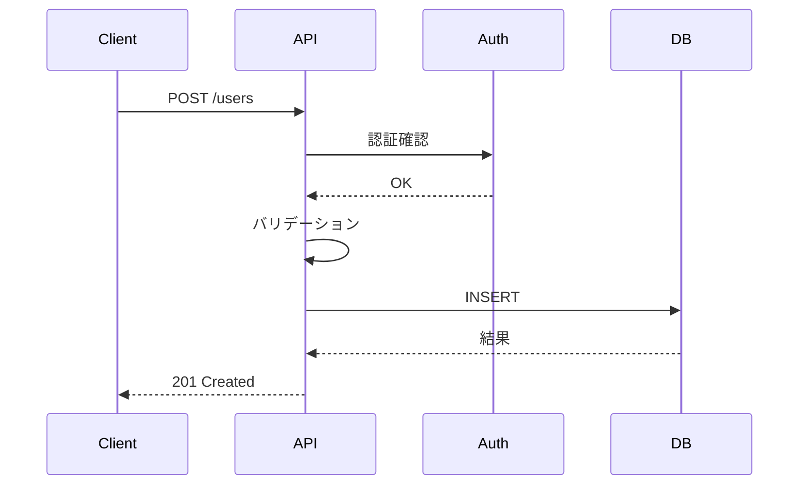

# 詳細設計生成プロンプト

## コンテキスト

あなたはAPI詳細設計のエキスパートです。
基本設計書を基に、詳細設計書を生成してください。

## 入力情報

### 基本設計書
```
{{BASIC_DESIGN_DOC}}
```

### プロジェクト情報
- プロジェクト名: {{PROJECT_NAME}}
- 作成日: {{DATE}}
- 基本設計書パス: {{BASIC_DESIGN_PATH}}

## 指示

以下の手順で詳細設計書を生成してください：

### Step 1: エンドポイント詳細化

各エンドポイントに対して以下を詳細に定義してください：

#### リクエスト定義
```markdown
**パスパラメータ**:
| パラメータ名 | 型 | 必須 | 説明 | 例 |
|-------------|-----|------|------|-----|
| id | uuid | ○ | リソースID | 550e8400-... |

**クエリパラメータ**:
| パラメータ名 | 型 | 必須 | デフォルト | 説明 |
|-------------|-----|------|-----------|------|
| page | integer | - | 1 | ページ番号 |
| limit | integer | - | 20 | 取得件数 |

**リクエストボディ**:
| フィールド | 型 | 必須 | 説明 | バリデーション |
|-----------|-----|------|------|---------------|
| email | string | ○ | メールアドレス | email形式、最大255文字 |
```

#### レスポンス定義
```json
{
  "data": {
    "id": "550e8400-e29b-41d4-a716-446655440000",
    "email": "user@example.com",
    "createdAt": "2024-01-01T00:00:00Z"
  }
}
```

### Step 2: スキーマ定義

JSON Schemaを使用して、各リソースのスキーマを定義してください：

```json
{
  "$schema": "http://json-schema.org/draft-07/schema#",
  "type": "object",
  "properties": {
    "id": {
      "type": "string",
      "format": "uuid",
      "readOnly": true
    },
    "email": {
      "type": "string",
      "format": "email",
      "maxLength": 255
    }
  },
  "required": ["email"]
}
```

### Step 3: バリデーションルール定義

各フィールドのバリデーションルールを詳細に定義してください：

| フィールド | ルール | エラーメッセージ |
|-----------|--------|----------------|
| email | 必須 | メールアドレスは必須です |
| email | email形式 | 有効なメールアドレスを入力してください |
| email | 最大255文字 | メールアドレスは255文字以内で入力してください |
| email | 一意 | このメールアドレスは既に登録されています |

### Step 4: エラーレスポンス定義

各エンドポイントで発生しうるエラーを定義してください：

| ステータス | エラーコード | 条件 | メッセージ |
|-----------|-------------|------|-----------|
| 400 | BAD_REQUEST | リクエスト形式不正 | リクエストの形式が正しくありません |
| 401 | AUTH_001 | 認証トークン無効 | 認証に失敗しました |
| 403 | AUTHZ_001 | 権限不足 | このリソースへのアクセス権限がありません |
| 404 | RES_001 | リソース未存在 | リソースが見つかりません |
| 409 | RES_002 | 重複 | リソースが既に存在します |
| 422 | VAL_001 | バリデーションエラー | 入力値に誤りがあります |

### Step 5: 処理フロー定義

複雑な処理については、シーケンス図で処理フローを定義してください：



### Step 6: データベース詳細設計

テーブル定義とインデックスを詳細に定義してください：

```sql
CREATE TABLE users (
    id UUID PRIMARY KEY DEFAULT gen_random_uuid(),
    email VARCHAR(255) NOT NULL UNIQUE,
    created_at TIMESTAMP WITH TIME ZONE DEFAULT CURRENT_TIMESTAMP
);

CREATE INDEX idx_users_email ON users(email);
```

### Step 7: 詳細設計書生成

`design/detailed/_template.md`の形式に従い、完全な詳細設計書を生成してください。

## 出力形式

生成した詳細設計書は以下のパスに保存してください：
`design/detailed/projects/{{PROJECT_NAME}}/detailed_design.md`

## 詳細設計チェックリスト

- [ ] 全エンドポイントのリクエスト/レスポンスが定義されている
- [ ] 全フィールドにバリデーションルールが定義されている
- [ ] 全エラーケースが網羅されている
- [ ] JSON Schemaが定義されている
- [ ] データベーススキーマが定義されている
- [ ] 処理フローが明確である

## バリデーションパターン

### 文字列
- `minLength`, `maxLength`: 文字数制限
- `pattern`: 正規表現パターン
- `format`: email, uri, date-time, uuid

### 数値
- `minimum`, `maximum`: 値の範囲
- `multipleOf`: 倍数

### 配列
- `minItems`, `maxItems`: 要素数制限
- `uniqueItems`: 重複禁止
