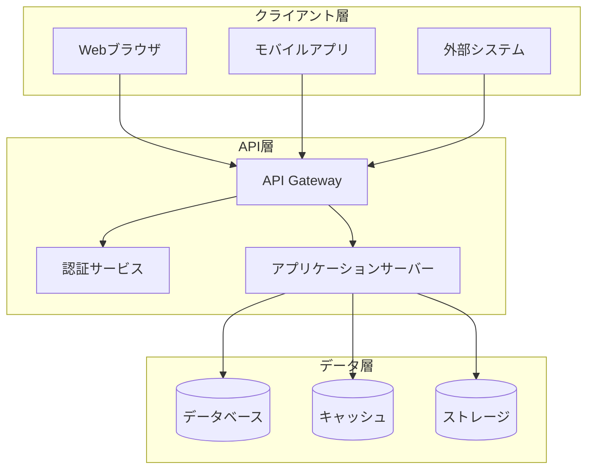
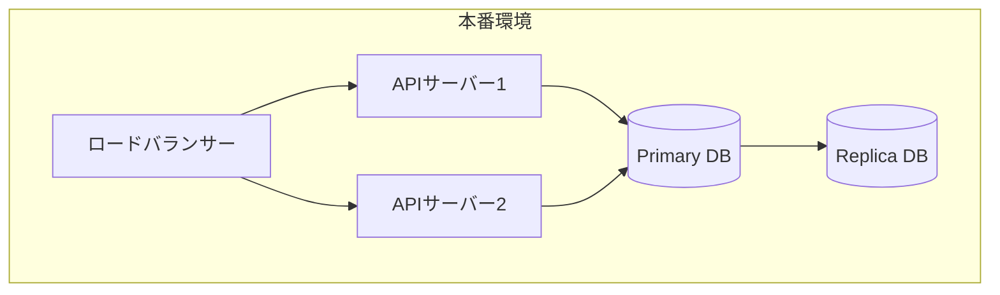
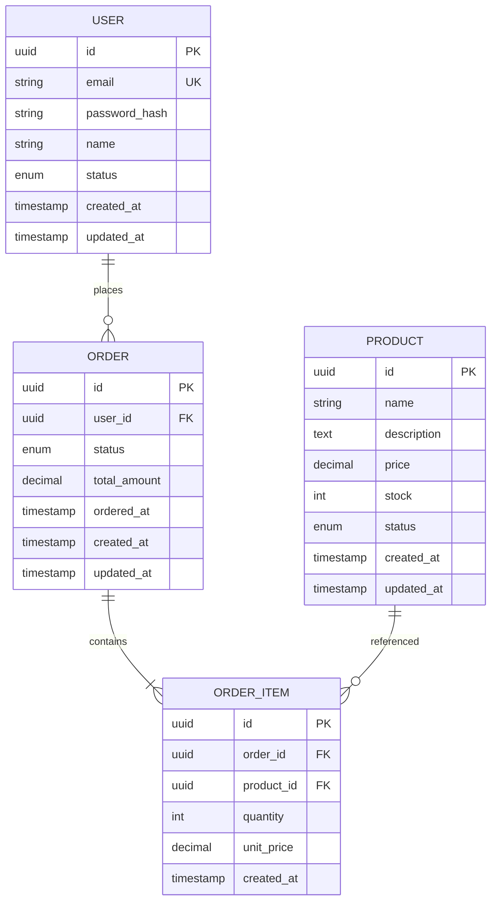
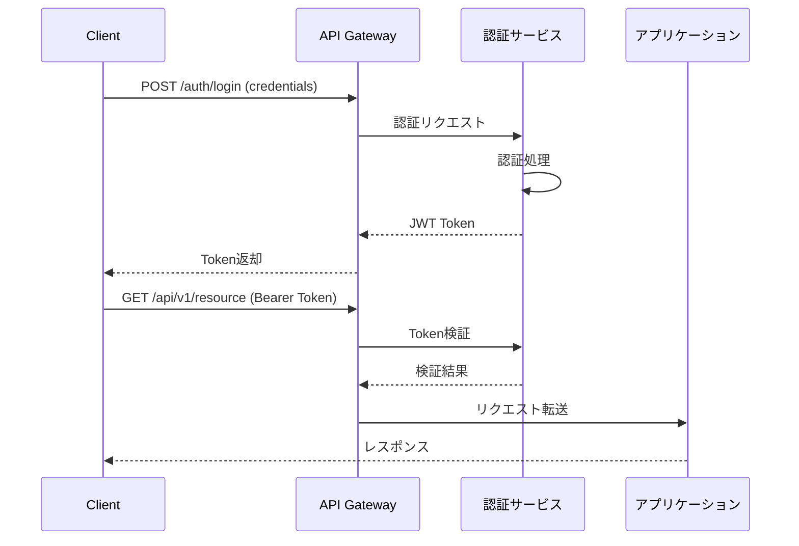
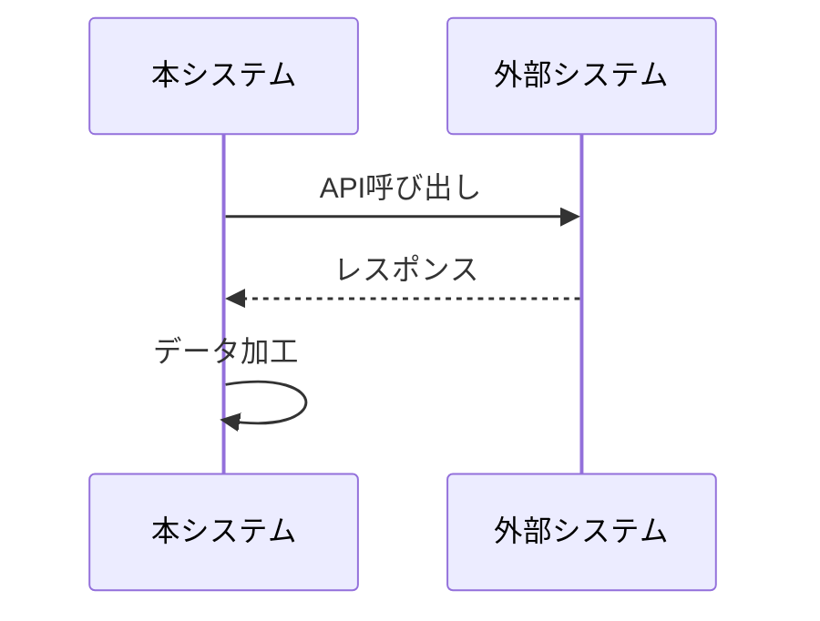

# 基本設計書テンプレート

## 文書情報

| 項目 | 内容 |
|------|------|
| プロジェクト名 | {{PROJECT_NAME}} |
| 文書バージョン | {{VERSION}} |
| 作成日 | {{CREATED_DATE}} |
| 最終更新日 | {{UPDATED_DATE}} |
| 作成者 | {{AUTHOR}} |
| ステータス | Draft / Review / Approved |
| 関連要件定義書 | {{REQUIREMENTS_DOC_REF}} |

---

## 1. システム構成

### 1.1 システムアーキテクチャ



### 1.2 技術スタック

| レイヤー | 技術 | バージョン | 備考 |
|---------|------|-----------|------|
| API Framework | {{FRAMEWORK}} | {{VERSION}} | |
| Database | {{DATABASE}} | {{VERSION}} | |
| Cache | {{CACHE}} | {{VERSION}} | |
| Authentication | {{AUTH}} | {{VERSION}} | |

### 1.3 デプロイメント構成



---

## 2. API設計

### 2.1 API設計方針

- RESTful設計原則に準拠
- リソース指向のURL設計
- 適切なHTTPメソッドとステータスコードの使用
- JSON形式でのデータ交換

### 2.2 URL設計規則

| 規則 | 説明 | 例 |
|------|------|-----|
| ベースURL | APIのベースパス | `/api/v1` |
| リソース名 | 複数形・小文字・ケバブケース | `/users`, `/order-items` |
| リソースID | パスパラメータ | `/users/{userId}` |
| サブリソース | 親子関係の表現 | `/users/{userId}/orders` |
| クエリパラメータ | フィルタリング・ページング | `?status=active&page=1` |

### 2.3 リソース一覧

| リソース | パス | 概要 |
|---------|------|------|
| {{RESOURCE_1}} | /api/v1/{{resource_1}} | {{RESOURCE_DESC_1}} |
| {{RESOURCE_2}} | /api/v1/{{resource_2}} | {{RESOURCE_DESC_2}} |

### 2.4 HTTPメソッド対応表

| メソッド | 用途 | 冪等性 | 安全性 |
|---------|------|--------|--------|
| GET | リソース取得 | ○ | ○ |
| POST | リソース作成 | × | × |
| PUT | リソース全体更新 | ○ | × |
| PATCH | リソース部分更新 | × | × |
| DELETE | リソース削除 | ○ | × |

### 2.5 エンドポイント設計

#### {{RESOURCE_1}}リソース

| メソッド | エンドポイント | 概要 | 認証 |
|---------|---------------|------|------|
| GET | /api/v1/{{resource_1}} | 一覧取得 | 必要 |
| POST | /api/v1/{{resource_1}} | 新規作成 | 必要 |
| GET | /api/v1/{{resource_1}}/{id} | 詳細取得 | 必要 |
| PUT | /api/v1/{{resource_1}}/{id} | 更新 | 必要 |
| DELETE | /api/v1/{{resource_1}}/{id} | 削除 | 必要 |

---

## 3. データモデル設計

### 3.1 ER図



### 3.2 エンティティ定義

#### {{ENTITY_NAME}}

| カラム名 | 型 | NULL | デフォルト | 説明 |
|---------|-----|------|-----------|------|
| id | UUID | NO | gen_uuid() | 主キー |
| {{column_1}} | {{type_1}} | {{nullable_1}} | {{default_1}} | {{desc_1}} |
| {{column_2}} | {{type_2}} | {{nullable_2}} | {{default_2}} | {{desc_2}} |
| created_at | TIMESTAMP | NO | CURRENT_TIMESTAMP | 作成日時 |
| updated_at | TIMESTAMP | NO | CURRENT_TIMESTAMP | 更新日時 |

**インデックス**:
- PRIMARY KEY (id)
- UNIQUE INDEX ({{unique_column}})
- INDEX ({{index_column}})

---

## 4. 認証・認可設計

### 4.1 認証方式



### 4.2 認可モデル

| ロール | 権限 | 説明 |
|--------|------|------|
| admin | * | 全権限 |
| user | read, write (own) | 自身のリソースのみ |
| guest | read (public) | 公開リソースの閲覧のみ |

---

## 5. エラー設計

### 5.1 エラーレスポンス形式

```json
{
  "error": {
    "code": "ERROR_CODE",
    "message": "Human readable message",
    "details": [
      {
        "field": "field_name",
        "reason": "validation_error",
        "message": "Field specific message"
      }
    ],
    "requestId": "uuid-for-tracking"
  }
}
```

### 5.2 HTTPステータスコード

| コード | 意味 | 使用場面 |
|--------|------|---------|
| 200 | OK | 正常完了 |
| 201 | Created | リソース作成成功 |
| 204 | No Content | 削除成功 |
| 400 | Bad Request | リクエスト不正 |
| 401 | Unauthorized | 認証エラー |
| 403 | Forbidden | 認可エラー |
| 404 | Not Found | リソース未存在 |
| 409 | Conflict | 競合エラー |
| 422 | Unprocessable Entity | バリデーションエラー |
| 500 | Internal Server Error | サーバーエラー |

### 5.3 エラーコード一覧

| エラーコード | HTTPステータス | 説明 |
|-------------|---------------|------|
| AUTH_001 | 401 | 認証トークンが無効 |
| AUTH_002 | 401 | 認証トークンが期限切れ |
| AUTHZ_001 | 403 | 権限不足 |
| VAL_001 | 422 | 必須フィールド未入力 |
| VAL_002 | 422 | 形式不正 |
| RES_001 | 404 | リソースが存在しない |
| SYS_001 | 500 | 内部エラー |

---

## 6. 共通仕様

### 6.1 ページネーション

**リクエスト**:
```
GET /api/v1/resources?page=1&limit=20&sort=created_at&order=desc
```

**レスポンス**:
```json
{
  "data": [...],
  "pagination": {
    "currentPage": 1,
    "totalPages": 10,
    "totalItems": 200,
    "itemsPerPage": 20,
    "hasNext": true,
    "hasPrev": false
  }
}
```

### 6.2 フィルタリング

```
GET /api/v1/resources?status=active&created_after=2024-01-01
```

### 6.3 共通ヘッダー

| ヘッダー | 必須 | 説明 |
|---------|------|------|
| Authorization | ○ | Bearer {token} |
| Content-Type | ○ | application/json |
| Accept | - | application/json |
| X-Request-ID | - | リクエスト追跡用ID |

---

## 7. 外部連携設計

### 7.1 連携システム一覧

| システム名 | 連携方式 | 認証 | 概要 |
|-----------|---------|------|------|
| {{EXTERNAL_SYSTEM}} | REST API | API Key | {{DESC}} |

### 7.2 連携シーケンス



---

## 8. 非機能設計

### 8.1 性能設計

| 項目 | 設計値 | 実現方法 |
|------|--------|---------|
| レスポンスタイム | 200ms以内 | キャッシュ、インデックス最適化 |
| スループット | 1000 req/s | 水平スケーリング |

### 8.2 可用性設計

| 項目 | 設計値 | 実現方法 |
|------|--------|---------|
| 稼働率 | 99.9% | 冗長構成、自動復旧 |

### 8.3 セキュリティ設計

| 項目 | 対策 |
|------|------|
| 通信暗号化 | TLS 1.3 |
| 認証 | JWT (RS256) |
| 入力検証 | スキーマバリデーション |
| SQLインジェクション | パラメータ化クエリ |
| XSS | 出力エスケープ |

---

## 9. 承認

| 役割 | 氏名 | 承認日 | 署名 |
|------|------|--------|------|
| プロジェクトマネージャー | | | |
| 技術リード | | | |
| アーキテクト | | | |

---

## 変更履歴

| バージョン | 日付 | 変更者 | 変更内容 |
|-----------|------|--------|---------|
| 1.0.0 | {{DATE}} | {{AUTHOR}} | 初版作成 |
