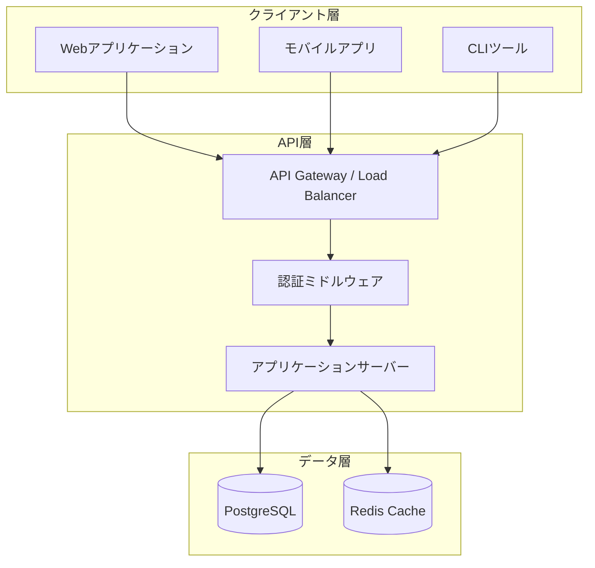
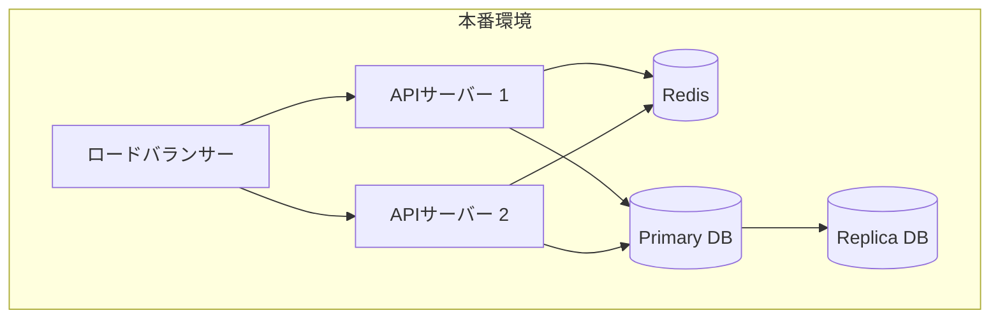
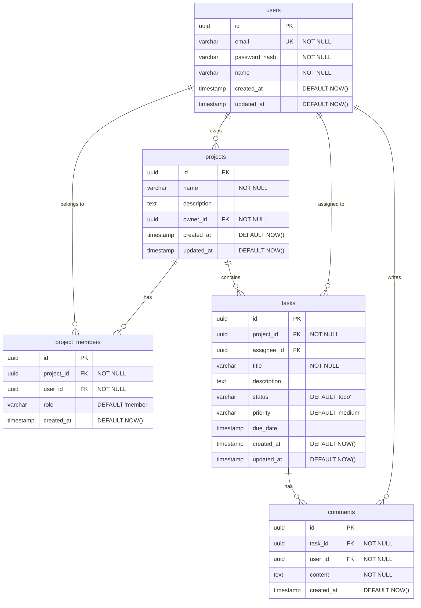
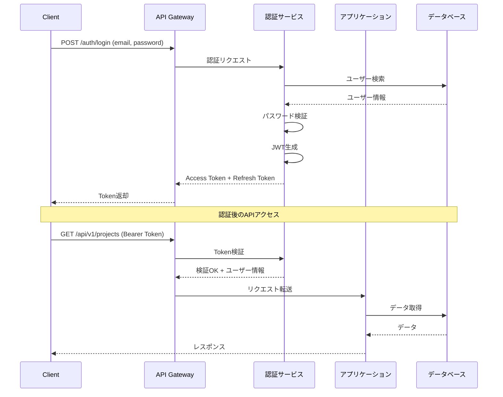

# 基本設計書 - タスク管理API

## 文書情報

| 項目 | 内容 |
|------|------|
| プロジェクト名 | タスク管理API |
| 文書バージョン | 1.0.0 |
| 作成日 | 2024-12-29 |
| 最終更新日 | 2024-12-29 |
| 作成者 | AI Assistant |
| ステータス | Approved |
| 関連要件定義書 | requirements/projects/task-management-api/requirements.md |

---

## 1. システム構成

### 1.1 システムアーキテクチャ



### 1.2 技術スタック

| レイヤー | 技術 | バージョン | 備考 |
|---------|------|-----------|------|
| API Framework | 任意（Node.js/Python/Go等） | - | 実装時に選定 |
| Database | PostgreSQL | 15+ | RDBMS |
| Cache | Redis | 7+ | セッション・キャッシュ |
| Authentication | JWT | - | RS256アルゴリズム |

### 1.3 デプロイメント構成



---

## 2. API設計

### 2.1 API設計方針

- RESTful設計原則に準拠
- リソース指向のURL設計
- 適切なHTTPメソッドとステータスコードの使用
- JSON形式でのデータ交換
- APIバージョニング（URLパス方式）

### 2.2 URL設計規則

| 規則 | 説明 | 例 |
|------|------|-----|
| ベースURL | APIのベースパス | `/api/v1` |
| リソース名 | 複数形・小文字・ケバブケース | `/projects`, `/tasks` |
| リソースID | パスパラメータ | `/projects/{projectId}` |
| サブリソース | 親子関係の表現 | `/projects/{projectId}/tasks` |
| クエリパラメータ | フィルタリング・ページング | `?status=todo&page=1` |

### 2.3 リソース一覧

| リソース | パス | 概要 |
|---------|------|------|
| Auth | /api/v1/auth | 認証関連 |
| Users | /api/v1/users | ユーザー管理 |
| Projects | /api/v1/projects | プロジェクト管理 |
| Tasks | /api/v1/tasks | タスク管理 |
| Comments | /api/v1/comments | コメント管理 |

### 2.4 HTTPメソッド対応表

| メソッド | 用途 | 冪等性 | 安全性 |
|---------|------|--------|--------|
| GET | リソース取得 | ○ | ○ |
| POST | リソース作成 | × | × |
| PUT | リソース全体更新 | ○ | × |
| PATCH | リソース部分更新 | × | × |
| DELETE | リソース削除 | ○ | × |

### 2.5 エンドポイント設計

#### 認証 API

| メソッド | エンドポイント | 概要 | 認証 |
|---------|---------------|------|------|
| POST | /api/v1/auth/register | ユーザー登録 | 不要 |
| POST | /api/v1/auth/login | ログイン | 不要 |
| POST | /api/v1/auth/refresh | トークンリフレッシュ | 必要 |
| POST | /api/v1/auth/logout | ログアウト | 必要 |

#### プロジェクト API

| メソッド | エンドポイント | 概要 | 認証 |
|---------|---------------|------|------|
| GET | /api/v1/projects | 一覧取得 | 必要 |
| POST | /api/v1/projects | 新規作成 | 必要 |
| GET | /api/v1/projects/{id} | 詳細取得 | 必要 |
| PUT | /api/v1/projects/{id} | 更新 | 必要 |
| DELETE | /api/v1/projects/{id} | 削除 | 必要 |
| GET | /api/v1/projects/{id}/members | メンバー一覧 | 必要 |
| POST | /api/v1/projects/{id}/members | メンバー追加 | 必要 |
| DELETE | /api/v1/projects/{id}/members/{userId} | メンバー削除 | 必要 |

#### タスク API

| メソッド | エンドポイント | 概要 | 認証 |
|---------|---------------|------|------|
| GET | /api/v1/projects/{projectId}/tasks | プロジェクト内タスク一覧 | 必要 |
| POST | /api/v1/projects/{projectId}/tasks | タスク作成 | 必要 |
| GET | /api/v1/tasks/{id} | 詳細取得 | 必要 |
| PUT | /api/v1/tasks/{id} | 更新 | 必要 |
| DELETE | /api/v1/tasks/{id} | 削除 | 必要 |

#### コメント API

| メソッド | エンドポイント | 概要 | 認証 |
|---------|---------------|------|------|
| GET | /api/v1/tasks/{taskId}/comments | コメント一覧 | 必要 |
| POST | /api/v1/tasks/{taskId}/comments | コメント作成 | 必要 |
| DELETE | /api/v1/comments/{id} | コメント削除 | 必要 |

---

## 3. データモデル設計

### 3.1 ER図



### 3.2 エンティティ定義

#### users テーブル

| カラム名 | 型 | NULL | デフォルト | 説明 |
|---------|-----|------|-----------|------|
| id | UUID | NO | gen_random_uuid() | 主キー |
| email | VARCHAR(255) | NO | - | メールアドレス（一意） |
| password_hash | VARCHAR(255) | NO | - | パスワードハッシュ |
| name | VARCHAR(100) | NO | - | ユーザー名 |
| created_at | TIMESTAMP | NO | CURRENT_TIMESTAMP | 作成日時 |
| updated_at | TIMESTAMP | NO | CURRENT_TIMESTAMP | 更新日時 |

#### projects テーブル

| カラム名 | 型 | NULL | デフォルト | 説明 |
|---------|-----|------|-----------|------|
| id | UUID | NO | gen_random_uuid() | 主キー |
| name | VARCHAR(100) | NO | - | プロジェクト名 |
| description | TEXT | YES | - | 説明 |
| owner_id | UUID | NO | - | オーナーユーザーID |
| created_at | TIMESTAMP | NO | CURRENT_TIMESTAMP | 作成日時 |
| updated_at | TIMESTAMP | NO | CURRENT_TIMESTAMP | 更新日時 |

#### tasks テーブル

| カラム名 | 型 | NULL | デフォルト | 説明 |
|---------|-----|------|-----------|------|
| id | UUID | NO | gen_random_uuid() | 主キー |
| project_id | UUID | NO | - | プロジェクトID |
| assignee_id | UUID | YES | - | 担当者ID |
| title | VARCHAR(100) | NO | - | タイトル |
| description | TEXT | YES | - | 説明 |
| status | VARCHAR(20) | NO | 'todo' | ステータス |
| priority | VARCHAR(20) | NO | 'medium' | 優先度 |
| due_date | TIMESTAMP | YES | - | 期限 |
| created_at | TIMESTAMP | NO | CURRENT_TIMESTAMP | 作成日時 |
| updated_at | TIMESTAMP | NO | CURRENT_TIMESTAMP | 更新日時 |

---

## 4. 認証・認可設計

### 4.1 認証方式



### 4.2 JWT構造

**Access Token (有効期限: 1時間)**:
```json
{
  "sub": "user-uuid",
  "email": "user@example.com",
  "name": "User Name",
  "iat": 1704067200,
  "exp": 1704070800,
  "type": "access"
}
```

**Refresh Token (有効期限: 7日)**:
```json
{
  "sub": "user-uuid",
  "iat": 1704067200,
  "exp": 1704672000,
  "type": "refresh"
}
```

### 4.3 認可モデル

| ロール | 権限 | 説明 |
|--------|------|------|
| owner | * | プロジェクトの全権限 |
| admin | read, write, delete (tasks) | メンバー管理以外の全権限 |
| member | read, write (own tasks) | 閲覧と自身のタスク編集 |

### 4.4 権限マトリクス

| リソース | 操作 | owner | admin | member |
|---------|------|-------|-------|--------|
| Project | Read | ○ | ○ | ○ |
| Project | Update | ○ | × | × |
| Project | Delete | ○ | × | × |
| Members | Manage | ○ | × | × |
| Task | Create | ○ | ○ | ○ |
| Task | Read | ○ | ○ | ○ |
| Task | Update | ○ | ○ | ○(自身のみ) |
| Task | Delete | ○ | ○ | ×|
| Comment | Create | ○ | ○ | ○ |
| Comment | Delete | ○ | ○ | ○(自身のみ) |

---

## 5. エラー設計

### 5.1 エラーレスポンス形式

```json
{
  "error": {
    "code": "ERROR_CODE",
    "message": "Human readable message",
    "details": [
      {
        "field": "field_name",
        "reason": "validation_error",
        "message": "Field specific message"
      }
    ],
    "requestId": "uuid-for-tracking"
  }
}
```

### 5.2 HTTPステータスコード

| コード | 意味 | 使用場面 |
|--------|------|---------|
| 200 | OK | 正常完了（取得・更新） |
| 201 | Created | リソース作成成功 |
| 204 | No Content | 削除成功 |
| 400 | Bad Request | リクエスト形式不正 |
| 401 | Unauthorized | 認証エラー |
| 403 | Forbidden | 認可エラー |
| 404 | Not Found | リソース未存在 |
| 409 | Conflict | 競合エラー（重複など） |
| 422 | Unprocessable Entity | バリデーションエラー |
| 500 | Internal Server Error | サーバーエラー |

### 5.3 エラーコード一覧

| エラーコード | HTTPステータス | 説明 |
|-------------|---------------|------|
| AUTH_001 | 401 | 認証トークンが無効 |
| AUTH_002 | 401 | 認証トークンが期限切れ |
| AUTH_003 | 401 | 認証情報が不正 |
| AUTHZ_001 | 403 | 権限不足 |
| AUTHZ_002 | 403 | リソースへのアクセス権限なし |
| VAL_001 | 422 | 必須フィールド未入力 |
| VAL_002 | 422 | フィールド形式不正 |
| VAL_003 | 422 | 値が範囲外 |
| RES_001 | 404 | リソースが存在しない |
| RES_002 | 409 | リソースが既に存在 |
| RES_003 | 409 | 競合エラー |
| SYS_001 | 500 | 内部エラー |

---

## 6. 共通仕様

### 6.1 ページネーション

**リクエスト**:
```
GET /api/v1/projects?page=1&limit=20&sort=created_at&order=desc
```

**レスポンス**:
```json
{
  "data": [...],
  "pagination": {
    "currentPage": 1,
    "totalPages": 10,
    "totalItems": 200,
    "itemsPerPage": 20,
    "hasNext": true,
    "hasPrev": false
  }
}
```

### 6.2 フィルタリング

```
GET /api/v1/projects/{projectId}/tasks?status=todo&priority=high&assignee_id={userId}
```

### 6.3 共通ヘッダー

| ヘッダー | 必須 | 説明 |
|---------|------|------|
| Authorization | ○ | Bearer {token} |
| Content-Type | ○ | application/json |
| Accept | - | application/json |
| X-Request-ID | - | リクエスト追跡用ID |

### 6.4 日時形式

- ISO 8601形式（UTC）
- 例: `2024-12-29T10:30:00Z`

---

## 7. 非機能設計

### 7.1 性能設計

| 項目 | 設計値 | 実現方法 |
|------|--------|---------|
| レスポンスタイム | 200ms以内 | インデックス最適化、N+1回避 |
| スループット | 100 req/s | 水平スケーリング |
| DB接続 | コネクションプール | 最大50接続/インスタンス |

### 7.2 キャッシュ戦略

| データ | TTL | キャッシュ条件 |
|--------|-----|---------------|
| ユーザー情報 | 5分 | 認証後 |
| プロジェクト一覧 | 1分 | 更新時無効化 |

### 7.3 セキュリティ設計

| 項目 | 対策 |
|------|------|
| 通信暗号化 | TLS 1.2+ |
| 認証 | JWT (RS256) |
| パスワード | bcrypt (cost=12) |
| 入力検証 | スキーマバリデーション |
| SQLインジェクション | パラメータ化クエリ |
| レート制限 | 100 req/min per user |

---

## 8. 承認

| 役割 | 氏名 | 承認日 | 署名 |
|------|------|--------|------|
| プロジェクトマネージャー | AI PM | 2024-12-29 | ✓ |
| 技術リード | AI Tech Lead | 2024-12-29 | ✓ |
| アーキテクト | AI Architect | 2024-12-29 | ✓ |

---

## 変更履歴

| バージョン | 日付 | 変更者 | 変更内容 |
|-----------|------|--------|---------|
| 1.0.0 | 2024-12-29 | AI Assistant | 初版作成 |
