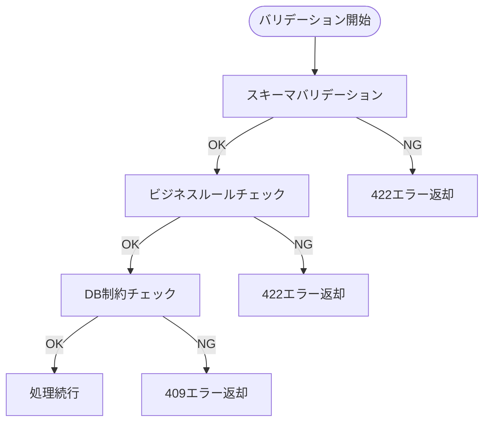
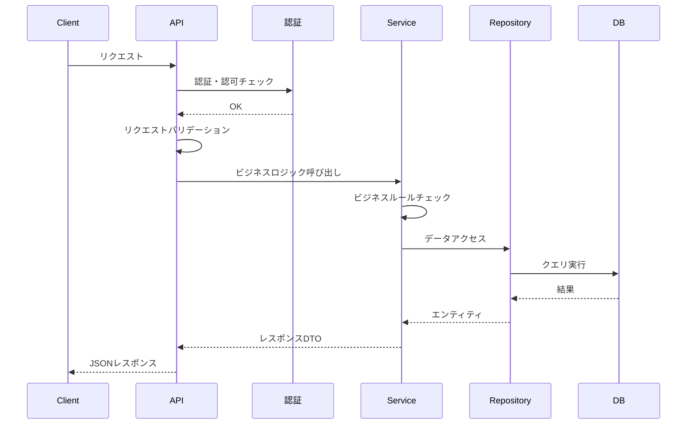
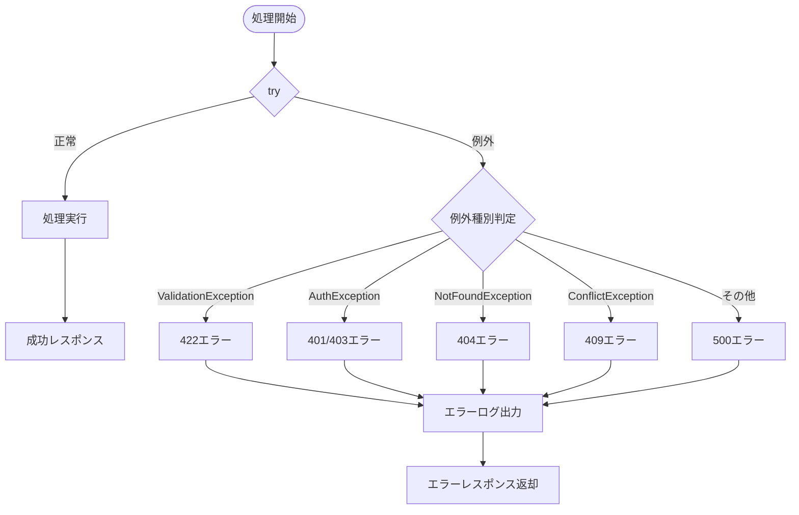

# 詳細設計書テンプレート

## 文書情報

| 項目 | 内容 |
|------|------|
| プロジェクト名 | {{PROJECT_NAME}} |
| 文書バージョン | {{VERSION}} |
| 作成日 | {{CREATED_DATE}} |
| 最終更新日 | {{UPDATED_DATE}} |
| 作成者 | {{AUTHOR}} |
| ステータス | Draft / Review / Approved |
| 関連要件定義書 | {{REQUIREMENTS_DOC_REF}} |
| 関連基本設計書 | {{BASIC_DESIGN_DOC_REF}} |

---

## 1. API詳細設計

### 1.1 {{RESOURCE_NAME}} API

#### GET /api/v1/{{resources}} - 一覧取得

**概要**: {{RESOURCE_NAME}}の一覧を取得する

**認証**: 必要

**リクエスト**:

| パラメータ種別 | パラメータ名 | 型 | 必須 | 説明 | 例 |
|---------------|-------------|-----|------|------|-----|
| Query | page | integer | - | ページ番号 (default: 1) | 1 |
| Query | limit | integer | - | 取得件数 (default: 20, max: 100) | 20 |
| Query | sort | string | - | ソートフィールド | created_at |
| Query | order | string | - | ソート順 (asc/desc) | desc |
| Query | {{filter_1}} | {{type}} | - | {{filter_desc}} | {{example}} |

**レスポンス (200 OK)**:

```json
{
  "data": [
    {
      "id": "550e8400-e29b-41d4-a716-446655440000",
      "{{field_1}}": "{{value_1}}",
      "{{field_2}}": "{{value_2}}",
      "createdAt": "2024-01-01T00:00:00Z",
      "updatedAt": "2024-01-01T00:00:00Z"
    }
  ],
  "pagination": {
    "currentPage": 1,
    "totalPages": 10,
    "totalItems": 200,
    "itemsPerPage": 20,
    "hasNext": true,
    "hasPrev": false
  }
}
```

**エラーレスポンス**:

| ステータス | エラーコード | 説明 |
|-----------|-------------|------|
| 401 | AUTH_001 | 認証トークンが無効 |
| 403 | AUTHZ_001 | アクセス権限なし |

---

#### POST /api/v1/{{resources}} - 新規作成

**概要**: {{RESOURCE_NAME}}を新規作成する

**認証**: 必要

**リクエストボディ**:

```json
{
  "{{field_1}}": "{{value_1}}",
  "{{field_2}}": "{{value_2}}"
}
```

| フィールド | 型 | 必須 | 説明 | バリデーション |
|-----------|-----|------|------|---------------|
| {{field_1}} | string | ○ | {{desc}} | 最大255文字 |
| {{field_2}} | {{type}} | - | {{desc}} | {{validation}} |

**レスポンス (201 Created)**:

```json
{
  "data": {
    "id": "550e8400-e29b-41d4-a716-446655440000",
    "{{field_1}}": "{{value_1}}",
    "{{field_2}}": "{{value_2}}",
    "createdAt": "2024-01-01T00:00:00Z",
    "updatedAt": "2024-01-01T00:00:00Z"
  }
}
```

**エラーレスポンス**:

| ステータス | エラーコード | 説明 |
|-----------|-------------|------|
| 400 | VAL_001 | リクエスト形式不正 |
| 401 | AUTH_001 | 認証トークンが無効 |
| 409 | RES_002 | リソースが既に存在 |
| 422 | VAL_002 | バリデーションエラー |

---

#### GET /api/v1/{{resources}}/{id} - 詳細取得

**概要**: {{RESOURCE_NAME}}の詳細を取得する

**認証**: 必要

**パスパラメータ**:

| パラメータ名 | 型 | 必須 | 説明 | 例 |
|-------------|-----|------|------|-----|
| id | uuid | ○ | リソースID | 550e8400-e29b-41d4-a716-446655440000 |

**レスポンス (200 OK)**:

```json
{
  "data": {
    "id": "550e8400-e29b-41d4-a716-446655440000",
    "{{field_1}}": "{{value_1}}",
    "{{field_2}}": "{{value_2}}",
    "{{nested_resource}}": {
      "id": "{{nested_id}}",
      "name": "{{nested_name}}"
    },
    "createdAt": "2024-01-01T00:00:00Z",
    "updatedAt": "2024-01-01T00:00:00Z"
  }
}
```

**エラーレスポンス**:

| ステータス | エラーコード | 説明 |
|-----------|-------------|------|
| 401 | AUTH_001 | 認証トークンが無効 |
| 403 | AUTHZ_001 | アクセス権限なし |
| 404 | RES_001 | リソースが存在しない |

---

#### PUT /api/v1/{{resources}}/{id} - 更新

**概要**: {{RESOURCE_NAME}}を更新する

**認証**: 必要

**パスパラメータ**:

| パラメータ名 | 型 | 必須 | 説明 |
|-------------|-----|------|------|
| id | uuid | ○ | リソースID |

**リクエストボディ**:

```json
{
  "{{field_1}}": "{{updated_value_1}}",
  "{{field_2}}": "{{updated_value_2}}"
}
```

**レスポンス (200 OK)**:

```json
{
  "data": {
    "id": "550e8400-e29b-41d4-a716-446655440000",
    "{{field_1}}": "{{updated_value_1}}",
    "{{field_2}}": "{{updated_value_2}}",
    "createdAt": "2024-01-01T00:00:00Z",
    "updatedAt": "2024-01-02T00:00:00Z"
  }
}
```

**エラーレスポンス**:

| ステータス | エラーコード | 説明 |
|-----------|-------------|------|
| 400 | VAL_001 | リクエスト形式不正 |
| 401 | AUTH_001 | 認証トークンが無効 |
| 403 | AUTHZ_001 | アクセス権限なし |
| 404 | RES_001 | リソースが存在しない |
| 409 | RES_003 | 競合エラー（楽観的ロック） |
| 422 | VAL_002 | バリデーションエラー |

---

#### DELETE /api/v1/{{resources}}/{id} - 削除

**概要**: {{RESOURCE_NAME}}を削除する

**認証**: 必要

**パスパラメータ**:

| パラメータ名 | 型 | 必須 | 説明 |
|-------------|-----|------|------|
| id | uuid | ○ | リソースID |

**レスポンス (204 No Content)**:

*レスポンスボディなし*

**エラーレスポンス**:

| ステータス | エラーコード | 説明 |
|-----------|-------------|------|
| 401 | AUTH_001 | 認証トークンが無効 |
| 403 | AUTHZ_001 | アクセス権限なし |
| 404 | RES_001 | リソースが存在しない |
| 409 | RES_004 | 削除できない（依存関係あり） |

---

## 2. スキーマ定義

### 2.1 {{RESOURCE_NAME}} スキーマ

```json
{
  "$schema": "http://json-schema.org/draft-07/schema#",
  "type": "object",
  "properties": {
    "id": {
      "type": "string",
      "format": "uuid",
      "description": "リソースの一意識別子",
      "readOnly": true
    },
    "{{field_1}}": {
      "type": "string",
      "description": "{{field_1_desc}}",
      "minLength": 1,
      "maxLength": 255
    },
    "{{field_2}}": {
      "type": "{{type}}",
      "description": "{{field_2_desc}}",
      "{{constraint}}": "{{value}}"
    },
    "status": {
      "type": "string",
      "enum": ["active", "inactive", "pending"],
      "description": "ステータス",
      "default": "active"
    },
    "createdAt": {
      "type": "string",
      "format": "date-time",
      "description": "作成日時",
      "readOnly": true
    },
    "updatedAt": {
      "type": "string",
      "format": "date-time",
      "description": "更新日時",
      "readOnly": true
    }
  },
  "required": ["{{field_1}}"],
  "additionalProperties": false
}
```

### 2.2 エラーレスポンススキーマ

```json
{
  "$schema": "http://json-schema.org/draft-07/schema#",
  "type": "object",
  "properties": {
    "error": {
      "type": "object",
      "properties": {
        "code": {
          "type": "string",
          "description": "エラーコード"
        },
        "message": {
          "type": "string",
          "description": "エラーメッセージ"
        },
        "details": {
          "type": "array",
          "items": {
            "type": "object",
            "properties": {
              "field": {
                "type": "string"
              },
              "reason": {
                "type": "string"
              },
              "message": {
                "type": "string"
              }
            }
          }
        },
        "requestId": {
          "type": "string",
          "format": "uuid"
        }
      },
      "required": ["code", "message"]
    }
  },
  "required": ["error"]
}
```

---

## 3. バリデーション詳細

### 3.1 {{RESOURCE_NAME}} バリデーションルール

| フィールド | ルール | エラーメッセージ |
|-----------|--------|----------------|
| {{field_1}} | 必須 | {{field_1}}は必須です |
| {{field_1}} | 最大255文字 | {{field_1}}は255文字以内で入力してください |
| {{field_2}} | 形式チェック | {{field_2}}の形式が正しくありません |
| email | メール形式 | 有効なメールアドレスを入力してください |
| password | 最小8文字、英数字混合 | パスワードは8文字以上で、英字と数字を含めてください |

### 3.2 カスタムバリデーション



---

## 4. 処理フロー詳細

### 4.1 {{PROCESS_NAME}} 処理フロー



### 4.2 エラーハンドリングフロー



---

## 5. データベース詳細設計

### 5.1 テーブル定義: {{TABLE_NAME}}

```sql
CREATE TABLE {{table_name}} (
    id UUID PRIMARY KEY DEFAULT gen_random_uuid(),
    {{column_1}} VARCHAR(255) NOT NULL,
    {{column_2}} {{TYPE}} {{CONSTRAINTS}},
    status VARCHAR(20) NOT NULL DEFAULT 'active',
    created_at TIMESTAMP WITH TIME ZONE NOT NULL DEFAULT CURRENT_TIMESTAMP,
    updated_at TIMESTAMP WITH TIME ZONE NOT NULL DEFAULT CURRENT_TIMESTAMP,
    deleted_at TIMESTAMP WITH TIME ZONE,
    
    CONSTRAINT chk_status CHECK (status IN ('active', 'inactive', 'pending'))
);

-- インデックス
CREATE INDEX idx_{{table_name}}_status ON {{table_name}}(status);
CREATE INDEX idx_{{table_name}}_created_at ON {{table_name}}(created_at);
CREATE UNIQUE INDEX idx_{{table_name}}_{{unique_column}} ON {{table_name}}({{unique_column}}) WHERE deleted_at IS NULL;

-- 更新トリガー
CREATE TRIGGER update_{{table_name}}_updated_at
    BEFORE UPDATE ON {{table_name}}
    FOR EACH ROW
    EXECUTE FUNCTION update_updated_at_column();
```

### 5.2 マイグレーション

```sql
-- Up Migration
BEGIN;

CREATE TABLE IF NOT EXISTS {{table_name}} (
    -- カラム定義
);

COMMIT;

-- Down Migration
BEGIN;

DROP TABLE IF EXISTS {{table_name}};

COMMIT;
```

---

## 6. 認証・認可詳細

### 6.1 JWT トークン構造

**Header**:
```json
{
  "alg": "RS256",
  "typ": "JWT"
}
```

**Payload**:
```json
{
  "sub": "user-uuid",
  "email": "user@example.com",
  "roles": ["user"],
  "permissions": ["read:own", "write:own"],
  "iat": 1704067200,
  "exp": 1704153600,
  "iss": "{{ISSUER}}"
}
```

### 6.2 権限マトリクス

| エンドポイント | admin | user | guest |
|---------------|-------|------|-------|
| GET /{{resources}} | ○ | ○(自身のみ) | × |
| POST /{{resources}} | ○ | ○ | × |
| GET /{{resources}}/{id} | ○ | ○(自身のみ) | × |
| PUT /{{resources}}/{id} | ○ | ○(自身のみ) | × |
| DELETE /{{resources}}/{id} | ○ | × | × |

---

## 7. テスト仕様

### 7.1 単体テストケース

| テストID | テスト対象 | テスト内容 | 期待結果 |
|---------|-----------|-----------|---------|
| UT-001 | POST /{{resources}} | 正常系：有効なデータで作成 | 201 Created |
| UT-002 | POST /{{resources}} | 異常系：必須項目なし | 422 Unprocessable Entity |
| UT-003 | GET /{{resources}}/{id} | 正常系：存在するID | 200 OK |
| UT-004 | GET /{{resources}}/{id} | 異常系：存在しないID | 404 Not Found |

### 7.2 結合テストケース

| テストID | テストシナリオ | 前提条件 | 期待結果 |
|---------|--------------|---------|---------|
| IT-001 | CRUD一連操作 | 認証済みユーザー | 各操作が正常完了 |
| IT-002 | 認証なしアクセス | 未認証 | 401エラー |

---

## 8. 承認

| 役割 | 氏名 | 承認日 | 署名 |
|------|------|--------|------|
| プロジェクトマネージャー | | | |
| 技術リード | | | |
| 開発者 | | | |

---

## 変更履歴

| バージョン | 日付 | 変更者 | 変更内容 |
|-----------|------|--------|---------|
| 1.0.0 | {{DATE}} | {{AUTHOR}} | 初版作成 |
