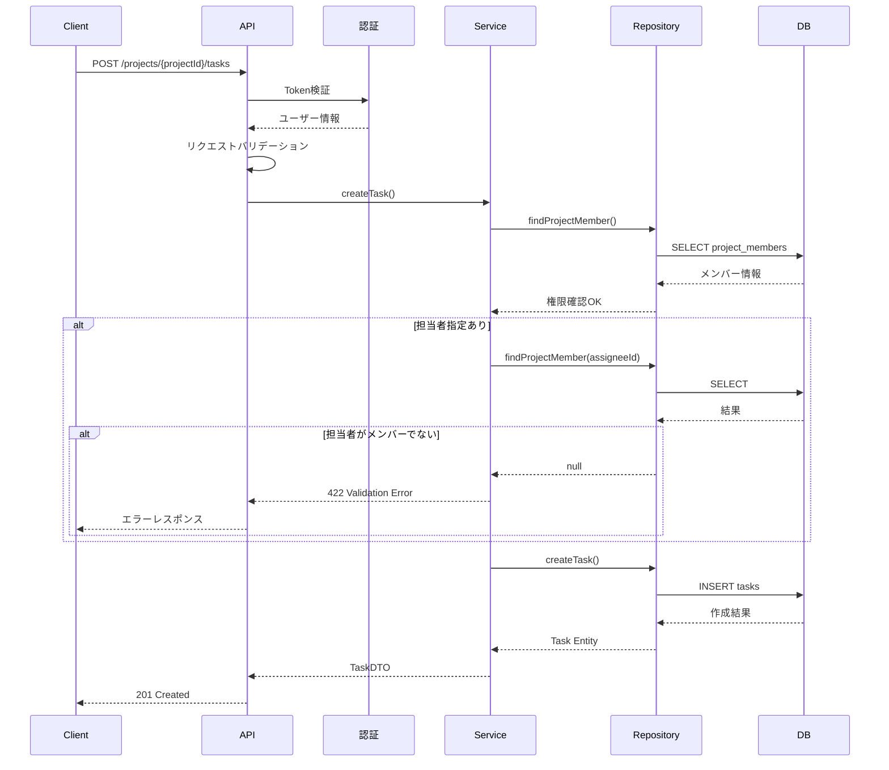
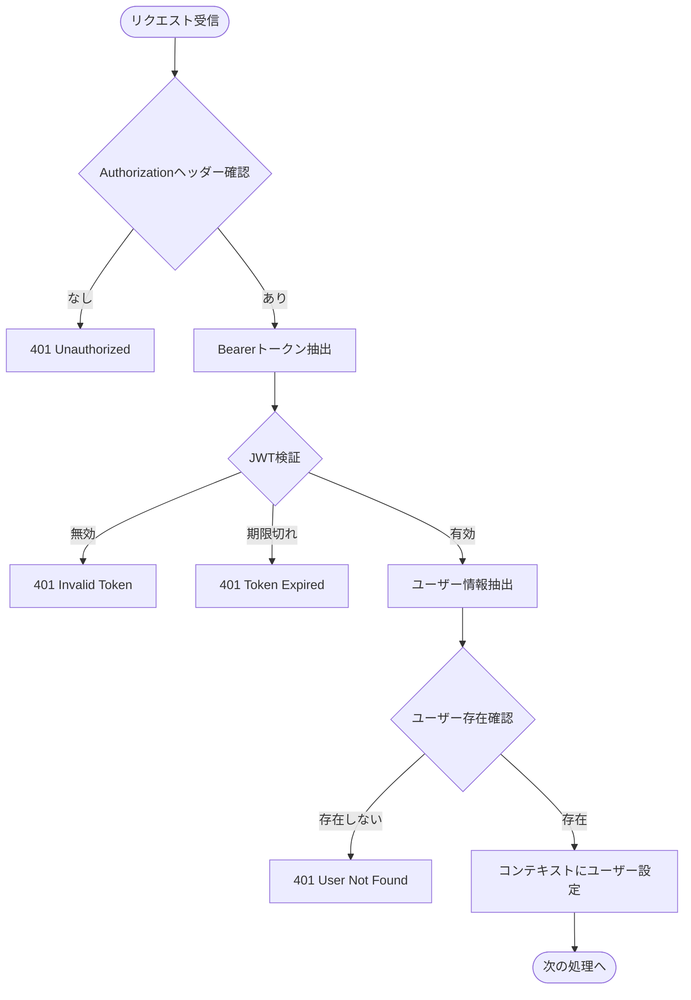

# 詳細設計書 - タスク管理API

## 文書情報

| 項目 | 内容 |
|------|------|
| プロジェクト名 | タスク管理API |
| 文書バージョン | 1.0.0 |
| 作成日 | 2024-12-29 |
| 最終更新日 | 2024-12-29 |
| 作成者 | AI Assistant |
| ステータス | Approved |
| 関連要件定義書 | requirements/projects/task-management-api/requirements.md |
| 関連基本設計書 | design/basic/projects/task-management-api/basic_design.md |

---

## 1. 認証API詳細設計

### 1.1 POST /api/v1/auth/register - ユーザー登録

**概要**: 新規ユーザーアカウントを作成する

**認証**: 不要

**リクエストボディ**:

```json
{
  "email": "user@example.com",
  "password": "Password123",
  "name": "山田太郎"
}
```

| フィールド | 型 | 必須 | 説明 | バリデーション |
|-----------|-----|------|------|---------------|
| email | string | ○ | メールアドレス | email形式、最大255文字、一意 |
| password | string | ○ | パスワード | 8文字以上、英字と数字を含む |
| name | string | ○ | ユーザー名 | 1-100文字 |

**レスポンス (201 Created)**:

```json
{
  "data": {
    "id": "550e8400-e29b-41d4-a716-446655440000",
    "email": "user@example.com",
    "name": "山田太郎",
    "createdAt": "2024-12-29T10:00:00Z"
  }
}
```

**エラーレスポンス**:

| ステータス | エラーコード | 説明 |
|-----------|-------------|------|
| 409 | RES_002 | メールアドレスが既に登録済み |
| 422 | VAL_001 | 必須フィールド未入力 |
| 422 | VAL_002 | パスワード形式不正 |

---

### 1.2 POST /api/v1/auth/login - ログイン

**概要**: メールアドレスとパスワードで認証し、JWTトークンを取得する

**認証**: 不要

**リクエストボディ**:

```json
{
  "email": "user@example.com",
  "password": "Password123"
}
```

| フィールド | 型 | 必須 | 説明 | バリデーション |
|-----------|-----|------|------|---------------|
| email | string | ○ | メールアドレス | email形式 |
| password | string | ○ | パスワード | - |

**レスポンス (200 OK)**:

```json
{
  "data": {
    "accessToken": "eyJhbGciOiJSUzI1NiIsInR5cCI6IkpXVCJ9...",
    "refreshToken": "eyJhbGciOiJSUzI1NiIsInR5cCI6IkpXVCJ9...",
    "expiresIn": 3600,
    "tokenType": "Bearer"
  }
}
```

**エラーレスポンス**:

| ステータス | エラーコード | 説明 |
|-----------|-------------|------|
| 401 | AUTH_003 | メールアドレスまたはパスワードが不正 |

---

### 1.3 POST /api/v1/auth/refresh - トークンリフレッシュ

**概要**: リフレッシュトークンを使用して新しいアクセストークンを取得する

**認証**: 不要（リフレッシュトークンで認証）

**リクエストボディ**:

```json
{
  "refreshToken": "eyJhbGciOiJSUzI1NiIsInR5cCI6IkpXVCJ9..."
}
```

**レスポンス (200 OK)**:

```json
{
  "data": {
    "accessToken": "eyJhbGciOiJSUzI1NiIsInR5cCI6IkpXVCJ9...",
    "refreshToken": "eyJhbGciOiJSUzI1NiIsInR5cCI6IkpXVCJ9...",
    "expiresIn": 3600,
    "tokenType": "Bearer"
  }
}
```

**エラーレスポンス**:

| ステータス | エラーコード | 説明 |
|-----------|-------------|------|
| 401 | AUTH_001 | リフレッシュトークンが無効 |
| 401 | AUTH_002 | リフレッシュトークンが期限切れ |

---

## 2. プロジェクトAPI詳細設計

### 2.1 GET /api/v1/projects - プロジェクト一覧取得

**概要**: ユーザーが参加しているプロジェクトの一覧を取得する

**認証**: 必要

**リクエストパラメータ**:

| パラメータ種別 | パラメータ名 | 型 | 必須 | 説明 | 例 |
|---------------|-------------|-----|------|------|-----|
| Query | page | integer | - | ページ番号 (default: 1) | 1 |
| Query | limit | integer | - | 取得件数 (default: 20, max: 100) | 20 |
| Query | sort | string | - | ソートフィールド | created_at |
| Query | order | string | - | ソート順 (asc/desc) | desc |

**レスポンス (200 OK)**:

```json
{
  "data": [
    {
      "id": "550e8400-e29b-41d4-a716-446655440000",
      "name": "プロジェクトA",
      "description": "サンプルプロジェクトの説明",
      "owner": {
        "id": "660e8400-e29b-41d4-a716-446655440000",
        "name": "山田太郎"
      },
      "role": "owner",
      "taskCount": 15,
      "createdAt": "2024-12-29T10:00:00Z",
      "updatedAt": "2024-12-29T10:00:00Z"
    }
  ],
  "pagination": {
    "currentPage": 1,
    "totalPages": 5,
    "totalItems": 100,
    "itemsPerPage": 20,
    "hasNext": true,
    "hasPrev": false
  }
}
```

---

### 2.2 POST /api/v1/projects - プロジェクト作成

**概要**: 新しいプロジェクトを作成する

**認証**: 必要

**リクエストボディ**:

```json
{
  "name": "新規プロジェクト",
  "description": "プロジェクトの説明文"
}
```

| フィールド | 型 | 必須 | 説明 | バリデーション |
|-----------|-----|------|------|---------------|
| name | string | ○ | プロジェクト名 | 1-100文字 |
| description | string | - | 説明 | 最大1000文字 |

**レスポンス (201 Created)**:

```json
{
  "data": {
    "id": "550e8400-e29b-41d4-a716-446655440000",
    "name": "新規プロジェクト",
    "description": "プロジェクトの説明文",
    "owner": {
      "id": "660e8400-e29b-41d4-a716-446655440000",
      "name": "山田太郎"
    },
    "createdAt": "2024-12-29T10:00:00Z",
    "updatedAt": "2024-12-29T10:00:00Z"
  }
}
```

---

### 2.3 GET /api/v1/projects/{id} - プロジェクト詳細取得

**概要**: 指定したプロジェクトの詳細を取得する

**認証**: 必要（プロジェクトメンバーのみ）

**パスパラメータ**:

| パラメータ名 | 型 | 必須 | 説明 |
|-------------|-----|------|------|
| id | uuid | ○ | プロジェクトID |

**レスポンス (200 OK)**:

```json
{
  "data": {
    "id": "550e8400-e29b-41d4-a716-446655440000",
    "name": "プロジェクトA",
    "description": "詳細な説明",
    "owner": {
      "id": "660e8400-e29b-41d4-a716-446655440000",
      "name": "山田太郎",
      "email": "yamada@example.com"
    },
    "members": [
      {
        "id": "770e8400-e29b-41d4-a716-446655440000",
        "name": "鈴木花子",
        "email": "suzuki@example.com",
        "role": "member"
      }
    ],
    "taskSummary": {
      "total": 20,
      "todo": 10,
      "inProgress": 5,
      "done": 5
    },
    "createdAt": "2024-12-29T10:00:00Z",
    "updatedAt": "2024-12-29T10:00:00Z"
  }
}
```

---

### 2.4 PUT /api/v1/projects/{id} - プロジェクト更新

**概要**: プロジェクト情報を更新する

**認証**: 必要（オーナーのみ）

**パスパラメータ**:

| パラメータ名 | 型 | 必須 | 説明 |
|-------------|-----|------|------|
| id | uuid | ○ | プロジェクトID |

**リクエストボディ**:

```json
{
  "name": "更新後のプロジェクト名",
  "description": "更新後の説明"
}
```

**レスポンス (200 OK)**:

```json
{
  "data": {
    "id": "550e8400-e29b-41d4-a716-446655440000",
    "name": "更新後のプロジェクト名",
    "description": "更新後の説明",
    "owner": {
      "id": "660e8400-e29b-41d4-a716-446655440000",
      "name": "山田太郎"
    },
    "createdAt": "2024-12-29T10:00:00Z",
    "updatedAt": "2024-12-29T11:00:00Z"
  }
}
```

---

### 2.5 DELETE /api/v1/projects/{id} - プロジェクト削除

**概要**: プロジェクトを削除する（関連するタスク・コメントも削除）

**認証**: 必要（オーナーのみ）

**レスポンス (204 No Content)**: *レスポンスボディなし*

---

## 3. タスクAPI詳細設計

### 3.1 GET /api/v1/projects/{projectId}/tasks - タスク一覧取得

**概要**: プロジェクト内のタスク一覧を取得する

**認証**: 必要（プロジェクトメンバーのみ）

**パスパラメータ**:

| パラメータ名 | 型 | 必須 | 説明 |
|-------------|-----|------|------|
| projectId | uuid | ○ | プロジェクトID |

**クエリパラメータ**:

| パラメータ名 | 型 | 必須 | 説明 | 例 |
|-------------|-----|------|------|-----|
| page | integer | - | ページ番号 | 1 |
| limit | integer | - | 取得件数 | 20 |
| status | string | - | ステータスフィルタ | todo |
| priority | string | - | 優先度フィルタ | high |
| assigneeId | uuid | - | 担当者フィルタ | uuid |
| sort | string | - | ソートフィールド | due_date |
| order | string | - | ソート順 | asc |

**レスポンス (200 OK)**:

```json
{
  "data": [
    {
      "id": "880e8400-e29b-41d4-a716-446655440000",
      "title": "タスク1",
      "description": "タスクの説明",
      "status": "todo",
      "priority": "high",
      "dueDate": "2024-12-31T23:59:59Z",
      "assignee": {
        "id": "770e8400-e29b-41d4-a716-446655440000",
        "name": "鈴木花子"
      },
      "commentCount": 3,
      "createdAt": "2024-12-29T10:00:00Z",
      "updatedAt": "2024-12-29T10:00:00Z"
    }
  ],
  "pagination": {
    "currentPage": 1,
    "totalPages": 3,
    "totalItems": 50,
    "itemsPerPage": 20,
    "hasNext": true,
    "hasPrev": false
  }
}
```

---

### 3.2 POST /api/v1/projects/{projectId}/tasks - タスク作成

**概要**: プロジェクト内に新しいタスクを作成する

**認証**: 必要（プロジェクトメンバー）

**パスパラメータ**:

| パラメータ名 | 型 | 必須 | 説明 |
|-------------|-----|------|------|
| projectId | uuid | ○ | プロジェクトID |

**リクエストボディ**:

```json
{
  "title": "新規タスク",
  "description": "タスクの詳細説明",
  "status": "todo",
  "priority": "high",
  "dueDate": "2024-12-31T23:59:59Z",
  "assigneeId": "770e8400-e29b-41d4-a716-446655440000"
}
```

| フィールド | 型 | 必須 | 説明 | バリデーション |
|-----------|-----|------|------|---------------|
| title | string | ○ | タイトル | 1-100文字 |
| description | string | - | 説明 | 最大1000文字 |
| status | string | - | ステータス | todo/in_progress/done |
| priority | string | - | 優先度 | low/medium/high |
| dueDate | string | - | 期限 | ISO8601形式 |
| assigneeId | uuid | - | 担当者ID | プロジェクトメンバーのみ |

**レスポンス (201 Created)**:

```json
{
  "data": {
    "id": "880e8400-e29b-41d4-a716-446655440000",
    "title": "新規タスク",
    "description": "タスクの詳細説明",
    "status": "todo",
    "priority": "high",
    "dueDate": "2024-12-31T23:59:59Z",
    "assignee": {
      "id": "770e8400-e29b-41d4-a716-446655440000",
      "name": "鈴木花子"
    },
    "project": {
      "id": "550e8400-e29b-41d4-a716-446655440000",
      "name": "プロジェクトA"
    },
    "createdAt": "2024-12-29T10:00:00Z",
    "updatedAt": "2024-12-29T10:00:00Z"
  }
}
```

---

### 3.3 GET /api/v1/tasks/{id} - タスク詳細取得

**概要**: タスクの詳細を取得する

**認証**: 必要（プロジェクトメンバー）

**レスポンス (200 OK)**:

```json
{
  "data": {
    "id": "880e8400-e29b-41d4-a716-446655440000",
    "title": "タスク1",
    "description": "タスクの詳細説明",
    "status": "in_progress",
    "priority": "high",
    "dueDate": "2024-12-31T23:59:59Z",
    "assignee": {
      "id": "770e8400-e29b-41d4-a716-446655440000",
      "name": "鈴木花子",
      "email": "suzuki@example.com"
    },
    "project": {
      "id": "550e8400-e29b-41d4-a716-446655440000",
      "name": "プロジェクトA"
    },
    "comments": [
      {
        "id": "990e8400-e29b-41d4-a716-446655440000",
        "content": "コメント内容",
        "user": {
          "id": "660e8400-e29b-41d4-a716-446655440000",
          "name": "山田太郎"
        },
        "createdAt": "2024-12-29T11:00:00Z"
      }
    ],
    "createdAt": "2024-12-29T10:00:00Z",
    "updatedAt": "2024-12-29T12:00:00Z"
  }
}
```

---

### 3.4 PUT /api/v1/tasks/{id} - タスク更新

**概要**: タスク情報を更新する

**認証**: 必要（オーナー/admin、または担当者が自身のタスク）

**リクエストボディ**:

```json
{
  "title": "更新後のタイトル",
  "description": "更新後の説明",
  "status": "in_progress",
  "priority": "medium",
  "dueDate": "2025-01-15T23:59:59Z",
  "assigneeId": "770e8400-e29b-41d4-a716-446655440000"
}
```

**レスポンス (200 OK)**: タスク詳細と同様の形式

---

### 3.5 DELETE /api/v1/tasks/{id} - タスク削除

**概要**: タスクを削除する（関連コメントも削除）

**認証**: 必要（オーナー/admin のみ）

**レスポンス (204 No Content)**: *レスポンスボディなし*

---

## 4. コメントAPI詳細設計

### 4.1 GET /api/v1/tasks/{taskId}/comments - コメント一覧取得

**概要**: タスクのコメント一覧を取得する

**認証**: 必要（プロジェクトメンバー）

**レスポンス (200 OK)**:

```json
{
  "data": [
    {
      "id": "990e8400-e29b-41d4-a716-446655440000",
      "content": "コメント内容です",
      "user": {
        "id": "660e8400-e29b-41d4-a716-446655440000",
        "name": "山田太郎"
      },
      "createdAt": "2024-12-29T11:00:00Z"
    }
  ],
  "pagination": {
    "currentPage": 1,
    "totalPages": 2,
    "totalItems": 25,
    "itemsPerPage": 20,
    "hasNext": true,
    "hasPrev": false
  }
}
```

---

### 4.2 POST /api/v1/tasks/{taskId}/comments - コメント作成

**概要**: タスクにコメントを追加する

**認証**: 必要（プロジェクトメンバー）

**リクエストボディ**:

```json
{
  "content": "コメント内容です"
}
```

| フィールド | 型 | 必須 | 説明 | バリデーション |
|-----------|-----|------|------|---------------|
| content | string | ○ | コメント内容 | 1-1000文字 |

**レスポンス (201 Created)**:

```json
{
  "data": {
    "id": "990e8400-e29b-41d4-a716-446655440000",
    "content": "コメント内容です",
    "user": {
      "id": "660e8400-e29b-41d4-a716-446655440000",
      "name": "山田太郎"
    },
    "task": {
      "id": "880e8400-e29b-41d4-a716-446655440000",
      "title": "タスク1"
    },
    "createdAt": "2024-12-29T11:00:00Z"
  }
}
```

---

### 4.3 DELETE /api/v1/comments/{id} - コメント削除

**概要**: コメントを削除する

**認証**: 必要（コメント作成者、またはオーナー/admin）

**レスポンス (204 No Content)**: *レスポンスボディなし*

---

## 5. スキーマ定義

### 5.1 User スキーマ

```json
{
  "$schema": "http://json-schema.org/draft-07/schema#",
  "type": "object",
  "properties": {
    "id": {
      "type": "string",
      "format": "uuid",
      "readOnly": true
    },
    "email": {
      "type": "string",
      "format": "email",
      "maxLength": 255
    },
    "name": {
      "type": "string",
      "minLength": 1,
      "maxLength": 100
    },
    "createdAt": {
      "type": "string",
      "format": "date-time",
      "readOnly": true
    }
  },
  "required": ["email", "name"]
}
```

### 5.2 Project スキーマ

```json
{
  "$schema": "http://json-schema.org/draft-07/schema#",
  "type": "object",
  "properties": {
    "id": {
      "type": "string",
      "format": "uuid",
      "readOnly": true
    },
    "name": {
      "type": "string",
      "minLength": 1,
      "maxLength": 100
    },
    "description": {
      "type": "string",
      "maxLength": 1000
    },
    "owner": {
      "$ref": "#/components/schemas/UserSummary"
    },
    "createdAt": {
      "type": "string",
      "format": "date-time",
      "readOnly": true
    },
    "updatedAt": {
      "type": "string",
      "format": "date-time",
      "readOnly": true
    }
  },
  "required": ["name"]
}
```

### 5.3 Task スキーマ

```json
{
  "$schema": "http://json-schema.org/draft-07/schema#",
  "type": "object",
  "properties": {
    "id": {
      "type": "string",
      "format": "uuid",
      "readOnly": true
    },
    "title": {
      "type": "string",
      "minLength": 1,
      "maxLength": 100
    },
    "description": {
      "type": "string",
      "maxLength": 1000
    },
    "status": {
      "type": "string",
      "enum": ["todo", "in_progress", "done"],
      "default": "todo"
    },
    "priority": {
      "type": "string",
      "enum": ["low", "medium", "high"],
      "default": "medium"
    },
    "dueDate": {
      "type": "string",
      "format": "date-time"
    },
    "assignee": {
      "$ref": "#/components/schemas/UserSummary"
    },
    "createdAt": {
      "type": "string",
      "format": "date-time",
      "readOnly": true
    },
    "updatedAt": {
      "type": "string",
      "format": "date-time",
      "readOnly": true
    }
  },
  "required": ["title"]
}
```

### 5.4 Comment スキーマ

```json
{
  "$schema": "http://json-schema.org/draft-07/schema#",
  "type": "object",
  "properties": {
    "id": {
      "type": "string",
      "format": "uuid",
      "readOnly": true
    },
    "content": {
      "type": "string",
      "minLength": 1,
      "maxLength": 1000
    },
    "user": {
      "$ref": "#/components/schemas/UserSummary"
    },
    "createdAt": {
      "type": "string",
      "format": "date-time",
      "readOnly": true
    }
  },
  "required": ["content"]
}
```

---

## 6. バリデーション詳細

### 6.1 ユーザー登録バリデーション

| フィールド | ルール | エラーメッセージ |
|-----------|--------|----------------|
| email | 必須 | メールアドレスは必須です |
| email | email形式 | 有効なメールアドレスを入力してください |
| email | 最大255文字 | メールアドレスは255文字以内で入力してください |
| email | 一意 | このメールアドレスは既に登録されています |
| password | 必須 | パスワードは必須です |
| password | 最小8文字 | パスワードは8文字以上で入力してください |
| password | 英数字混合 | パスワードは英字と数字を含めてください |
| name | 必須 | 名前は必須です |
| name | 1-100文字 | 名前は1〜100文字で入力してください |

### 6.2 タスクバリデーション

| フィールド | ルール | エラーメッセージ |
|-----------|--------|----------------|
| title | 必須 | タイトルは必須です |
| title | 1-100文字 | タイトルは1〜100文字で入力してください |
| description | 最大1000文字 | 説明は1000文字以内で入力してください |
| status | enum | ステータスは todo, in_progress, done のいずれかを指定してください |
| priority | enum | 優先度は low, medium, high のいずれかを指定してください |
| dueDate | ISO8601 | 期限は有効な日時形式で入力してください |
| assigneeId | プロジェクトメンバー | 担当者はプロジェクトメンバーである必要があります |

---

## 7. 処理フロー詳細

### 7.1 タスク作成処理フロー



### 7.2 認証フロー



---

## 8. データベース詳細設計

### 8.1 テーブル定義: users

```sql
CREATE TABLE users (
    id UUID PRIMARY KEY DEFAULT gen_random_uuid(),
    email VARCHAR(255) NOT NULL,
    password_hash VARCHAR(255) NOT NULL,
    name VARCHAR(100) NOT NULL,
    created_at TIMESTAMP WITH TIME ZONE NOT NULL DEFAULT CURRENT_TIMESTAMP,
    updated_at TIMESTAMP WITH TIME ZONE NOT NULL DEFAULT CURRENT_TIMESTAMP,
    
    CONSTRAINT uk_users_email UNIQUE (email)
);

CREATE INDEX idx_users_email ON users(email);

CREATE TRIGGER update_users_updated_at
    BEFORE UPDATE ON users
    FOR EACH ROW
    EXECUTE FUNCTION update_updated_at_column();
```

### 8.2 テーブル定義: projects

```sql
CREATE TABLE projects (
    id UUID PRIMARY KEY DEFAULT gen_random_uuid(),
    name VARCHAR(100) NOT NULL,
    description TEXT,
    owner_id UUID NOT NULL REFERENCES users(id) ON DELETE CASCADE,
    created_at TIMESTAMP WITH TIME ZONE NOT NULL DEFAULT CURRENT_TIMESTAMP,
    updated_at TIMESTAMP WITH TIME ZONE NOT NULL DEFAULT CURRENT_TIMESTAMP
);

CREATE INDEX idx_projects_owner_id ON projects(owner_id);

CREATE TRIGGER update_projects_updated_at
    BEFORE UPDATE ON projects
    FOR EACH ROW
    EXECUTE FUNCTION update_updated_at_column();
```

### 8.3 テーブル定義: project_members

```sql
CREATE TABLE project_members (
    id UUID PRIMARY KEY DEFAULT gen_random_uuid(),
    project_id UUID NOT NULL REFERENCES projects(id) ON DELETE CASCADE,
    user_id UUID NOT NULL REFERENCES users(id) ON DELETE CASCADE,
    role VARCHAR(20) NOT NULL DEFAULT 'member',
    created_at TIMESTAMP WITH TIME ZONE NOT NULL DEFAULT CURRENT_TIMESTAMP,
    
    CONSTRAINT uk_project_members UNIQUE (project_id, user_id),
    CONSTRAINT chk_role CHECK (role IN ('owner', 'admin', 'member'))
);

CREATE INDEX idx_project_members_project_id ON project_members(project_id);
CREATE INDEX idx_project_members_user_id ON project_members(user_id);
```

### 8.4 テーブル定義: tasks

```sql
CREATE TABLE tasks (
    id UUID PRIMARY KEY DEFAULT gen_random_uuid(),
    project_id UUID NOT NULL REFERENCES projects(id) ON DELETE CASCADE,
    assignee_id UUID REFERENCES users(id) ON DELETE SET NULL,
    title VARCHAR(100) NOT NULL,
    description TEXT,
    status VARCHAR(20) NOT NULL DEFAULT 'todo',
    priority VARCHAR(20) NOT NULL DEFAULT 'medium',
    due_date TIMESTAMP WITH TIME ZONE,
    created_at TIMESTAMP WITH TIME ZONE NOT NULL DEFAULT CURRENT_TIMESTAMP,
    updated_at TIMESTAMP WITH TIME ZONE NOT NULL DEFAULT CURRENT_TIMESTAMP,
    
    CONSTRAINT chk_status CHECK (status IN ('todo', 'in_progress', 'done')),
    CONSTRAINT chk_priority CHECK (priority IN ('low', 'medium', 'high'))
);

CREATE INDEX idx_tasks_project_id ON tasks(project_id);
CREATE INDEX idx_tasks_assignee_id ON tasks(assignee_id);
CREATE INDEX idx_tasks_status ON tasks(status);
CREATE INDEX idx_tasks_due_date ON tasks(due_date);

CREATE TRIGGER update_tasks_updated_at
    BEFORE UPDATE ON tasks
    FOR EACH ROW
    EXECUTE FUNCTION update_updated_at_column();
```

### 8.5 テーブル定義: comments

```sql
CREATE TABLE comments (
    id UUID PRIMARY KEY DEFAULT gen_random_uuid(),
    task_id UUID NOT NULL REFERENCES tasks(id) ON DELETE CASCADE,
    user_id UUID NOT NULL REFERENCES users(id) ON DELETE CASCADE,
    content TEXT NOT NULL,
    created_at TIMESTAMP WITH TIME ZONE NOT NULL DEFAULT CURRENT_TIMESTAMP
);

CREATE INDEX idx_comments_task_id ON comments(task_id);
CREATE INDEX idx_comments_user_id ON comments(user_id);
```

### 8.6 共通関数

```sql
CREATE OR REPLACE FUNCTION update_updated_at_column()
RETURNS TRIGGER AS $$
BEGIN
    NEW.updated_at = CURRENT_TIMESTAMP;
    RETURN NEW;
END;
$$ language 'plpgsql';
```

---

## 9. 承認

| 役割 | 氏名 | 承認日 | 署名 |
|------|------|--------|------|
| プロジェクトマネージャー | AI PM | 2024-12-29 | ✓ |
| 技術リード | AI Tech Lead | 2024-12-29 | ✓ |
| 開発者 | AI Developer | 2024-12-29 | ✓ |

---

## 変更履歴

| バージョン | 日付 | 変更者 | 変更内容 |
|-----------|------|--------|---------|
| 1.0.0 | 2024-12-29 | AI Assistant | 初版作成 |
