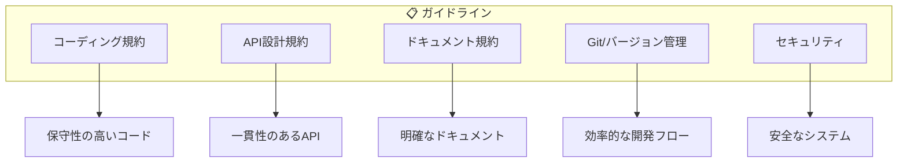
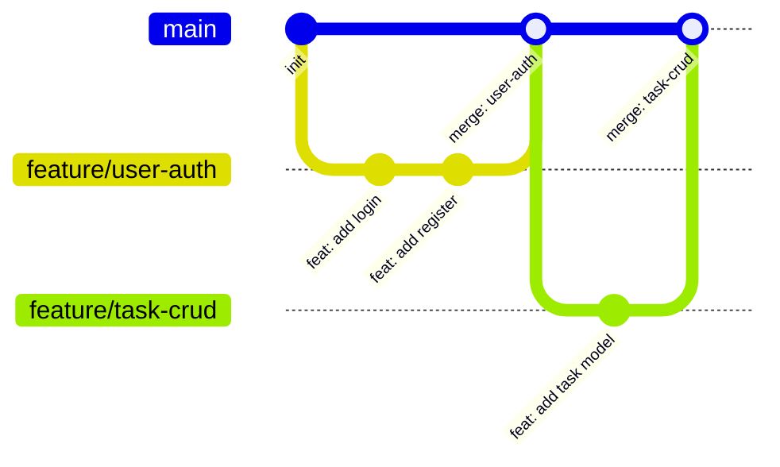

# 開発ガイドライン インデックス

> **ドキュメントバージョン**: 1.0.0  
> **最終更新日**: 2025-12-30  
> **ステータス**: Active

---

## 概要

このディレクトリには、AI駆動 RESTful API 自動生成システムの開発における標準的なガイドラインとベストプラクティスが含まれています。

---

## ガイドライン構成



---

## ガイドライン一覧

### 1. コーディング規約

| 言語 | 規約 | 説明 |
|------|------|------|
| Python | PEP 8 | Python公式スタイルガイド |
| YAML | YAML 1.2 | OpenAPI仕様書記述用 |
| Markdown | CommonMark | ドキュメント記述用 |

**Python コーディングのポイント:**
- インデント: スペース4つ
- 最大行長: 88文字（Black formatter準拠）
- 命名規則:
  - クラス: `PascalCase`
  - 関数/変数: `snake_case`
  - 定数: `UPPER_SNAKE_CASE`
- 型ヒントの積極的な使用

---

### 2. API設計規約

#### RESTful設計原則

```mermaid
flowchart LR
    subgraph Resources["リソース指向"]
        A[/projects] --> B[/projects/{id}]
        B --> C[/projects/{id}/tasks]
        C --> D[/projects/{id}/tasks/{taskId}]
    end
```

| 項目 | 規約 | 例 |
|------|------|-----|
| URL命名 | 複数形、ケバブケース | `/api/v1/projects`, `/api/v1/task-comments` |
| HTTPメソッド | 適切なメソッドを使用 | GET(取得), POST(作成), PUT/PATCH(更新), DELETE(削除) |
| ステータスコード | 意味のあるコードを返却 | 200(成功), 201(作成), 400(バッドリクエスト), 404(未発見) |
| バージョニング | URLにバージョンを含める | `/api/v1/`, `/api/v2/` |

#### レスポンス形式

```json
{
  "data": { /* 成功時のデータ */ },
  "pagination": { /* ページネーション情報 */ },
  "error": { /* エラー時の情報 */ }
}
```

---

### 3. ドキュメント規約

#### ファイル構成

| ドキュメント種別 | 配置場所 | ファイル形式 |
|----------------|---------|-------------|
| システム概要 | `docs/` | Markdown |
| ガイド | `docs/guides/` | Markdown |
| ガイドライン | `docs/guidelines/` | Markdown |
| 要件定義書 | `requirements/projects/{project}/` | Markdown |
| 基本設計書 | `design/basic/projects/{project}/` | Markdown |
| 詳細設計書 | `design/detailed/projects/{project}/` | Markdown |
| OpenAPI仕様 | `specs/openapi/projects/{project}/` | YAML |

#### Markdown記述規約

- 見出しレベルは `#` から始め、階層的に使用
- 図表は **Mermaid** で記述
- コードブロックには言語を指定
- メタ情報（バージョン、日付、ステータス）を冒頭に記載

```markdown
# ドキュメントタイトル

> **ドキュメントバージョン**: X.Y.Z  
> **最終更新日**: YYYY-MM-DD  
> **ステータス**: Draft | Active | Deprecated
```

---

### 4. Git / バージョン管理規約

#### ブランチ戦略



| ブランチ種別 | 命名規則 | 用途 |
|-------------|---------|------|
| main | `main` | 本番リリース用 |
| feature | `feature/{機能名}` | 新機能開発用 |
| fix | `fix/{修正内容}` | バグ修正用 |
| docs | `docs/{ドキュメント名}` | ドキュメント更新用 |

#### コミットメッセージ規約

```
<type>: <subject>

<body>

<footer>
```

| Type | 説明 |
|------|------|
| `feat` | 新機能 |
| `fix` | バグ修正 |
| `docs` | ドキュメント変更 |
| `style` | コードスタイル変更（動作に影響なし） |
| `refactor` | リファクタリング |
| `test` | テスト追加・修正 |
| `chore` | ビルド・ツール関連 |

---

### 5. セキュリティガイドライン

#### 認証・認可

| 項目 | 推奨方法 |
|------|---------|
| 認証方式 | JWT (JSON Web Token) |
| トークン有効期限 | アクセストークン: 1時間、リフレッシュトークン: 7日 |
| パスワード保存 | bcrypt/argon2 でハッシュ化 |
| 通信暗号化 | HTTPS必須 |

#### セキュリティチェックリスト

- [ ] 入力値のバリデーション
- [ ] SQLインジェクション対策（ORM使用）
- [ ] XSS対策（出力エスケープ）
- [ ] CSRF対策（トークン検証）
- [ ] 機密情報の環境変数管理
- [ ] 適切なCORS設定

---

## 関連ドキュメント

| ドキュメント | パス | 説明 |
|-------------|------|------|
| システム概要 | [../overview.md](../overview.md) | システム全体の概要 |
| ガイドインデックス | [../guides/index.md](../guides/index.md) | 実装・デプロイガイド一覧 |
| AIワークフロー | `ai/instructions/workflow.md` | AI指示フロー |

---

## 今後追加予定のガイドライン

| ガイドライン | 説明 | 優先度 |
|-------------|------|--------|
| テスト規約 | 単体テスト・統合テストの書き方 | 高 |
| CI/CD規約 | GitHub Actions設定の標準化 | 高 |
| ログ規約 | ログ出力の標準化 | 中 |
| エラーハンドリング規約 | 例外処理の標準化 | 中 |

---

## 変更履歴

| バージョン | 日付 | 変更内容 |
|-----------|------|----------|
| 1.0.0 | 2025-12-30 | 初版作成 |

---

**作成日**: 2025-12-30  
**メンテナー**: auto_deploy プロジェクトチーム
