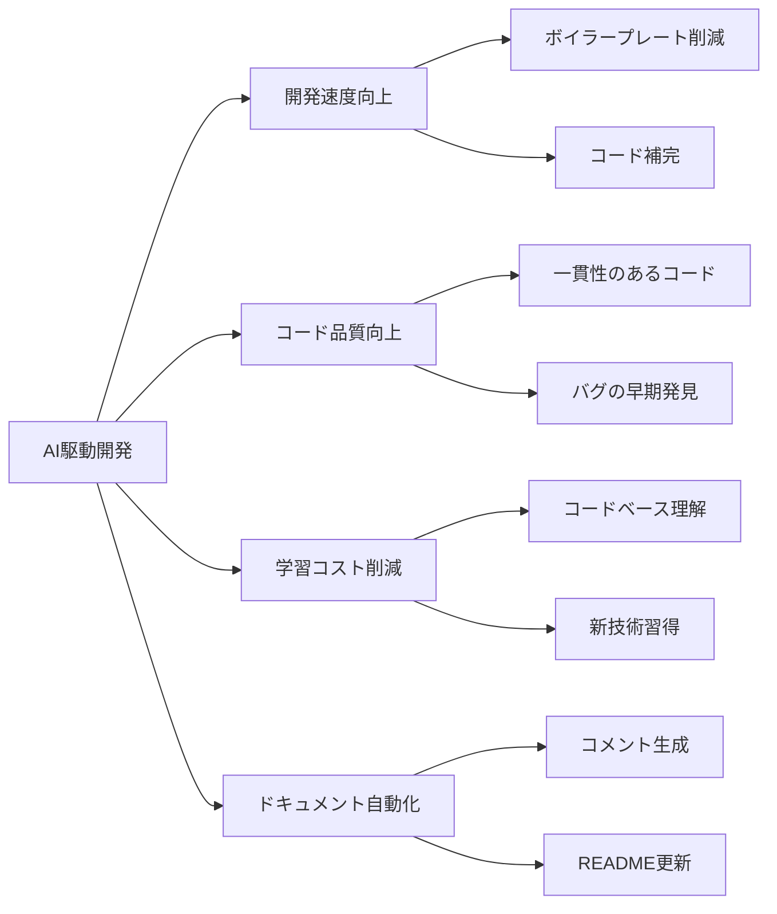
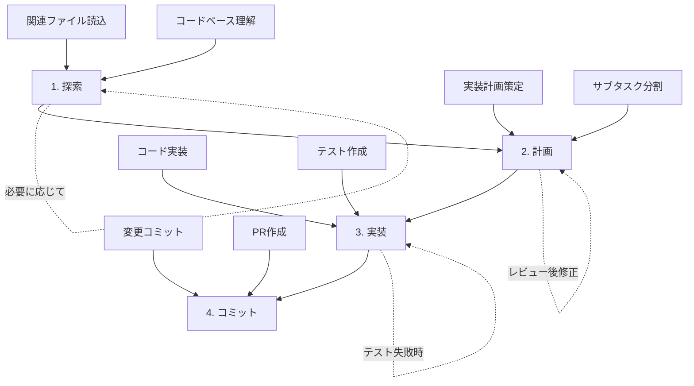
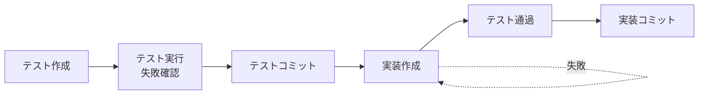
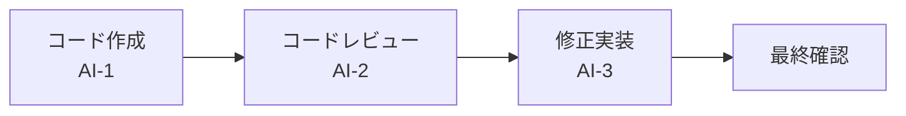
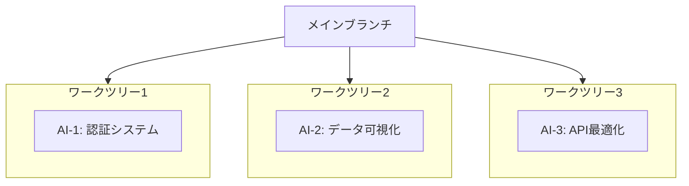
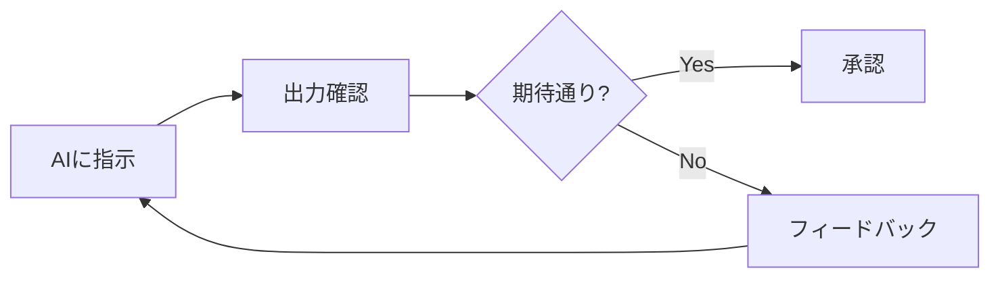

# AI駆動開発ベストプラクティスガイド

> **ドキュメントバージョン**: 1.0.0  
> **最終更新日**: 2026-01-06  
> **ステータス**: Active

---

## 目次

- [1. 概要](#1-概要)
- [2. AIアシスタントのセットアップ](#2-aiアシスタントのセットアップ)
- [3. 効果的なワークフロー](#3-効果的なワークフロー)
- [4. プロンプトエンジニアリング](#4-プロンプトエンジニアリング)
- [5. コード品質の維持](#5-コード品質の維持)
- [6. マルチAIワークフロー](#6-マルチaiワークフロー)
- [7. トラブルシューティング](#7-トラブルシューティング)

---

## 1. 概要

AI駆動開発（AI-Driven Development）は、AIアシスタントを活用してソフトウェア開発プロセスを効率化するアプローチです。本ガイドでは、GitHub Copilot、Claude Code、Cursor等のAIコーディングツールを効果的に活用するためのベストプラクティスを紹介します。

### 1.1 AI駆動開発の利点



### 1.2 本システムでの活用シーン

| シーン | AIの活用方法 |
|--------|-------------|
| 要件定義 | 自然言語から構造化された要件を抽出 |
| 設計 | アーキテクチャ図の生成、APIエンドポイント設計 |
| 実装 | OpenAPIからコード生成、テスト作成 |
| レビュー | コード品質チェック、改善提案 |
| ドキュメント | README更新、CHANGELOG作成 |

---

## 2. AIアシスタントのセットアップ

### 2.1 プロジェクト指示ファイル

AIアシスタントにプロジェクトのコンテキストを提供するため、ルートディレクトリに指示ファイルを配置します。

| AIツール | 指示ファイル | 用途 |
|---------|-------------|------|
| GitHub Copilot | `COPILOT.md` / `.github/copilot-instructions.md` | プロジェクト固有の指示 |
| Claude Code | `CLAUDE.md` | プロジェクト固有の指示 |
| Cursor | `.cursorrules` | エディタ固有の設定 |
| 汎用 | `.ai/instructions.md` | ツール非依存の指示 |

### 2.2 指示ファイルに含める内容

```markdown
# 推奨構成

1. プロジェクト概要
2. よく使うコマンド
3. コードスタイルガイド
4. ワークフロー説明
5. ファイル構造
6. 品質チェックリスト
7. 禁止事項・注意事項
```

### 2.3 カスタムコマンドの活用

プロジェクト固有のワークフローを定義し、再利用可能なコマンドとして保存します。

**コマンド配置場所**:
- GitHub Copilot: `.github/copilot-commands/`
- Claude Code: `.claude/commands/`

**例: GitHubイシュー修正コマンド**

```markdown
# .claude/commands/fix-github-issue.md

GitHubイシュー $ARGUMENTS を分析して修正してください。

手順:
1. `gh issue view` でイシュー詳細を取得
2. 問題を理解
3. 関連ファイルを検索
4. 修正を実装
5. テストを実行して検証
6. コミットしてPRを作成
```

---

## 3. 効果的なワークフロー

### 3.1 探索→計画→実装→コミット

複雑なタスクに最適なワークフローです。



**各ステップの詳細**:

| ステップ | 説明 | AIへの指示例 |
|---------|------|-------------|
| 1. 探索 | 関連ファイルを読み込み、コードを理解 | 「logging.pyを読んで、ログ機能の仕組みを説明して」 |
| 2. 計画 | 実装計画を立て、承認を得る | 「この問題を解決する計画を立てて。まだコードは書かないで」 |
| 3. 実装 | 計画に沿ってコードを実装 | 「計画に従って実装を進めて」 |
| 4. コミット | 変更をコミットしてPR作成 | 「変更をコミットしてPRを作成して」 |

### 3.2 テスト駆動開発（TDD）

AIを活用したTDDワークフローは特に効果的です。



**AIへの指示例**:

```markdown
# Step 1: テスト作成
「ユーザー登録機能のテストを書いて。まだ実装コードは書かないで」

# Step 2: テスト確認
「テストを実行して失敗することを確認して」

# Step 3: 実装
「テストが通るように実装を書いて。テストは修正しないで」
```

### 3.3 ビジュアルフィードバックループ

UI開発時の効果的なワークフローです。

1. AIにスクリーンショット機能を提供
2. ビジュアルモック（デザイン画像）を共有
3. 実装 → スクリーンショット → 比較 → 改善のサイクル

---

## 4. プロンプトエンジニアリング

### 4.1 効果的なプロンプトの特徴

| 悪い例 | 良い例 |
|--------|--------|
| `foo.pyにテストを追加して` | `foo.pyに新しいテストケースを追加して。ユーザーがログアウトした場合のエッジケースをカバーして。モックは使わないで` |
| `なぜAPIが変なの？` | `git履歴を調べて、ExecutionFactoryのAPIがこのような設計になった経緯を説明して` |
| `カレンダーウィジェット追加して` | `ホームページの既存ウィジェットの実装を確認して、パターンを理解して。HotDogWidget.phpを参考に。同じパターンで月選択とページネーション機能付きのカレンダーウィジェットを実装して` |

### 4.2 思考モードの活用

AIに深い思考を促すキーワード:

| キーワード | 思考レベル | 用途 |
|-----------|-----------|------|
| `think` | 標準 | 一般的な問題 |
| `think hard` | 深い | 複雑な問題 |
| `think harder` | より深い | 非常に複雑な問題 |
| `ultrathink` | 最深 | 極めて難しい問題 |

**使用例**:

```markdown
「この認証システムの設計について think hard で検討して。
セキュリティ、スケーラビリティ、保守性のトレードオフを考慮して」
```

### 4.3 軌道修正のテクニック

- **計画先行**: 「計画を立てて。コードはまだ書かないで」
- **中断**: 思考中やツール実行中に中断してリダイレクト
- **履歴編集**: 過去のプロンプトに戻って別のアプローチを試す
- **アンドゥ**: 「変更を元に戻して、別のアプローチで」

---

## 5. コード品質の維持

### 5.1 AIによるコードレビュー



**2つのAIインスタンスを使用するパターン**:

1. AI-1: コードを書く
2. `/clear` またはコンテキストをリセット
3. AI-2: コードをレビュー
4. AI-3: レビューコメントを元に修正

### 5.2 チェックリストとスクラッチパッド

大規模タスクでは、AIにMarkdownファイルをチェックリストとして使用させます。

**例: Lintエラー修正**

```markdown
「Lintコマンドを実行して、すべてのエラーをMarkdownチェックリストに書き出して。
その後、1つずつ修正して、完了したらチェックマークをつけて」
```

### 5.3 コンテキストの管理

- **`/clear`の活用**: タスク間でコンテキストをリセット
- **関連ファイルの明示**: 必要なファイルをタブ補完で指定
- **URLの共有**: ドキュメントURLを直接共有

---

## 6. マルチAIワークフロー

### 6.1 並列作業

複数のAIインスタンスを使用して独立したタスクを並列実行:



**Git Worktreeの活用**:

```bash
# ワークツリー作成
git worktree add ../project-feature-a feature-a
git worktree add ../project-feature-b feature-b

# 各ワークツリーでAIを起動
cd ../project-feature-a && claude
cd ../project-feature-b && claude

# クリーンアップ
git worktree remove ../project-feature-a
```

### 6.2 ヘッドレスモード

CI/CDパイプラインやスクリプトからAIを呼び出す:

```bash
# イシュートリアージ
claude -p "GitHubイシュー一覧を確認して、適切なラベルを付けて" --allowedTools Bash

# コードレビュー
claude -p "PRの差分を確認して、問題点を指摘して" --output-format json

# マイグレーション
for file in *.py; do
  claude -p "このファイルをPython 3.12形式に移行: $file" --allowedTools Edit
done
```

---

## 7. トラブルシューティング

### 7.1 よくある問題と解決策

| 問題 | 原因 | 解決策 |
|------|------|--------|
| AIが期待と異なるコードを生成 | コンテキスト不足 | 関連ファイルを明示的に読み込ませる |
| 同じ間違いを繰り返す | 指示が曖昧 | より具体的な指示を与える |
| 長いタスクで混乱 | コンテキストオーバーフロー | `/clear`でリセット、チェックリストを使用 |
| 特定のパターンに従わない | プロジェクト規約を知らない | 指示ファイルに規約を追加 |

### 7.2 効果的なデバッグ

```markdown
# デバッグプロンプト例

「このエラーをデバッグして:
1. エラーメッセージを分析
2. 関連するコードを特定
3. 根本原因を特定
4. 修正を提案（まだ実装しないで）
5. 修正の影響範囲を説明」
```

### 7.3 フィードバックループの活用



---

## 参考リソース

- [Claude Code: Best practices for agentic coding](https://www.anthropic.com/engineering/claude-code-best-practices)
- [GitHub Copilot Documentation](https://docs.github.com/en/copilot)
- [Cursor Documentation](https://docs.cursor.com)
- [Prompt Engineering Guide](https://www.promptingguide.ai/)

---

## 関連ドキュメント

- [AI駆動開発ワークフロー](../../ai/instructions/workflow.md)
- [プロンプトテンプレート](../../ai/prompts/)
- [開発ガイドライン](../guidelines/index.md)
