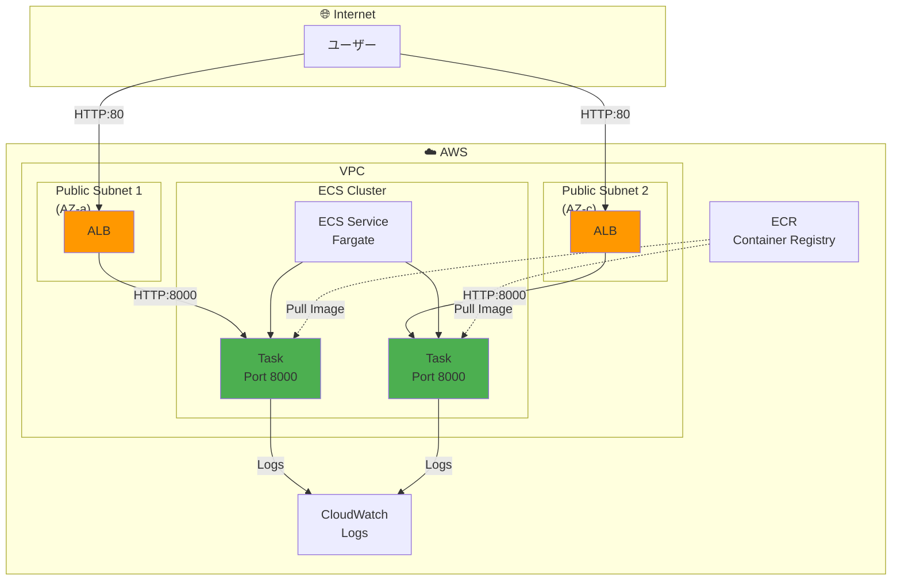
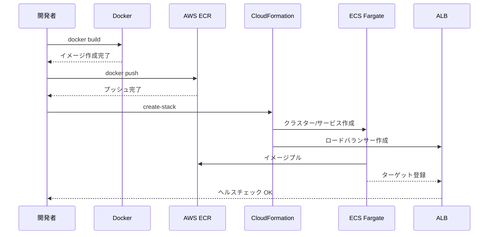

# AWS ECS Fargate デプロイガイド

> **ドキュメントバージョン**: 1.1.0  
> **最終更新日**: 2025-12-30  
> **ステータス**: Active

Django REST Framework アプリケーションを AWS ECS Fargate にデプロイするためのガイドです。

## 目次

1. [前提条件](#前提条件)
2. [アーキテクチャ](#アーキテクチャ)
3. [デプロイ手順](#デプロイ手順)
4. [トラブルシューティング](#トラブルシューティング)
5. [よくあるエラーと解決方法](#よくあるエラーと解決方法)
6. [関連ドキュメント](#関連ドキュメント)

---

## 前提条件

### 必要なツール

```bash
# AWS CLI
aws --version  # v2.x 推奨

# Docker
docker --version

# jq (JSON処理用)
jq --version
```

### AWS CLI 設定

```bash
# 設定確認
aws configure list

# リージョン確認（重要！）
aws configure get region
```

### 必要なIAMポリシー

デプロイには以下のアクションが必要です：

- `ecr:*` - ECRリポジトリ操作
- `ecs:*` - ECSクラスター/サービス操作
- `ec2:*` - VPC/サブネット/セキュリティグループ
- `elasticloadbalancing:*` - ALB操作
- `logs:*` - CloudWatch Logs
- `iam:*` - IAMロール作成
- `cloudformation:*` - スタック操作

---

## アーキテクチャ

### システム構成図



### デプロイフロー



---

## デプロイ手順

### 1. ECRリポジトリ作成

```bash
# リポジトリ作成
aws ecr create-repository \
  --repository-name task-management-api \
  --region us-east-1

# 出力からURIを確認
# 例: 123456789012.dkr.ecr.us-east-1.amazonaws.com/task-management-api
```

### 2. Dockerイメージのビルドとプッシュ

```bash
# ECRにログイン
aws ecr get-login-password --region us-east-1 | \
  docker login --username AWS --password-stdin \
  123456789012.dkr.ecr.us-east-1.amazonaws.com

# イメージビルド（AMD64アーキテクチャ指定）
docker build --platform linux/amd64 -t task-management-api:latest ./backend

# タグ付け
docker tag task-management-api:latest \
  123456789012.dkr.ecr.us-east-1.amazonaws.com/task-management-api:latest

# プッシュ
docker push 123456789012.dkr.ecr.us-east-1.amazonaws.com/task-management-api:latest
```

### 3. CloudFormationでインフラデプロイ

```bash
# スタック作成
aws cloudformation create-stack \
  --stack-name task-management-api \
  --template-body file://aws/cloudformation/ecs-fargate.yaml \
  --capabilities CAPABILITY_NAMED_IAM \
  --parameters ParameterKey=ContainerImage,ParameterValue=123456789012.dkr.ecr.us-east-1.amazonaws.com/task-management-api:latest

# 作成完了を待機
aws cloudformation wait stack-create-complete --stack-name task-management-api

# ALB URLを取得
aws cloudformation describe-stacks \
  --stack-name task-management-api \
  --query 'Stacks[0].Outputs[?OutputKey==`ALBDNS`].OutputValue' \
  --output text
```

### 4. 動作確認

```bash
# ヘルスチェック
curl http://<ALB_DNS>/api/v1/auth/register

# ユーザー登録テスト
curl -X POST http://<ALB_DNS>/api/v1/auth/register \
  -H "Content-Type: application/json" \
  -d '{"email":"test@example.com","password":"TestPass123","name":"Test User"}'
```

---

## トラブルシューティング

### ECSサービスの状態確認

```bash
# サービス状態
aws ecs describe-services \
  --cluster task-management-api-cluster \
  --services task-management-api-service \
  --query 'services[0].{status:status,runningCount:runningCount,desiredCount:desiredCount,events:events[0:3]}'

# タスク一覧
aws ecs list-tasks \
  --cluster task-management-api-cluster \
  --service-name task-management-api-service

# タスク詳細
aws ecs describe-tasks \
  --cluster task-management-api-cluster \
  --tasks <task-arn>
```

### CloudWatch Logsの確認

```bash
# 最新のログを取得
aws logs tail /ecs/task-management-api --follow
```

### CloudFormationイベント確認

```bash
# 失敗したリソースを確認
aws cloudformation describe-stack-events \
  --stack-name task-management-api \
  --query 'StackEvents[?ResourceStatus==`CREATE_FAILED`].[LogicalResourceId,ResourceStatusReason]'
```

---

## よくあるエラーと解決方法

### 1. CannotPullContainerError: 403 Forbidden

**原因**: ECRイメージとECSのリージョンが一致していない

**確認方法**:
```bash
# AWS CLIのデフォルトリージョン
aws configure get region

# ECRリポジトリのリージョン（URLに含まれる）
# 例: 123456789012.dkr.ecr.ap-northeast-1.amazonaws.com ← ap-northeast-1
```

**解決方法**:
```bash
# 同じリージョンにECRリポジトリを作成
aws ecr create-repository --repository-name task-management-api --region us-east-1

# イメージを再プッシュ
docker tag task-management-api:latest 123456789012.dkr.ecr.us-east-1.amazonaws.com/task-management-api:latest
docker push 123456789012.dkr.ecr.us-east-1.amazonaws.com/task-management-api:latest
```

### 2. InsufficientCapabilitiesException: CAPABILITY_NAMED_IAM

**原因**: CloudFormationでIAMリソースを作成するための権限が不足

**解決方法**:
```bash
# --capabilities に CAPABILITY_NAMED_IAM を指定
aws cloudformation create-stack \
  --capabilities CAPABILITY_NAMED_IAM \
  ...
```

### 3. Parameters: [XXX] must have values

**原因**: 必須パラメータが不足

**確認方法**:
```bash
# テンプレートのパラメータを確認
grep -A10 "Parameters:" aws/cloudformation/ecs-fargate.yaml
```

**解決方法**:
```bash
# 必要なパラメータを指定
--parameters ParameterKey=ContainerImage,ParameterValue=<ECR_IMAGE_URI>
```

### 4. タスクが起動しない (runningCount: 0)

**確認手順**:
```bash
# 1. サービスイベントを確認
aws ecs describe-services --cluster <cluster> --services <service> \
  --query 'services[0].events[0:5]'

# 2. 停止したタスクの理由を確認
aws ecs describe-tasks --cluster <cluster> --tasks <task-arn> \
  --query 'tasks[0].stoppedReason'

# 3. CloudWatch Logsを確認
aws logs tail /ecs/<app-name> --since 30m
```

**よくある原因**:
- ヘルスチェック失敗 → ALBターゲットグループの設定確認
- メモリ不足 → タスク定義のメモリを増やす
- アプリケーションエラー → ログを確認

### 5. ALBヘルスチェック失敗

**確認方法**:
```bash
# ターゲットグループの状態
aws elbv2 describe-target-health \
  --target-group-arn <target-group-arn>
```

**解決方法**:
- ヘルスチェックパスを確認 (`/api/v1/` など)
- コンテナのポートが正しいか確認 (8000)
- セキュリティグループでALBからのアクセスを許可

---

## Dockerfile例

```dockerfile
FROM python:3.10-slim

WORKDIR /app

# 依存関係インストール
COPY requirements.txt .
RUN pip install --no-cache-dir -r requirements.txt

# アプリケーションコピー
COPY . .

# 静的ファイル収集とマイグレーション
RUN python manage.py collectstatic --noinput

# ポート公開
EXPOSE 8000

# 起動コマンド
CMD ["sh", "-c", "python manage.py migrate && gunicorn config.wsgi:application --bind 0.0.0.0:8000"]
```

---

## requirements.txt例

```
django>=5.0
djangorestframework>=3.14
djangorestframework-simplejwt>=5.3
django-cors-headers>=4.3
gunicorn>=21.0
```

---

## スタック削除

```bash
# スタック削除
aws cloudformation delete-stack --stack-name task-management-api

# 削除完了を待機
aws cloudformation wait stack-delete-complete --stack-name task-management-api

# ECRリポジトリ削除（イメージも含めて）
aws ecr delete-repository \
  --repository-name task-management-api \
  --force
```

---

## チェックリスト

デプロイ前:
- [ ] AWS CLIが正しく設定されている
- [ ] デフォルトリージョンを確認した
- [ ] 必要なIAMポリシーがアタッチされている
- [ ] Dockerfileが正しく動作する
- [ ] ローカルでテストが通過している

デプロイ時:
- [ ] ECRリポジトリとCloudFormationが同じリージョン
- [ ] `--capabilities CAPABILITY_NAMED_IAM` を指定
- [ ] 正しいイメージURIをパラメータに指定

デプロイ後:
- [ ] ECSサービスの runningCount が desiredCount と一致
- [ ] ALBヘルスチェックが healthy
- [ ] APIエンドポイントにアクセスできる

---

## 関連ドキュメント

| ドキュメント | パス | 説明 |
|-------------|------|------|
| システム概要 | [../overview.md](../overview.md) | システム全体の概要 |
| ガイドインデックス | [index.md](./index.md) | ガイド一覧 |
| OpenAPI→Django変換ガイド | [openapi-to-django.md](./openapi-to-django.md) | Django実装方法 |
| CloudFormationテンプレート | `aws/cloudformation/ecs-fargate.yaml` | ECS構築用テンプレート |
| IAMポリシー | `aws/policies/` | 各種IAMポリシー定義 |

---

## 変更履歴

| バージョン | 日付 | 変更内容 |
|-----------|------|----------|
| 1.1.0 | 2025-12-30 | mermaid図への変換、関連ドキュメントセクション追加 |
| 1.0.0 | 2024-12-29 | 初版作成 |

---

**作成日**: 2024-12-29  
**最終更新日**: 2025-12-30  
**メンテナー**: auto_deploy プロジェクトチーム
