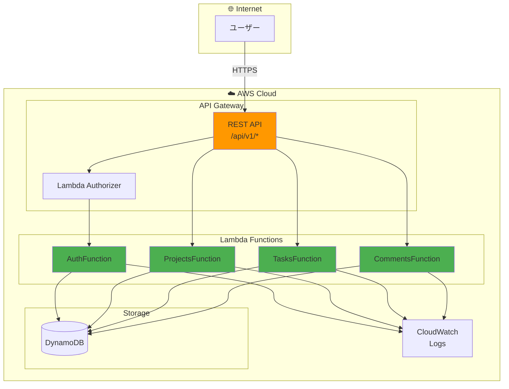
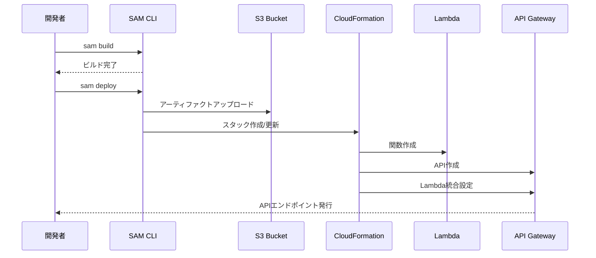

# AWS API Gateway + Lambda デプロイガイド

> **ドキュメントバージョン**: 1.0.0  
> **最終更新日**: 2025-12-30  
> **ステータス**: Active

AWS SAM (Serverless Application Model) を使用して、サーバーレスAPIをAPI Gateway + Lambdaにデプロイするためのガイドです。

## 目次

1. [前提条件](#前提条件)
2. [アーキテクチャ](#アーキテクチャ)
3. [デプロイ手順](#デプロイ手順)
4. [トラブルシューティング](#トラブルシューティング)
5. [よくあるエラーと解決方法](#よくあるエラーと解決方法)
6. [関連ドキュメント](#関連ドキュメント)

---

## 前提条件

### 必要なツール

```bash
# AWS CLI
aws --version  # v2.x 推奨

# SAM CLI
sam --version  # v1.90.0 以上推奨

# Python
python --version  # 3.11 推奨

# Docker (ローカルテスト用)
docker --version
```

### SAM CLIのインストール

```bash
# macOS
brew install aws-sam-cli

# Linux
pip install aws-sam-cli

# 確認
sam --version
```

### AWS CLI 設定

```bash
# 設定確認
aws configure list

# リージョン確認
aws configure get region
```

### 必要なIAMポリシー

デプロイには以下のアクションが必要です：

- `lambda:*` - Lambda関数操作
- `apigateway:*` - API Gateway操作
- `dynamodb:*` - DynamoDBテーブル操作
- `iam:*` - IAMロール作成
- `cloudformation:*` - スタック操作
- `s3:*` - デプロイアーティファクト保存

---

## アーキテクチャ

### システム構成図



### デプロイフロー



---

## デプロイ手順

### 1. プロジェクト構成確認

```
lambda/
├── template.yaml          # SAMテンプレート
├── samconfig.toml         # SAM設定（sam deploy --guided で生成）
├── requirements.txt
├── src/
│   ├── handlers/
│   │   ├── __init__.py
│   │   ├── auth.py
│   │   ├── projects.py
│   │   └── tasks.py
│   ├── models/
│   ├── services/
│   └── shared/
└── tests/
```

### 2. template.yaml 作成

```yaml
AWSTemplateFormatVersion: '2010-09-09'
Transform: AWS::Serverless-2016-10-31
Description: Task Management API - Serverless

Globals:
  Function:
    Timeout: 30
    Runtime: python3.11
    Architectures:
      - x86_64
    MemorySize: 256
    Environment:
      Variables:
        TABLE_NAME: !Ref DynamoDBTable
        LOG_LEVEL: INFO

Parameters:
  Environment:
    Type: String
    Default: dev
    AllowedValues:
      - dev
      - staging
      - prod
  JwtSecret:
    Type: String
    NoEcho: true
    Description: JWT signing secret

Resources:
  # ========================================
  # API Gateway
  # ========================================
  ApiGateway:
    Type: AWS::Serverless::Api
    Properties:
      Name: !Sub ${AWS::StackName}-api
      StageName: !Ref Environment
      Cors:
        AllowMethods: "'GET,POST,PUT,PATCH,DELETE,OPTIONS'"
        AllowHeaders: "'Content-Type,Authorization'"
        AllowOrigin: "'*'"
      Auth:
        DefaultAuthorizer: LambdaAuthorizer
        AddDefaultAuthorizerToCorsPreflight: false
        Authorizers:
          LambdaAuthorizer:
            FunctionArn: !GetAtt AuthorizerFunction.Arn
            Identity:
              Headers:
                - Authorization

  # ========================================
  # DynamoDB
  # ========================================
  DynamoDBTable:
    Type: AWS::DynamoDB::Table
    Properties:
      TableName: !Sub ${AWS::StackName}-table
      BillingMode: PAY_PER_REQUEST
      AttributeDefinitions:
        - AttributeName: PK
          AttributeType: S
        - AttributeName: SK
          AttributeType: S
        - AttributeName: GSI1PK
          AttributeType: S
        - AttributeName: GSI1SK
          AttributeType: S
      KeySchema:
        - AttributeName: PK
          KeyType: HASH
        - AttributeName: SK
          KeyType: RANGE
      GlobalSecondaryIndexes:
        - IndexName: GSI1
          KeySchema:
            - AttributeName: GSI1PK
              KeyType: HASH
            - AttributeName: GSI1SK
              KeyType: RANGE
          Projection:
            ProjectionType: ALL
      Tags:
        - Key: Environment
          Value: !Ref Environment

  # ========================================
  # Lambda Functions
  # ========================================
  
  # Authorizer
  AuthorizerFunction:
    Type: AWS::Serverless::Function
    Properties:
      FunctionName: !Sub ${AWS::StackName}-authorizer
      CodeUri: src/
      Handler: handlers.auth.authorizer_handler
      Environment:
        Variables:
          JWT_SECRET: !Ref JwtSecret

  # Auth Endpoints (Public)
  AuthFunction:
    Type: AWS::Serverless::Function
    Properties:
      FunctionName: !Sub ${AWS::StackName}-auth
      CodeUri: src/
      Handler: handlers.auth.lambda_handler
      Policies:
        - DynamoDBCrudPolicy:
            TableName: !Ref DynamoDBTable
      Events:
        Register:
          Type: Api
          Properties:
            RestApiId: !Ref ApiGateway
            Path: /auth/register
            Method: POST
            Auth:
              Authorizer: NONE
        Login:
          Type: Api
          Properties:
            RestApiId: !Ref ApiGateway
            Path: /auth/login
            Method: POST
            Auth:
              Authorizer: NONE
        Refresh:
          Type: Api
          Properties:
            RestApiId: !Ref ApiGateway
            Path: /auth/refresh
            Method: POST
            Auth:
              Authorizer: NONE

  # Projects
  ProjectsFunction:
    Type: AWS::Serverless::Function
    Properties:
      FunctionName: !Sub ${AWS::StackName}-projects
      CodeUri: src/
      Handler: handlers.projects.lambda_handler
      Policies:
        - DynamoDBCrudPolicy:
            TableName: !Ref DynamoDBTable
      Events:
        List:
          Type: Api
          Properties:
            RestApiId: !Ref ApiGateway
            Path: /projects
            Method: GET
        Create:
          Type: Api
          Properties:
            RestApiId: !Ref ApiGateway
            Path: /projects
            Method: POST
        Get:
          Type: Api
          Properties:
            RestApiId: !Ref ApiGateway
            Path: /projects/{projectId}
            Method: GET
        Update:
          Type: Api
          Properties:
            RestApiId: !Ref ApiGateway
            Path: /projects/{projectId}
            Method: PUT
        Delete:
          Type: Api
          Properties:
            RestApiId: !Ref ApiGateway
            Path: /projects/{projectId}
            Method: DELETE

  # Tasks
  TasksFunction:
    Type: AWS::Serverless::Function
    Properties:
      FunctionName: !Sub ${AWS::StackName}-tasks
      CodeUri: src/
      Handler: handlers.tasks.lambda_handler
      Policies:
        - DynamoDBCrudPolicy:
            TableName: !Ref DynamoDBTable
      Events:
        List:
          Type: Api
          Properties:
            RestApiId: !Ref ApiGateway
            Path: /projects/{projectId}/tasks
            Method: GET
        Create:
          Type: Api
          Properties:
            RestApiId: !Ref ApiGateway
            Path: /projects/{projectId}/tasks
            Method: POST
        Get:
          Type: Api
          Properties:
            RestApiId: !Ref ApiGateway
            Path: /tasks/{taskId}
            Method: GET
        Update:
          Type: Api
          Properties:
            RestApiId: !Ref ApiGateway
            Path: /tasks/{taskId}
            Method: PUT
        Delete:
          Type: Api
          Properties:
            RestApiId: !Ref ApiGateway
            Path: /tasks/{taskId}
            Method: DELETE

Outputs:
  ApiEndpoint:
    Description: API Gateway endpoint URL
    Value: !Sub https://${ApiGateway}.execute-api.${AWS::Region}.amazonaws.com/${Environment}
  DynamoDBTableName:
    Description: DynamoDB Table Name
    Value: !Ref DynamoDBTable
```

### 3. SAMビルド

```bash
cd lambda

# ビルド
sam build

# ビルド結果確認
ls -la .aws-sam/build/
```

### 4. ローカルテスト

```bash
# ローカルAPI起動
sam local start-api

# 別ターミナルでテスト
curl http://localhost:3000/auth/register \
  -X POST \
  -H "Content-Type: application/json" \
  -d '{"email":"test@example.com","password":"TestPass123","name":"Test User"}'

# 単一関数のテスト
sam local invoke ProjectsFunction \
  --event events/list_projects.json
```

### 5. デプロイ

```bash
# 初回デプロイ（対話式）
sam deploy --guided

# 以下の質問に回答
# Stack Name: task-management-api-serverless
# AWS Region: us-east-1
# Parameter Environment: dev
# Parameter JwtSecret: <your-secret-key>
# Confirm changes before deploy: y
# Allow SAM CLI IAM role creation: y
# Save arguments to samconfig.toml: y

# 2回目以降
sam deploy
```

### 6. 動作確認

```bash
# APIエンドポイント取得
API_URL=$(aws cloudformation describe-stacks \
  --stack-name task-management-api-serverless \
  --query 'Stacks[0].Outputs[?OutputKey==`ApiEndpoint`].OutputValue' \
  --output text)

echo $API_URL

# ユーザー登録
curl -X POST ${API_URL}/auth/register \
  -H "Content-Type: application/json" \
  -d '{"email":"test@example.com","password":"TestPass123","name":"Test User"}'

# ログイン
TOKEN=$(curl -s -X POST ${API_URL}/auth/login \
  -H "Content-Type: application/json" \
  -d '{"email":"test@example.com","password":"TestPass123"}' \
  | jq -r '.data.accessToken')

# プロジェクト作成
curl -X POST ${API_URL}/projects \
  -H "Content-Type: application/json" \
  -H "Authorization: Bearer $TOKEN" \
  -d '{"name":"Test Project","description":"My first project"}'
```

---

## トラブルシューティング

### Lambda関数のログ確認

```bash
# CloudWatch Logsを確認
sam logs -n ProjectsFunction --stack-name task-management-api-serverless --tail

# 特定の期間のログ
sam logs -n ProjectsFunction --stack-name task-management-api-serverless \
  --start-time "5min ago"
```

### スタックイベント確認

```bash
# CloudFormationイベント
aws cloudformation describe-stack-events \
  --stack-name task-management-api-serverless \
  --query 'StackEvents[?ResourceStatus==`CREATE_FAILED`].[LogicalResourceId,ResourceStatusReason]'
```

### API Gateway テスト

```bash
# API Gatewayのステージ確認
aws apigateway get-stages \
  --rest-api-id <api-id>

# デプロイメント確認
aws apigateway get-deployments \
  --rest-api-id <api-id>
```

---

## よくあるエラーと解決方法

### 1. SAM build失敗: Requirements.txt not found

**原因**: requirements.txtが見つからない

**解決方法**:
```bash
# requirements.txtをsrc/に配置
cp requirements.txt src/

# または template.yaml で CodeUri を修正
```

### 2. Lambda関数のImportError

**原因**: 依存パッケージが含まれていない

**解決方法**:
```bash
# requirements.txtを確認
cat src/requirements.txt

# 再ビルド
sam build --use-container
```

### 3. API Gateway 403 Forbidden

**原因**: Lambda Authorizerのエラー

**確認方法**:
```bash
# Authorizerのログを確認
sam logs -n AuthorizerFunction --stack-name task-management-api-serverless --tail
```

**解決方法**:
- JWTシークレットが正しいか確認
- トークンの形式が正しいか確認（`Bearer <token>`）

### 4. DynamoDB AccessDeniedException

**原因**: Lambda関数にDynamoDBへのアクセス権限がない

**解決方法**:
```yaml
# template.yaml でポリシーを追加
Policies:
  - DynamoDBCrudPolicy:
      TableName: !Ref DynamoDBTable
```

### 5. コールドスタート遅延

**原因**: Lambda関数の初期化に時間がかかる

**解決方法**:
```yaml
# Provisioned Concurrencyを設定
ProvisionedConcurrencyConfig:
  ProvisionedConcurrentExecutions: 1

# または、関数をウォームアップ
# EventBridge Schedulerで定期的に呼び出し
```

### 6. API Gateway タイムアウト

**原因**: Lambda関数の実行時間がAPI Gatewayのタイムアウト（29秒）を超過

**解決方法**:
- 処理を最適化
- 非同期処理に変更（Step Functions等）
- Lambda関数のタイムアウトを確認（デフォルト3秒）

---

## スタック削除

```bash
# スタック削除
sam delete --stack-name task-management-api-serverless

# または CloudFormation から
aws cloudformation delete-stack --stack-name task-management-api-serverless

# 削除完了を待機
aws cloudformation wait stack-delete-complete \
  --stack-name task-management-api-serverless
```

**注意**: DynamoDBテーブルはデフォルトで削除されます。本番環境では `DeletionPolicy: Retain` を設定してください。

---

## チェックリスト

デプロイ前:
- [ ] SAM CLIがインストールされている
- [ ] AWS CLIが正しく設定されている
- [ ] Dockerが起動している（ローカルテスト用）
- [ ] JWTシークレットが準備されている
- [ ] ローカルテストが通過している

デプロイ時:
- [ ] 正しい環境（dev/staging/prod）を指定
- [ ] パラメータ（JwtSecret等）を正しく設定
- [ ] IAMロール作成を許可

デプロイ後:
- [ ] APIエンドポイントにアクセスできる
- [ ] 認証が正しく動作する
- [ ] DynamoDBにデータが保存される
- [ ] CloudWatch Logsにログが出力される

---

## 関連ドキュメント

| ドキュメント | パス | 説明 |
|-------------|------|------|
| システム概要 | [../overview.md](../overview.md) | システム全体の概要 |
| ガイドインデックス | [index.md](./index.md) | ガイド一覧 |
| OpenAPI→Lambda変換ガイド | [openapi-to-lambda.md](./openapi-to-lambda.md) | Lambda実装方法 |
| SAMテンプレート | `aws/sam/template.yaml` | SAMテンプレートサンプル |

---

## 変更履歴

| バージョン | 日付 | 変更内容 |
|-----------|------|----------|
| 1.0.0 | 2025-12-30 | 初版作成 |

---

**作成日**: 2025-12-30  
**メンテナー**: auto_deploy プロジェクトチーム
