# AWS API Gateway + Lambda デプロイガイド

> **ドキュメントバージョン**: 1.1.0  
> **最終更新日**: 2025-12-30  
> **ステータス**: Active

AWS SAM (Serverless Application Model) を使用して、サーバーレスAPIをAPI Gateway + Lambdaにデプロイするためのガイドです。

> **認証方式**: Amazon Cognitoを使用したJWT認証

## 目次

1. [前提条件](#前提条件)
2. [アーキテクチャ](#アーキテクチャ)
3. [デプロイ手順](#デプロイ手順)
4. [トラブルシューティング](#トラブルシューティング)
5. [よくあるエラーと解決方法](#よくあるエラーと解決方法)
6. [関連ドキュメント](#関連ドキュメント)

---

## 前提条件

### 必要なツール

```bash
# AWS CLI
aws --version  # v2.x 推奨

# SAM CLI
sam --version  # v1.90.0 以上推奨

# Python
python --version  # 3.11 推奨

# Docker (ローカルテスト用)
docker --version
```

### SAM CLIのインストール

```bash
# macOS
brew install aws-sam-cli

# Linux
pip install aws-sam-cli

# 確認
sam --version
```

### AWS CLI 設定

```bash
# 設定確認
aws configure list

# リージョン確認
aws configure get region
```

### 必要なIAMポリシー

デプロイには以下のアクションが必要です：

- `lambda:*` - Lambda関数操作
- `apigateway:*` - API Gateway操作
- `dynamodb:*` - DynamoDBテーブル操作
- `iam:*` - IAMロール作成
- `cloudformation:*` - スタック操作
- `s3:*` - デプロイアーティファクト保存

---

## アーキテクチャ

### システム構成図

```mermaid
flowchart TB
    subgraph Internet["🌐 Internet"]
        User[ユーザー]
    end
    
    subgraph AWS["☁️ AWS Cloud"]
        subgraph Auth["認証"]
            Cognito[Amazon Cognito<br>User Pool]
        end
        
        subgraph APIGW["API Gateway"]
            REST[REST API<br>/api/v1/*]
            CogAuth[Cognito Authorizer]
        end
        
        subgraph Lambda["Lambda Functions"]
            L1[AuthFunction<br>Cognito操作]
            L2[ProjectsFunction]
            L3[TasksFunction]
            L4[CommentsFunction]
        end
        
        subgraph Storage["Storage"]
            DDB[(DynamoDB)]
        end
        
        CW[CloudWatch<br>Logs]
    end
    
    User -->|1. サインイン| Cognito
    Cognito -->|2. JWT Token| User
    User -->|3. API + Token| REST
    REST --> CogAuth
    CogAuth -->|4. トークン検証| Cognito
    CogAuth --> L1
    CogAuth --> L2
    CogAuth --> L3
    CogAuth --> L4
    L1 --> Cognito
    L2 --> DDB
    L3 --> DDB
    L4 --> DDB
    L1 --> CW
    L2 --> CW
    L3 --> CW
    L4 --> CW
    
    style Cognito fill:#ff9800
    style REST fill:#2196f3
    style L1 fill:#4caf50
    style L2 fill:#4caf50
    style L3 fill:#4caf50
    style L4 fill:#4caf50
```



### デプロイフロー

```mermaid
sequenceDiagram
    participant Dev as 開発者
    participant SAM as SAM CLI
    participant S3 as S3 Bucket
    participant CF as CloudFormation
    participant Lambda as Lambda
    participant APIGW as API Gateway
    
    Dev->>SAM: sam build
    SAM-->>Dev: ビルド完了
    Dev->>SAM: sam deploy
    SAM->>S3: アーティファクトアップロード
    SAM->>CF: スタック作成/更新
    CF->>Lambda: 関数作成
    CF->>APIGW: API作成
    CF->>APIGW: Lambda統合設定
    APIGW-->>Dev: APIエンドポイント発行
```



---

## デプロイ手順

### 1. プロジェクト構成確認

```
lambda/
├── template.yaml          # SAMテンプレート
├── samconfig.toml         # SAM設定（sam deploy --guided で生成）
├── requirements.txt
├── src/
│   ├── handlers/
│   │   ├── __init__.py
│   │   ├── auth.py
│   │   ├── projects.py
│   │   └── tasks.py
│   ├── models/
│   ├── services/
│   └── shared/
└── tests/
```

### 2. template.yaml 作成

```yaml
AWSTemplateFormatVersion: '2010-09-09'
Transform: AWS::Serverless-2016-10-31
Description: Task Management API - Serverless with Cognito Auth

Globals:
  Function:
    Timeout: 30
    Runtime: python3.11
    Architectures:
      - x86_64
    MemorySize: 256
    Environment:
      Variables:
        TABLE_NAME: !Ref DynamoDBTable
        COGNITO_USER_POOL_ID: !Ref CognitoUserPool
        COGNITO_CLIENT_ID: !Ref CognitoUserPoolClient
        LOG_LEVEL: INFO

Parameters:
  Environment:
    Type: String
    Default: dev
    AllowedValues:
      - dev
      - staging
      - prod

Resources:
  # ========================================
  # Amazon Cognito
  # ========================================
  CognitoUserPool:
    Type: AWS::Cognito::UserPool
    Properties:
      UserPoolName: !Sub ${AWS::StackName}-user-pool
      AutoVerifiedAttributes:
        - email
      UsernameAttributes:
        - email
      Policies:
        PasswordPolicy:
          MinimumLength: 8
          RequireLowercase: true
          RequireNumbers: true
          RequireSymbols: false
          RequireUppercase: true
      Schema:
        - Name: email
          Required: true
          Mutable: true
        - Name: name
          Required: false
          Mutable: true
      AccountRecoverySetting:
        RecoveryMechanisms:
          - Name: verified_email
            Priority: 1

  CognitoUserPoolClient:
    Type: AWS::Cognito::UserPoolClient
    Properties:
      ClientName: !Sub ${AWS::StackName}-client
      UserPoolId: !Ref CognitoUserPool
      GenerateSecret: false
      ExplicitAuthFlows:
        - ALLOW_USER_PASSWORD_AUTH
        - ALLOW_REFRESH_TOKEN_AUTH
        - ALLOW_USER_SRP_AUTH
      PreventUserExistenceErrors: ENABLED
      SupportedIdentityProviders:
        - COGNITO
      AllowedOAuthFlows:
        - implicit
      AllowedOAuthScopes:
        - email
        - openid
        - profile
      CallbackURLs:
        - http://localhost:3000/callback
      LogoutURLs:
        - http://localhost:3000/logout

  # ========================================
  # API Gateway
  # ========================================
  ApiGateway:
    Type: AWS::Serverless::Api
    Properties:
      Name: !Sub ${AWS::StackName}-api
      StageName: !Ref Environment
      Cors:
        AllowMethods: "'GET,POST,PUT,PATCH,DELETE,OPTIONS'"
        AllowHeaders: "'Content-Type,Authorization'"
        AllowOrigin: "'*'"
      Auth:
        DefaultAuthorizer: CognitoAuthorizer
        AddDefaultAuthorizerToCorsPreflight: false
        Authorizers:
          CognitoAuthorizer:
            UserPoolArn: !GetAtt CognitoUserPool.Arn

  # ========================================
  # DynamoDB
  # ========================================
  DynamoDBTable:
    Type: AWS::DynamoDB::Table
    Properties:
      TableName: !Sub ${AWS::StackName}-table
      BillingMode: PAY_PER_REQUEST
      AttributeDefinitions:
        - AttributeName: PK
          AttributeType: S
        - AttributeName: SK
          AttributeType: S
        - AttributeName: GSI1PK
          AttributeType: S
        - AttributeName: GSI1SK
          AttributeType: S
      KeySchema:
        - AttributeName: PK
          KeyType: HASH
        - AttributeName: SK
          KeyType: RANGE
      GlobalSecondaryIndexes:
        - IndexName: GSI1
          KeySchema:
            - AttributeName: GSI1PK
              KeyType: HASH
            - AttributeName: GSI1SK
              KeyType: RANGE
          Projection:
            ProjectionType: ALL
      Tags:
        - Key: Environment
          Value: !Ref Environment

  # ========================================
  # Lambda Functions
  # ========================================
  
  # Auth Endpoints (Public - Cognito操作)
  AuthFunction:
    Type: AWS::Serverless::Function
    Properties:
      FunctionName: !Sub ${AWS::StackName}-auth
      CodeUri: src/
      Handler: handlers.auth.lambda_handler
      Policies:
        - Version: '2012-10-17'
          Statement:
            - Effect: Allow
              Action:
                - cognito-idp:SignUp
                - cognito-idp:ConfirmSignUp
                - cognito-idp:InitiateAuth
                - cognito-idp:ForgotPassword
                - cognito-idp:ConfirmForgotPassword
                - cognito-idp:GlobalSignOut
              Resource: !GetAtt CognitoUserPool.Arn
      Events:
        SignUp:
          Type: Api
          Properties:
            RestApiId: !Ref ApiGateway
            Path: /auth/signup
            Method: POST
            Auth:
              Authorizer: NONE
        ConfirmSignUp:
          Type: Api
          Properties:
            RestApiId: !Ref ApiGateway
            Path: /auth/signup/confirm
            Method: POST
            Auth:
              Authorizer: NONE
        SignIn:
          Type: Api
          Properties:
            RestApiId: !Ref ApiGateway
            Path: /auth/signin
            Method: POST
            Auth:
              Authorizer: NONE
        Refresh:
          Type: Api
          Properties:
            RestApiId: !Ref ApiGateway
            Path: /auth/refresh
            Method: POST
            Auth:
              Authorizer: NONE
        SignOut:
          Type: Api
          Properties:
            RestApiId: !Ref ApiGateway
            Path: /auth/signout
            Method: POST

  # Projects
  ProjectsFunction:
    Type: AWS::Serverless::Function
    Properties:
      FunctionName: !Sub ${AWS::StackName}-projects
      CodeUri: src/
      Handler: handlers.projects.lambda_handler
      Policies:
        - DynamoDBCrudPolicy:
            TableName: !Ref DynamoDBTable
      Events:
        List:
          Type: Api
          Properties:
            RestApiId: !Ref ApiGateway
            Path: /projects
            Method: GET
        Create:
          Type: Api
          Properties:
            RestApiId: !Ref ApiGateway
            Path: /projects
            Method: POST
        Get:
          Type: Api
          Properties:
            RestApiId: !Ref ApiGateway
            Path: /projects/{projectId}
            Method: GET
        Update:
          Type: Api
          Properties:
            RestApiId: !Ref ApiGateway
            Path: /projects/{projectId}
            Method: PUT
        Delete:
          Type: Api
          Properties:
            RestApiId: !Ref ApiGateway
            Path: /projects/{projectId}
            Method: DELETE

  # Tasks
  TasksFunction:
    Type: AWS::Serverless::Function
    Properties:
      FunctionName: !Sub ${AWS::StackName}-tasks
      CodeUri: src/
      Handler: handlers.tasks.lambda_handler
      Policies:
        - DynamoDBCrudPolicy:
            TableName: !Ref DynamoDBTable
      Events:
        List:
          Type: Api
          Properties:
            RestApiId: !Ref ApiGateway
            Path: /projects/{projectId}/tasks
            Method: GET
        Create:
          Type: Api
          Properties:
            RestApiId: !Ref ApiGateway
            Path: /projects/{projectId}/tasks
            Method: POST
        Get:
          Type: Api
          Properties:
            RestApiId: !Ref ApiGateway
            Path: /tasks/{taskId}
            Method: GET
        Update:
          Type: Api
          Properties:
            RestApiId: !Ref ApiGateway
            Path: /tasks/{taskId}
            Method: PUT
        Delete:
          Type: Api
          Properties:
            RestApiId: !Ref ApiGateway
            Path: /tasks/{taskId}
            Method: DELETE

Outputs:
  ApiEndpoint:
    Description: API Gateway endpoint URL
    Value: !Sub https://${ApiGateway}.execute-api.${AWS::Region}.amazonaws.com/${Environment}
  DynamoDBTableName:
    Description: DynamoDB Table Name
    Value: !Ref DynamoDBTable
  CognitoUserPoolId:
    Description: Cognito User Pool ID
    Value: !Ref CognitoUserPool
  CognitoUserPoolClientId:
    Description: Cognito User Pool Client ID
    Value: !Ref CognitoUserPoolClient
  CognitoUserPoolArn:
    Description: Cognito User Pool ARN
    Value: !GetAtt CognitoUserPool.Arn
```

### 3. SAMビルド

```bash
cd lambda

# ビルド
sam build

# ビルド結果確認
ls -la .aws-sam/build/
```

### 4. ローカルテスト

```bash
# ローカルAPI起動
sam local start-api

# 別ターミナルでテスト
curl http://localhost:3000/auth/register \
  -X POST \
  -H "Content-Type: application/json" \
  -d '{"email":"test@example.com","password":"TestPass123","name":"Test User"}'

# 単一関数のテスト
sam local invoke ProjectsFunction \
  --event events/list_projects.json
```

### 5. デプロイ

```bash
# 初回デプロイ（対話式）
sam deploy --guided

# 以下の質問に回答
# Stack Name: task-management-api-serverless
# AWS Region: us-east-1
# Parameter Environment: dev
# Confirm changes before deploy: y
# Allow SAM CLI IAM role creation: y
# Save arguments to samconfig.toml: y

# 2回目以降
sam deploy
```

### 6. 動作確認

```bash
# 出力情報取得
STACK_NAME=task-management-api-serverless

API_URL=$(aws cloudformation describe-stacks \
  --stack-name $STACK_NAME \
  --query 'Stacks[0].Outputs[?OutputKey==`ApiEndpoint`].OutputValue' \
  --output text)

CLIENT_ID=$(aws cloudformation describe-stacks \
  --stack-name $STACK_NAME \
  --query 'Stacks[0].Outputs[?OutputKey==`CognitoUserPoolClientId`].OutputValue' \
  --output text)

echo "API URL: $API_URL"
echo "Client ID: $CLIENT_ID"

# ユーザー登録（Cognito経由）
curl -X POST ${API_URL}/auth/signup \
  -H "Content-Type: application/json" \
  -d '{"email":"test@example.com","password":"TestPass123!","name":"Test User"}'

# メール確認コード入力（実際のメールで受信したコードを使用）
curl -X POST ${API_URL}/auth/signup/confirm \
  -H "Content-Type: application/json" \
  -d '{"email":"test@example.com","confirmation_code":"123456"}'

# サインイン
TOKENS=$(curl -s -X POST ${API_URL}/auth/signin \
  -H "Content-Type: application/json" \
  -d '{"email":"test@example.com","password":"TestPass123!"}')

# ID Token を使用（Cognito Authorizerの場合）
TOKEN=$(echo $TOKENS | jq -r '.data.id_token')

# プロジェクト作成
curl -X POST ${API_URL}/projects \
  -H "Content-Type: application/json" \
  -H "Authorization: Bearer $TOKEN" \
  -d '{"name":"Test Project","description":"My first project"}'
```

---

## トラブルシューティング

### Lambda関数のログ確認

```bash
# CloudWatch Logsを確認
sam logs -n ProjectsFunction --stack-name task-management-api-serverless --tail

# 特定の期間のログ
sam logs -n ProjectsFunction --stack-name task-management-api-serverless \
  --start-time "5min ago"
```

### スタックイベント確認

```bash
# CloudFormationイベント
aws cloudformation describe-stack-events \
  --stack-name task-management-api-serverless \
  --query 'StackEvents[?ResourceStatus==`CREATE_FAILED`].[LogicalResourceId,ResourceStatusReason]'
```

### API Gateway テスト

```bash
# API Gatewayのステージ確認
aws apigateway get-stages \
  --rest-api-id <api-id>

# デプロイメント確認
aws apigateway get-deployments \
  --rest-api-id <api-id>
```

---

## よくあるエラーと解決方法

### 1. SAM build失敗: Requirements.txt not found

**原因**: requirements.txtが見つからない

**解決方法**:
```bash
# requirements.txtをsrc/に配置
cp requirements.txt src/

# または template.yaml で CodeUri を修正
```

### 2. Lambda関数のImportError

**原因**: 依存パッケージが含まれていない

**解決方法**:
```bash
# requirements.txtを確認
cat src/requirements.txt

# 再ビルド
sam build --use-container
```

### 3. API Gateway 401 Unauthorized（Cognito認証エラー）

**原因**: Cognitoトークンが無効または期限切れ

**確認方法**:
```bash
# トークンのデコード確認（jwt.ioなどで確認）
# または AWS CLI で確認
aws cognito-idp get-user --access-token $TOKEN
```

**解決方法**:
- ID Token を使用しているか確認（Cognito Authorizer は ID Token を検証）
- トークンの有効期限を確認
- User Pool ID と Client ID が正しいか確認

### 4. Cognito サインアップエラー: InvalidPasswordException

**原因**: パスワードがポリシーを満たしていない

**解決方法**:
- 8文字以上
- 大文字を含む
- 小文字を含む
- 数字を含む
- 特殊文字を含む（設定による）

### 5. DynamoDB AccessDeniedException

**原因**: Lambda関数にDynamoDBへのアクセス権限がない

**解決方法**:
```yaml
# template.yaml でポリシーを追加
Policies:
  - DynamoDBCrudPolicy:
      TableName: !Ref DynamoDBTable
```

### 6. コールドスタート遅延

**原因**: Lambda関数の初期化に時間がかかる

**解決方法**:
```yaml
# Provisioned Concurrencyを設定
ProvisionedConcurrencyConfig:
  ProvisionedConcurrentExecutions: 1

# または、関数をウォームアップ
# EventBridge Schedulerで定期的に呼び出し
```

### 6. API Gateway タイムアウト

**原因**: Lambda関数の実行時間がAPI Gatewayのタイムアウト（29秒）を超過

**解決方法**:
- 処理を最適化
- 非同期処理に変更（Step Functions等）
- Lambda関数のタイムアウトを確認（デフォルト3秒）

---

## スタック削除

```bash
# スタック削除
sam delete --stack-name task-management-api-serverless

# または CloudFormation から
aws cloudformation delete-stack --stack-name task-management-api-serverless

# 削除完了を待機
aws cloudformation wait stack-delete-complete \
  --stack-name task-management-api-serverless
```

**注意**: DynamoDBテーブルはデフォルトで削除されます。本番環境では `DeletionPolicy: Retain` を設定してください。

---

## チェックリスト

デプロイ前:
- [ ] SAM CLIがインストールされている
- [ ] AWS CLIが正しく設定されている
- [ ] Dockerが起動している（ローカルテスト用）
- [ ] JWTシークレットが準備されている
- [ ] ローカルテストが通過している

デプロイ時:
- [ ] 正しい環境（dev/staging/prod）を指定
- [ ] パラメータ（JwtSecret等）を正しく設定
- [ ] IAMロール作成を許可

デプロイ後:
- [ ] APIエンドポイントにアクセスできる
- [ ] 認証が正しく動作する
- [ ] DynamoDBにデータが保存される
- [ ] CloudWatch Logsにログが出力される

---

## 関連ドキュメント

| ドキュメント | パス | 説明 |
|-------------|------|------|
| システム概要 | [../overview.md](../overview.md) | システム全体の概要 |
| ガイドインデックス | [index.md](./index.md) | ガイド一覧 |
| OpenAPI→Lambda変換ガイド | [openapi-to-lambda.md](./openapi-to-lambda.md) | Lambda実装方法 |
| SAMテンプレート | `aws/sam/template.yaml` | SAMテンプレートサンプル |

---

## 変更履歴

| バージョン | 日付 | 変更内容 |
|-----------|------|----------|
| 1.0.0 | 2025-12-30 | 初版作成 |

---

**作成日**: 2025-12-30  
**メンテナー**: auto_deploy プロジェクトチーム
