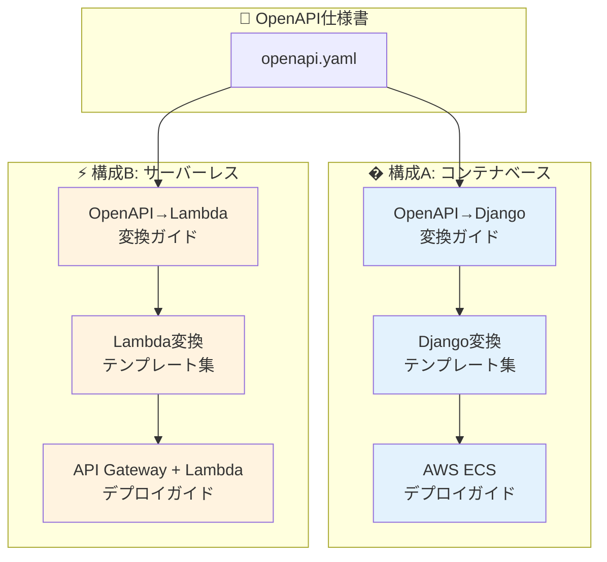
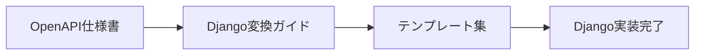
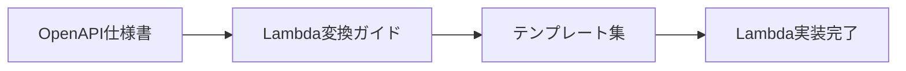
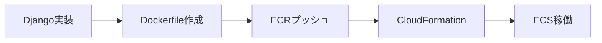
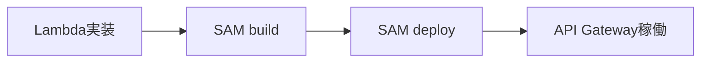

# 実装・デプロイガイド インデックス

> **ドキュメントバージョン**: 2.0.0  
> **最終更新日**: 2025-12-30  
> **ステータス**: Active

---

## 概要

このディレクトリには、AI駆動 RESTful API 自動生成システムの実装およびデプロイに関するガイドドキュメントが含まれています。

本システムでは **2つの実装・デプロイ構成** をサポートしています：

- **構成A**: Django REST Framework + ECS Fargate（コンテナベース）
- **構成B**: Python Lambda + API Gateway（サーバーレス）

---

## ガイド一覧

---

## 構成A: コンテナベース（Django + ECS Fargate）

フルスタックなWebフレームワークを活用した、柔軟性の高い構成です。

### ドキュメント一覧

| # | ドキュメント | 説明 |
|---|-------------|------|
| 1 | [OpenAPI→Django変換ガイド](./openapi-to-django.md) | OpenAPI仕様書からDjango REST Frameworkへの変換方法 |
| 2 | [Django変換テンプレート集](./openapi-to-django-templates.md) | Django実装用のコードテンプレート |
| 3 | [AWS ECS Fargateデプロイガイド](./aws-ecs-deployment.md) | ECS Fargateへのデプロイ手順 |

### 推奨ケース

- 複雑なデータモデルやリレーションを持つアプリケーション
- Django Admin によるデータ管理が必要
- 処理時間が15分を超える可能性がある
- 常時一定のトラフィックがある
- ORM（Django ORM）を活用した開発効率を重視

---

## 構成B: サーバーレス（Lambda + API Gateway）

従量課金でコスト効率の高い、スケーラブルな構成です。

### ドキュメント一覧

| # | ドキュメント | 説明 |
|---|-------------|------|
| 1 | [OpenAPI→Lambda変換ガイド](./openapi-to-lambda.md) | OpenAPI仕様書からLambdaへの変換方法 |
| 2 | [Lambda変換テンプレート集](./openapi-to-lambda-templates.md) | Lambda実装用のコードテンプレート |
| 3 | [API Gateway + Lambdaデプロイガイド](./aws-lambda-deployment.md) | サーバーレスAPIのデプロイ手順 |

### 推奨ケース

- トラフィックが不規則または低頻度
- コストを最小限に抑えたい（使った分だけ課金）
- シンプルなCRUD操作が中心
- イベント駆動（S3、SQS等との連携）が必要
- マイクロサービスアーキテクチャ

---

## 構成比較

| 項目 | 構成A: Django + ECS | 構成B: Lambda + API Gateway |
|------|---------------------|----------------------------|
| **実装フレームワーク** | Django REST Framework | Python + AWS Lambda Powertools |
| **実行環境** | ECS Fargate (コンテナ) | AWS Lambda (サーバーレス) |
| **API管理** | ALB + ECS Service | API Gateway |
| **データベース** | RDS / Aurora | DynamoDB / RDS |
| **スケーリング** | ECS Auto Scaling | 自動スケーリング |
| **コールドスタート** | なし | あり |
| **料金体系** | 常時稼働課金 | リクエスト課金 |
| **最大実行時間** | 制限なし | 15分 |
| **開発の複雑さ** | 中 | 低〜中 |

---

## 使用シナリオ別ガイド

### シナリオ1: 新規API実装（コンテナベース）

1. [OpenAPI→Django変換ガイド](./openapi-to-django.md) でマッピングルールを確認
2. [Django変換テンプレート集](./openapi-to-django-templates.md) からコードをコピー＆カスタマイズ
3. `pytest` でテスト実行

### シナリオ2: 新規API実装（サーバーレス）

1. [OpenAPI→Lambda変換ガイド](./openapi-to-lambda.md) でマッピングルールを確認
2. [Lambda変換テンプレート集](./openapi-to-lambda-templates.md) からコードをコピー＆カスタマイズ
3. `sam local invoke` でローカルテスト

### シナリオ3: AWSへのデプロイ（コンテナベース）

1. [AWS ECS デプロイガイド](./aws-ecs-deployment.md) の前提条件を確認
2. ECRリポジトリ作成、Dockerイメージプッシュ
3. CloudFormationでインフラ構築

### シナリオ4: AWSへのデプロイ（サーバーレス）

1. [API Gateway + Lambda デプロイガイド](./aws-lambda-deployment.md) の前提条件を確認
2. SAM CLI でビルド
3. `sam deploy --guided` でデプロイ

### シナリオ5: トラブルシューティング

**コンテナベース:**
- デプロイ時のエラー → [AWS ECS デプロイガイド - トラブルシューティング](./aws-ecs-deployment.md#トラブルシューティング)
- 実装時のエラー → [OpenAPI→Django変換ガイド - チェックリスト](./openapi-to-django.md#チェックリスト)

**サーバーレス:**
- デプロイ時のエラー → [API GW + Lambda デプロイガイド - トラブルシューティング](./aws-lambda-deployment.md#トラブルシューティング)
- 実装時のエラー → [OpenAPI→Lambda変換ガイド - チェックリスト](./openapi-to-lambda.md#チェックリスト)

---

## 関連ドキュメント

| ドキュメント | パス | 説明 |
|-------------|------|------|
| システム概要 | [../overview.md](../overview.md) | システム全体の概要・構成選択の詳細 |
| ガイドライン | [../guidelines/index.md](../guidelines/index.md) | 開発ガイドラインインデックス |
| ECS CloudFormation | `aws/cloudformation/ecs-fargate.yaml` | ECS Fargate構築テンプレート |
| Lambda CloudFormation | `aws/cloudformation/api-gateway-lambda.yaml` | API GW + Lambda構築テンプレート |
| SAMテンプレート | `aws/sam/template.yaml` | SAMによるLambdaデプロイ |
| IAMポリシー | `aws/policies/` | 各種IAMポリシー定義 |

---

## 変更履歴

| バージョン | 日付 | 変更内容 |
|-----------|------|----------|
| 2.0.0 | 2025-12-30 | Lambda + API Gateway構成を追加、構成選択ガイドを追加 |
| 1.0.0 | 2025-12-30 | 初版作成 |

---

**作成日**: 2025-12-30  
**メンテナー**: auto_deploy プロジェクトチーム
