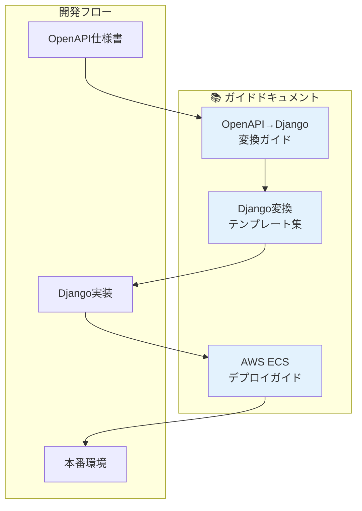
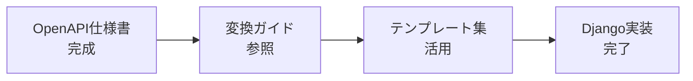
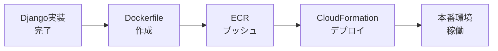

# 実装・デプロイガイド インデックス

> **ドキュメントバージョン**: 1.0.0  
> **最終更新日**: 2025-12-30  
> **ステータス**: Active

---

## 概要

このディレクトリには、AI駆動 RESTful API 自動生成システムの実装およびデプロイに関するガイドドキュメントが含まれています。

---

## ガイド一覧

---

## ドキュメント詳細

### 1. OpenAPI → Django REST Framework 変換ガイド

| 項目 | 内容 |
|------|------|
| **ファイル** | [openapi-to-django.md](./openapi-to-django.md) |
| **目的** | OpenAPI仕様書からDjango REST Frameworkへの変換方法を解説 |
| **対象者** | バックエンド開発者 |
| **前提知識** | Python, Django, REST API の基礎知識 |

**主なトピック:**
- プロジェクト構成
- 依存パッケージ
- OpenAPI → Django マッピングルール
- 実装手順
- コード変換パターン

---

### 2. OpenAPI → Django 変換テンプレート集

| 項目 | 内容 |
|------|------|
| **ファイル** | [openapi-to-django-templates.md](./openapi-to-django-templates.md) |
| **目的** | 実際のコード生成に使用できるテンプレートを提供 |
| **対象者** | バックエンド開発者、AI |
| **前提知識** | Django REST Framework の基礎知識 |

**主なトピック:**
- settings.py テンプレート
- モデルテンプレート（カスタムユーザー、基本モデル）
- シリアライザーテンプレート（作成/更新/レスポンス用）
- ビューテンプレート（ViewSet、カスタムアクション）
- 認証ビューテンプレート
- テストテンプレート

---

### 3. AWS ECS Fargate デプロイガイド

| 項目 | 内容 |
|------|------|
| **ファイル** | [aws-ecs-deployment.md](./aws-ecs-deployment.md) |
| **目的** | Django REST Framework アプリケーションをAWS ECS Fargateにデプロイする手順を解説 |
| **対象者** | インフラエンジニア、DevOpsエンジニア |
| **前提知識** | AWS, Docker, コマンドライン操作の基礎知識 |

**主なトピック:**
- 前提条件と必要なツール
- アーキテクチャ概要
- ECR リポジトリ作成
- Docker イメージのビルドとプッシュ
- CloudFormation によるインフラデプロイ
- トラブルシューティング
- よくあるエラーと解決方法

---

## 使用シナリオ別ガイド

### シナリオ1: 新規API実装

1. [OpenAPI→Django変換ガイド](./openapi-to-django.md) でマッピングルールを確認
2. [Django変換テンプレート集](./openapi-to-django-templates.md) からコードをコピー＆カスタマイズ
3. テスト実行で動作確認

### シナリオ2: AWSへのデプロイ

1. [AWS ECS デプロイガイド](./aws-ecs-deployment.md) の前提条件を確認
2. ECRリポジトリ作成、Dockerイメージプッシュ
3. CloudFormationでインフラ構築

### シナリオ3: トラブルシューティング

- デプロイ時のエラー → [AWS ECS デプロイガイド - トラブルシューティング](./aws-ecs-deployment.md#トラブルシューティング)
- 実装時のエラー → [OpenAPI→Django変換ガイド - チェックリスト](./openapi-to-django.md#チェックリスト)

---

## 関連ドキュメント

| ドキュメント | パス | 説明 |
|-------------|------|------|
| システム概要 | [../overview.md](../overview.md) | システム全体の概要 |
| ガイドライン | [../guidelines/index.md](../guidelines/index.md) | 開発ガイドラインインデックス |
| CloudFormation | `aws/cloudformation/ecs-fargate.yaml` | ECS Fargate構築テンプレート |
| IAMポリシー | `aws/policies/` | 各種IAMポリシー定義 |

---

## 変更履歴

| バージョン | 日付 | 変更内容 |
|-----------|------|----------|
| 1.0.0 | 2025-12-30 | 初版作成 |

---

**作成日**: 2025-12-30  
**メンテナー**: auto_deploy プロジェクトチーム
