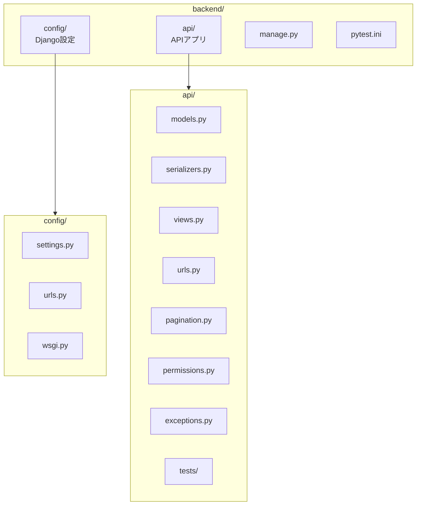

# OpenAPI → Django REST Framework 変換ガイド

> **ドキュメントバージョン**: 1.1.0  
> **最終更新日**: 2025-12-30  
> **ステータス**: Active

OpenAPI仕様書からDjango + Django REST Framework (DRF) を使用したAPIを実装するためのガイドです。

## 目次

1. [プロジェクト構成](#プロジェクト構成)
2. [依存パッケージ](#依存パッケージ)
3. [OpenAPI → Django マッピング](#openapi--django-マッピング)
4. [実装手順](#実装手順)
5. [コード変換パターン](#コード変換パターン)
6. [チェックリスト](#チェックリスト)
7. [関連ドキュメント](#関連ドキュメント)

---

## プロジェクト構成

### ディレクトリ構造



```
backend/
├── config/                    # Djangoプロジェクト設定
│   ├── settings.py           # 設定ファイル
│   ├── urls.py               # ルートURL設定
│   └── wsgi.py
├── api/                      # APIアプリ
│   ├── models.py             # データモデル
│   ├── serializers.py        # シリアライザー
│   ├── views.py              # ビュー（エンドポイント）
│   ├── urls.py               # URLルーティング
│   ├── pagination.py         # ペジネーション
│   ├── permissions.py        # 権限制御
│   ├── exceptions.py         # 例外ハンドラー
│   └── tests/                # テスト
├── manage.py
└── pytest.ini
```

---

## 依存パッケージ

```bash
pip install django djangorestframework djangorestframework-simplejwt django-cors-headers drf-nested-routers pytest pytest-django
```

| パッケージ | 用途 |
|-----------|------|
| django | Webフレームワーク |
| djangorestframework | REST API構築 |
| djangorestframework-simplejwt | JWT認証 |
| django-cors-headers | CORS設定 |
| drf-nested-routers | ネストしたURL構造 |
| pytest + pytest-django | テスト |

---

## OpenAPI → Django マッピング

### スキーマ → モデル

| OpenAPI | Django |
|---------|--------|
| `type: string` | `CharField`, `TextField` |
| `type: string, format: uuid` | `UUIDField` |
| `type: string, format: email` | `EmailField` |
| `type: string, format: date-time` | `DateTimeField` |
| `type: integer` | `IntegerField` |
| `type: boolean` | `BooleanField` |
| `type: string, enum: [...]` | `CharField(choices=...)` |
| `$ref: "#/components/schemas/User"` | `ForeignKey(User)` |
| `required: [field]` | `blank=False, null=False` |
| `maxLength: 100` | `max_length=100` |

### エンドポイント → ビュー

| OpenAPI Method | DRF ViewSet Action |
|----------------|-------------------|
| GET (list) | `list()` |
| GET (detail) | `retrieve()` |
| POST | `create()` |
| PUT | `update()` |
| PATCH | `partial_update()` |
| DELETE | `destroy()` |

### レスポンス形式

| OpenAPI Status | DRF Response |
|----------------|--------------|
| 200 | `Response(data, status=status.HTTP_200_OK)` |
| 201 | `Response(data, status=status.HTTP_201_CREATED)` |
| 204 | `Response(status=status.HTTP_204_NO_CONTENT)` |
| 400 | `Response(error, status=status.HTTP_400_BAD_REQUEST)` |
| 401 | `Response(error, status=status.HTTP_401_UNAUTHORIZED)` |
| 403 | `Response(error, status=status.HTTP_403_FORBIDDEN)` |
| 404 | `Response(error, status=status.HTTP_404_NOT_FOUND)` |
| 422 | `Response(error, status=status.HTTP_422_UNPROCESSABLE_ENTITY)` |

---

## 実装手順

### 1. Django プロジェクト作成

```bash
django-admin startproject config ./backend
cd backend
python manage.py startapp api
```

### 2. settings.py 設定

```python
INSTALLED_APPS = [
    ...
    'rest_framework',
    'rest_framework_simplejwt',
    'corsheaders',
    'api',
]

MIDDLEWARE = [
    ...
    'corsheaders.middleware.CorsMiddleware',
    ...
]

# カスタムユーザーモデル
AUTH_USER_MODEL = 'api.User'

# DRF設定
REST_FRAMEWORK = {
    'DEFAULT_AUTHENTICATION_CLASSES': (
        'rest_framework_simplejwt.authentication.JWTAuthentication',
    ),
    'DEFAULT_PERMISSION_CLASSES': (
        'rest_framework.permissions.IsAuthenticated',
    ),
    'DEFAULT_PAGINATION_CLASS': 'api.pagination.CustomPagination',
    'PAGE_SIZE': 20,
    'EXCEPTION_HANDLER': 'api.exceptions.custom_exception_handler',
}

# JWT設定
from datetime import timedelta
SIMPLE_JWT = {
    'ACCESS_TOKEN_LIFETIME': timedelta(hours=1),
    'REFRESH_TOKEN_LIFETIME': timedelta(days=7),
}
```

### 3. マイグレーション実行

```bash
python manage.py makemigrations
python manage.py migrate
```

### 4. テスト実行

```bash
pytest api/tests/ -v
```

---

## コード変換パターン

### パターン1: OpenAPI スキーマ → Django モデル

**OpenAPI:**
```yaml
Task:
  type: object
  properties:
    id:
      type: string
      format: uuid
      readOnly: true
    title:
      type: string
      maxLength: 100
    status:
      type: string
      enum: [todo, in_progress, done]
      default: todo
    assignee:
      $ref: "#/components/schemas/UserSummary"
    createdAt:
      type: string
      format: date-time
      readOnly: true
```

**Django Model:**
```python
class Task(models.Model):
    STATUS_CHOICES = [
        ('todo', 'TODO'),
        ('in_progress', '進行中'),
        ('done', '完了'),
    ]
    
    id = models.UUIDField(primary_key=True, default=uuid.uuid4, editable=False)
    title = models.CharField('タイトル', max_length=100)
    status = models.CharField('ステータス', max_length=20, choices=STATUS_CHOICES, default='todo')
    assignee = models.ForeignKey(User, on_delete=models.SET_NULL, null=True, blank=True)
    created_at = models.DateTimeField('作成日時', auto_now_add=True)
```

### パターン2: リクエスト/レスポンス → シリアライザー

**OpenAPI:**
```yaml
CreateTaskRequest:
  type: object
  required:
    - title
  properties:
    title:
      type: string
      minLength: 1
      maxLength: 100
    description:
      type: string
      maxLength: 1000
    assigneeId:
      type: string
      format: uuid
```

**DRF Serializer:**
```python
class CreateTaskSerializer(serializers.ModelSerializer):
    assigneeId = serializers.UUIDField(required=False, allow_null=True)
    
    class Meta:
        model = Task
        fields = ['title', 'description', 'assigneeId']
    
    def validate_assigneeId(self, value):
        if value and not User.objects.filter(id=value).exists():
            raise serializers.ValidationError('指定されたユーザーが存在しません')
        return value
    
    def create(self, validated_data):
        assignee_id = validated_data.pop('assigneeId', None)
        if assignee_id:
            validated_data['assignee'] = User.objects.get(id=assignee_id)
        return super().create(validated_data)
```

### パターン3: エンドポイント → ビュー

**OpenAPI:**
```yaml
/projects/{projectId}/tasks:
  get:
    summary: タスク一覧取得
    operationId: listTasks
    parameters:
      - name: status
        in: query
        schema:
          type: string
          enum: [todo, in_progress, done]
  post:
    summary: タスク作成
    operationId: createTask
```

**DRF ViewSet:**
```python
class TaskViewSet(viewsets.ModelViewSet):
    permission_classes = [IsAuthenticated]
    pagination_class = CustomPagination
    
    def get_serializer_class(self):
        if self.action == 'create':
            return CreateTaskSerializer
        return TaskSerializer
    
    def get_queryset(self):
        project_id = self.kwargs.get('project_pk')
        queryset = Task.objects.filter(project_id=project_id)
        
        # クエリパラメータによるフィルター
        status_param = self.request.query_params.get('status')
        if status_param:
            queryset = queryset.filter(status=status_param)
        
        return queryset
    
    def create(self, request, *args, **kwargs):
        project_id = self.kwargs.get('project_pk')
        project = get_object_or_404(Project, id=project_id)
        
        serializer = self.get_serializer(data=request.data)
        serializer.is_valid(raise_exception=True)
        task = serializer.save(project=project)
        
        response_serializer = TaskResponseSerializer(task)
        return Response(
            {'data': response_serializer.data},
            status=status.HTTP_201_CREATED
        )
```

### パターン4: ネストしたURL → drf-nested-routers

**OpenAPI:**
```yaml
/projects/{projectId}/tasks/{taskId}/comments:
  get: ...
  post: ...
```

**URL設定:**
```python
from rest_framework_nested import routers

router = routers.DefaultRouter()
router.register(r'projects', ProjectViewSet, basename='project')

projects_router = routers.NestedDefaultRouter(router, r'projects', lookup='project')
projects_router.register(r'tasks', TaskViewSet, basename='project-tasks')

tasks_router = routers.NestedDefaultRouter(projects_router, r'tasks', lookup='task')
tasks_router.register(r'comments', CommentViewSet, basename='task-comments')

urlpatterns = [
    path('', include(router.urls)),
    path('', include(projects_router.urls)),
    path('', include(tasks_router.urls)),
]
```

### パターン5: カスタムアクション

**OpenAPI:**
```yaml
/projects/{projectId}/tasks/{taskId}/status:
  patch:
    summary: タスクステータス更新
```

**DRF Action:**
```python
class TaskViewSet(viewsets.ModelViewSet):
    @action(detail=True, methods=['patch'], url_path='status')
    def update_status(self, request, project_pk=None, pk=None):
        task = self.get_object()
        
        new_status = request.data.get('status')
        if new_status not in ['todo', 'in_progress', 'done']:
            return Response(
                {'error': {'code': 'VAL_001', 'message': '無効なステータスです'}},
                status=status.HTTP_422_UNPROCESSABLE_ENTITY
            )
        
        task.status = new_status
        task.save()
        
        serializer = TaskResponseSerializer(task)
        return Response({'data': serializer.data})
```

### パターン6: ページネーション

**OpenAPI:**
```yaml
Pagination:
  type: object
  properties:
    currentPage:
      type: integer
    totalPages:
      type: integer
    totalItems:
      type: integer
    itemsPerPage:
      type: integer
    hasNext:
      type: boolean
    hasPrev:
      type: boolean
```

**DRF Pagination:**
```python
from rest_framework.pagination import PageNumberPagination
from rest_framework.response import Response

class CustomPagination(PageNumberPagination):
    page_size = 20
    page_size_query_param = 'limit'
    page_query_param = 'page'
    
    def get_paginated_response(self, data):
        return Response({
            'data': data,
            'pagination': {
                'currentPage': self.page.number,
                'totalPages': self.page.paginator.num_pages,
                'totalItems': self.page.paginator.count,
                'itemsPerPage': self.get_page_size(self.request),
                'hasNext': self.page.has_next(),
                'hasPrev': self.page.has_previous(),
            }
        })
```

### パターン7: エラーレスポンス

**OpenAPI:**
```yaml
Error:
  type: object
  properties:
    error:
      type: object
      properties:
        code:
          type: string
        message:
          type: string
        details:
          type: array
        requestId:
          type: string
          format: uuid
```

**DRF Exception Handler:**
```python
import uuid
from rest_framework.views import exception_handler

def custom_exception_handler(exc, context):
    response = exception_handler(exc, context)
    
    if response is not None:
        response.data = {
            'error': {
                'code': get_error_code(response.status_code, exc),
                'message': get_error_message(response.status_code, exc),
                'details': get_error_details(exc),
                'requestId': str(uuid.uuid4()),
            }
        }
    
    return response
```

---

## チェックリスト

実装時に確認すべき項目:

- [ ] 全てのOpenAPIエンドポイントが実装されているか
- [ ] 必須フィールドのバリデーションが正しいか
- [ ] レスポンス形式がOpenAPI仕様と一致しているか
- [ ] エラーレスポンス形式が統一されているか
- [ ] 認証・認可が正しく実装されているか
- [ ] ページネーションが仕様通りか
- [ ] フィールド名のcamelCase/snake_case変換が正しいか
- [ ] テストが全エンドポイントをカバーしているか

---

## 関連ドキュメント

| ドキュメント | パス | 説明 |
|-------------|------|------|
| システム概要 | [../overview.md](../overview.md) | システム全体の概要 |
| ガイドインデックス | [index.md](./index.md) | ガイド一覧 |
| Django変換テンプレート集 | [openapi-to-django-templates.md](./openapi-to-django-templates.md) | コードテンプレート |
| AWS ECSデプロイガイド | [aws-ecs-deployment.md](./aws-ecs-deployment.md) | デプロイ手順 |

---

## 変更履歴

| バージョン | 日付 | 変更内容 |
|-----------|------|----------|
| 1.1.0 | 2025-12-30 | mermaid図の追加、関連ドキュメントセクション追加 |
| 1.0.0 | 2024-12-29 | 初版作成 |

---

**作成日**: 2024-12-29  
**最終更新日**: 2025-12-30  
**メンテナー**: auto_deploy プロジェクトチーム
