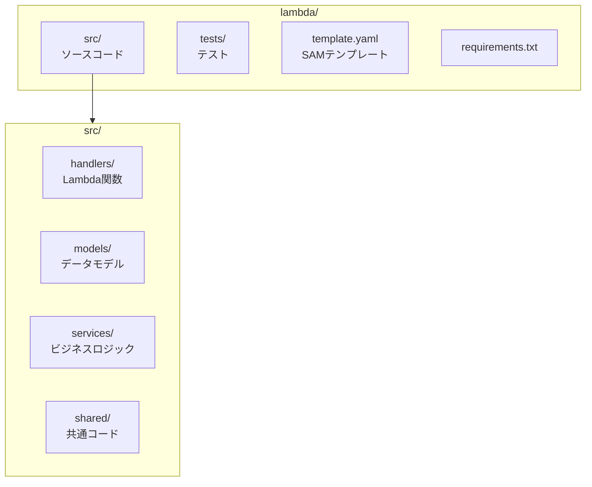
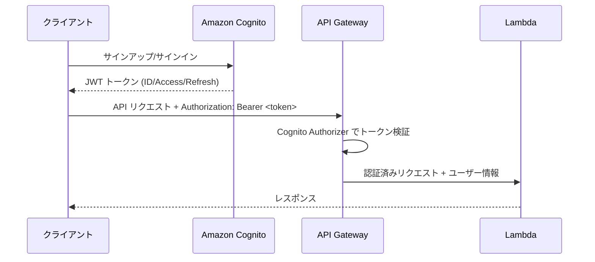

# OpenAPI → AWS Lambda 変換ガイド

> **ドキュメントバージョン**: 1.1.0  
> **最終更新日**: 2025-12-30  
> **ステータス**: Active

OpenAPI仕様書からAWS Lambda + API Gatewayを使用したサーバーレスAPIを実装するためのガイドです。

> **認証方式**: Amazon Cognitoを使用したJWT認証

## 目次

1. [プロジェクト構成](#プロジェクト構成)
2. [依存パッケージ](#依存パッケージ)
3. [OpenAPI → Lambda マッピング](#openapi--lambda-マッピング)
4. [実装手順](#実装手順)
5. [コード変換パターン](#コード変換パターン)
6. [チェックリスト](#チェックリスト)
7. [関連ドキュメント](#関連ドキュメント)

---

## プロジェクト構成

### ディレクトリ構造



```
lambda/
├── template.yaml              # SAMテンプレート
├── samconfig.toml             # SAM設定
├── requirements.txt           # 依存パッケージ
├── src/
│   ├── handlers/              # Lambda関数ハンドラー
│   │   ├── __init__.py
│   │   ├── auth.py            # 認証関連
│   │   ├── projects.py        # プロジェクトCRUD
│   │   ├── tasks.py           # タスクCRUD
│   │   └── comments.py        # コメントCRUD
│   ├── models/                # Pydanticモデル
│   │   ├── __init__.py
│   │   ├── base.py
│   │   ├── user.py
│   │   ├── project.py
│   │   └── task.py
│   ├── services/              # ビジネスロジック
│   │   ├── __init__.py
│   │   ├── auth_service.py
│   │   ├── project_service.py
│   │   └── task_service.py
│   ├── repositories/          # データアクセス層
│   │   ├── __init__.py
│   │   ├── base.py
│   │   └── dynamodb.py
│   └── shared/                # 共通ユーティリティ
│       ├── __init__.py
│       ├── config.py
│       ├── exceptions.py
│       ├── response.py
│       └── validators.py
└── tests/
    ├── __init__.py
    ├── conftest.py
    ├── unit/
    └── integration/
```

---

## 依存パッケージ

```bash
pip install aws-lambda-powertools pydantic boto3 python-jose pytest pytest-mock moto
```

| パッケージ | 用途 |
|-----------|------|
| aws-lambda-powertools | Lambda開発ユーティリティ（ロギング、トレーシング、バリデーション） |
| pydantic | データバリデーション・シリアライゼーション |
| boto3 | AWSサービス操作（DynamoDB、Cognito等） |
| python-jose | Cognito JWT トークン検証 |
| pytest | テスト |
| moto | AWSサービスモック |

> **Note**: 認証にはAmazon Cognitoを使用します。ユーザー管理（サインアップ、サインイン、パスワードリセット等）はCognitoが担当するため、`passlib`等のパスワードハッシュライブラリは不要です。

### requirements.txt

```
aws-lambda-powertools>=2.0.0
pydantic>=2.0.0
boto3>=1.28.0
python-jose[cryptography]>=3.3.0
```

---

## OpenAPI → Lambda マッピング

### スキーマ → Pydanticモデル

| OpenAPI | Pydantic |
|---------|----------|
| `type: string` | `str` |
| `type: string, format: uuid` | `UUID` |
| `type: string, format: email` | `EmailStr` |
| `type: string, format: date-time` | `datetime` |
| `type: integer` | `int` |
| `type: boolean` | `bool` |
| `type: string, enum: [...]` | `Literal[...]` または `Enum` |
| `required: [field]` | フィールドにデフォルト値なし |
| `maxLength: 100` | `Field(max_length=100)` |

### エンドポイント → Lambda関数

| OpenAPI Method | Lambda Handler |
|----------------|----------------|
| GET (list) | `list_handler` |
| GET (detail) | `get_handler` |
| POST | `create_handler` |
| PUT | `update_handler` |
| PATCH | `partial_update_handler` |
| DELETE | `delete_handler` |

### APIパス → API Gateway設定

| OpenAPI Path | API Gateway | Lambda関数 |
|--------------|-------------|-----------|
| `/projects` | GET /projects | ProjectsListFunction |
| `/projects` | POST /projects | ProjectsCreateFunction |
| `/projects/{id}` | GET /projects/{id} | ProjectsGetFunction |
| `/projects/{id}` | PUT /projects/{id} | ProjectsUpdateFunction |
| `/projects/{id}` | DELETE /projects/{id} | ProjectsDeleteFunction |

---

## 実装手順

### 1. SAMプロジェクト初期化

```bash
sam init --runtime python3.11 --name my-api
cd my-api
```

### 2. template.yaml 設定

```yaml
AWSTemplateFormatVersion: '2010-09-09'
Transform: AWS::Serverless-2016-10-31
Description: Serverless API

Globals:
  Function:
    Timeout: 30
    Runtime: python3.11
    Architectures:
      - x86_64
    Environment:
      Variables:
        TABLE_NAME: !Ref DynamoDBTable
        JWT_SECRET: !Ref JwtSecret

Parameters:
  JwtSecret:
    Type: String
    NoEcho: true

Resources:
  # API Gateway
  ApiGateway:
    Type: AWS::Serverless::Api
    Properties:
      StageName: v1
      Auth:
        DefaultAuthorizer: LambdaAuthorizer
        Authorizers:
          LambdaAuthorizer:
            FunctionArn: !GetAtt AuthorizerFunction.Arn

  # DynamoDB
  DynamoDBTable:
    Type: AWS::DynamoDB::Table
    Properties:
      TableName: !Sub ${AWS::StackName}-table
      BillingMode: PAY_PER_REQUEST
      AttributeDefinitions:
        - AttributeName: PK
          AttributeType: S
        - AttributeName: SK
          AttributeType: S
      KeySchema:
        - AttributeName: PK
          KeyType: HASH
        - AttributeName: SK
          KeyType: RANGE
      GlobalSecondaryIndexes:
        - IndexName: GSI1
          KeySchema:
            - AttributeName: SK
              KeyType: HASH
            - AttributeName: PK
              KeyType: RANGE
          Projection:
            ProjectionType: ALL

  # Lambda Functions
  ProjectsListFunction:
    Type: AWS::Serverless::Function
    Properties:
      CodeUri: src/
      Handler: handlers.projects.list_handler
      Events:
        Api:
          Type: Api
          Properties:
            RestApiId: !Ref ApiGateway
            Path: /projects
            Method: GET
```

### 3. Lambda関数実装

### 4. ローカルテスト

```bash
# SAMローカル起動
sam local start-api

# テスト実行
pytest tests/ -v
```

### 5. デプロイ

```bash
sam build
sam deploy --guided
```

---

## コード変換パターン

### パターン1: OpenAPIスキーマ → Pydanticモデル

**OpenAPI:**
```yaml
Task:
  type: object
  properties:
    id:
      type: string
      format: uuid
      readOnly: true
    title:
      type: string
      maxLength: 100
    status:
      type: string
      enum: [todo, in_progress, done]
      default: todo
    createdAt:
      type: string
      format: date-time
      readOnly: true
```

**Pydantic Model:**
```python
from datetime import datetime
from typing import Literal
from uuid import UUID, uuid4
from pydantic import BaseModel, Field


class TaskBase(BaseModel):
    title: str = Field(..., max_length=100)
    status: Literal["todo", "in_progress", "done"] = "todo"


class TaskCreate(TaskBase):
    pass


class TaskUpdate(BaseModel):
    title: str | None = Field(None, max_length=100)
    status: Literal["todo", "in_progress", "done"] | None = None


class Task(TaskBase):
    id: UUID = Field(default_factory=uuid4)
    created_at: datetime = Field(default_factory=datetime.utcnow)
    
    class Config:
        from_attributes = True
```

### パターン2: エンドポイント → Lambdaハンドラー

**OpenAPI:**
```yaml
/projects/{projectId}/tasks:
  get:
    summary: タスク一覧取得
  post:
    summary: タスク作成
```

**Lambda Handler:**
```python
from aws_lambda_powertools import Logger, Tracer
from aws_lambda_powertools.event_handler import APIGatewayRestResolver
from aws_lambda_powertools.utilities.typing import LambdaContext

logger = Logger()
tracer = Tracer()
app = APIGatewayRestResolver()


@app.get("/projects/<project_id>/tasks")
@tracer.capture_method
def list_tasks(project_id: str):
    """タスク一覧取得"""
    # クエリパラメータ取得
    status = app.current_event.get_query_string_value("status")
    page = int(app.current_event.get_query_string_value("page", "1"))
    
    # サービス呼び出し
    tasks, pagination = task_service.list_tasks(
        project_id=project_id,
        status=status,
        page=page
    )
    
    return {
        "data": [task.model_dump() for task in tasks],
        "pagination": pagination.model_dump()
    }


@app.post("/projects/<project_id>/tasks")
@tracer.capture_method
def create_task(project_id: str):
    """タスク作成"""
    body = app.current_event.json_body
    
    # バリデーション
    task_data = TaskCreate(**body)
    
    # サービス呼び出し
    task = task_service.create_task(
        project_id=project_id,
        data=task_data,
        user_id=app.current_event.request_context.authorizer.get("user_id")
    )
    
    return {"data": task.model_dump()}, 201


@logger.inject_lambda_context
@tracer.capture_lambda_handler
def lambda_handler(event: dict, context: LambdaContext) -> dict:
    return app.resolve(event, context)
```

### パターン3: DynamoDB シングルテーブル設計

**データモデル:**
```python
# PK/SK パターン
# User:     PK=USER#<user_id>, SK=USER#<user_id>
# Project:  PK=PROJECT#<project_id>, SK=PROJECT#<project_id>
# Task:     PK=PROJECT#<project_id>, SK=TASK#<task_id>
# Comment:  PK=TASK#<task_id>, SK=COMMENT#<comment_id>

class DynamoDBRepository:
    def __init__(self, table_name: str):
        self.table = boto3.resource("dynamodb").Table(table_name)
    
    def get_project(self, project_id: str) -> dict | None:
        response = self.table.get_item(
            Key={
                "PK": f"PROJECT#{project_id}",
                "SK": f"PROJECT#{project_id}"
            }
        )
        return response.get("Item")
    
    def list_tasks_by_project(self, project_id: str) -> list[dict]:
        response = self.table.query(
            KeyConditionExpression="PK = :pk AND begins_with(SK, :sk_prefix)",
            ExpressionAttributeValues={
                ":pk": f"PROJECT#{project_id}",
                ":sk_prefix": "TASK#"
            }
        )
        return response.get("Items", [])
    
    def create_task(self, project_id: str, task: dict) -> dict:
        task_id = str(uuid4())
        item = {
            "PK": f"PROJECT#{project_id}",
            "SK": f"TASK#{task_id}",
            "id": task_id,
            "project_id": project_id,
            **task,
            "created_at": datetime.utcnow().isoformat()
        }
        self.table.put_item(Item=item)
        return item
```

### パターン4: Amazon Cognito 認証

#### 認証フロー



#### Cognito User Pool の設定（SAMテンプレート）

```yaml
Resources:
  CognitoUserPool:
    Type: AWS::Cognito::UserPool
    Properties:
      UserPoolName: !Sub ${AWS::StackName}-user-pool
      AutoVerifiedAttributes:
        - email
      UsernameAttributes:
        - email
      Policies:
        PasswordPolicy:
          MinimumLength: 8
          RequireLowercase: true
          RequireNumbers: true
          RequireSymbols: false
          RequireUppercase: true
      Schema:
        - Name: email
          Required: true
          Mutable: true
        - Name: name
          Required: false
          Mutable: true

  CognitoUserPoolClient:
    Type: AWS::Cognito::UserPoolClient
    Properties:
      ClientName: !Sub ${AWS::StackName}-client
      UserPoolId: !Ref CognitoUserPool
      GenerateSecret: false
      ExplicitAuthFlows:
        - ALLOW_USER_PASSWORD_AUTH
        - ALLOW_REFRESH_TOKEN_AUTH
        - ALLOW_USER_SRP_AUTH
      PreventUserExistenceErrors: ENABLED
```

#### API Gateway Cognito Authorizer

```yaml
  ApiGateway:
    Type: AWS::Serverless::Api
    Properties:
      Auth:
        DefaultAuthorizer: CognitoAuthorizer
        Authorizers:
          CognitoAuthorizer:
            UserPoolArn: !GetAtt CognitoUserPool.Arn
```

#### Lambda ハンドラーでのユーザー情報取得

```python
def get_user_from_event(event: dict) -> dict:
    """Cognito認証情報からユーザー情報を取得"""
    claims = event.get("requestContext", {}).get("authorizer", {}).get("claims", {})
    
    return {
        "user_id": claims.get("sub"),
        "email": claims.get("email"),
        "name": claims.get("name", ""),
        "email_verified": claims.get("email_verified") == "true",
    }


@app.get("/projects")
def list_projects():
    user = get_user_from_event(app.current_event.raw_event)
    # user["user_id"] でユーザー識別
    projects = project_service.list_by_user(user["user_id"])
    return {"data": projects}
```

#### クライアント側の認証実装例（Python）

```python
import boto3

cognito = boto3.client("cognito-idp")

# サインアップ
def sign_up(email: str, password: str, name: str, client_id: str):
    return cognito.sign_up(
        ClientId=client_id,
        Username=email,
        Password=password,
        UserAttributes=[
            {"Name": "email", "Value": email},
            {"Name": "name", "Value": name},
        ],
    )

# サインイン
def sign_in(email: str, password: str, client_id: str):
    response = cognito.initiate_auth(
        ClientId=client_id,
        AuthFlow="USER_PASSWORD_AUTH",
        AuthParameters={
            "USERNAME": email,
            "PASSWORD": password,
        },
    )
    return {
        "access_token": response["AuthenticationResult"]["AccessToken"],
        "id_token": response["AuthenticationResult"]["IdToken"],
        "refresh_token": response["AuthenticationResult"]["RefreshToken"],
    }

# トークンリフレッシュ
def refresh_token(refresh_token: str, client_id: str):
    response = cognito.initiate_auth(
        ClientId=client_id,
        AuthFlow="REFRESH_TOKEN_AUTH",
        AuthParameters={
            "REFRESH_TOKEN": refresh_token,
        },
    )
    return response["AuthenticationResult"]
```

### パターン5: エラーハンドリング

**共通例外処理:**
```python
from aws_lambda_powertools.event_handler.exceptions import (
    BadRequestError,
    NotFoundError,
    UnauthorizedError,
)
from pydantic import ValidationError


@app.exception_handler(ValidationError)
def handle_validation_error(ex: ValidationError):
    return {
        "error": {
            "code": "VALIDATION_ERROR",
            "message": "入力データが不正です",
            "details": ex.errors()
        }
    }, 422


@app.exception_handler(NotFoundError)
def handle_not_found(ex: NotFoundError):
    return {
        "error": {
            "code": "NOT_FOUND",
            "message": str(ex)
        }
    }, 404


@app.exception_handler(Exception)
def handle_generic_error(ex: Exception):
    logger.exception("Unexpected error")
    return {
        "error": {
            "code": "INTERNAL_ERROR",
            "message": "内部エラーが発生しました"
        }
    }, 500
```

### パターン6: ページネーション

**ページネーション実装:**
```python
from pydantic import BaseModel


class Pagination(BaseModel):
    current_page: int
    total_pages: int
    total_items: int
    items_per_page: int
    has_next: bool
    has_prev: bool


class PaginatedResponse(BaseModel):
    data: list
    pagination: Pagination


def paginate_dynamodb_query(
    table,
    key_condition,
    page: int = 1,
    limit: int = 20,
    **kwargs
) -> tuple[list, Pagination]:
    """DynamoDBクエリのページネーション"""
    # 全件取得（小規模データ想定）
    response = table.query(
        KeyConditionExpression=key_condition,
        **kwargs
    )
    items = response.get("Items", [])
    
    # ページネーション計算
    total_items = len(items)
    total_pages = (total_items + limit - 1) // limit
    start_idx = (page - 1) * limit
    end_idx = start_idx + limit
    
    return items[start_idx:end_idx], Pagination(
        current_page=page,
        total_pages=total_pages,
        total_items=total_items,
        items_per_page=limit,
        has_next=page < total_pages,
        has_prev=page > 1
    )
```

---

## チェックリスト

実装時に確認すべき項目:

- [ ] 全てのOpenAPIエンドポイントがLambda関数として実装されているか
- [ ] Pydanticモデルでリクエスト/レスポンスが定義されているか
- [ ] Lambda Authorizerが正しく設定されているか
- [ ] エラーレスポンス形式が統一されているか
- [ ] DynamoDBのPK/SKパターンが適切か
- [ ] ページネーションが仕様通りか
- [ ] フィールド名のcamelCase/snake_case変換が正しいか
- [ ] ローカルテストが通過するか
- [ ] SAMテンプレートが正しく設定されているか

---

## 関連ドキュメント

| ドキュメント | パス | 説明 |
|-------------|------|------|
| システム概要 | [../overview.md](../overview.md) | システム全体の概要 |
| ガイドインデックス | [index.md](./index.md) | ガイド一覧 |
| Lambda変換テンプレート集 | [openapi-to-lambda-templates.md](./openapi-to-lambda-templates.md) | コードテンプレート |
| API GW + Lambdaデプロイガイド | [aws-lambda-deployment.md](./aws-lambda-deployment.md) | デプロイ手順 |

---

## 変更履歴

| バージョン | 日付 | 変更内容 |
|-----------|------|----------|
| 1.0.0 | 2025-12-30 | 初版作成 |

---

**作成日**: 2025-12-30  
**メンテナー**: auto_deploy プロジェクトチーム
