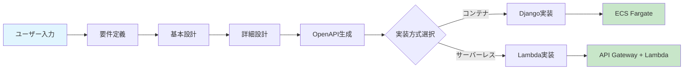
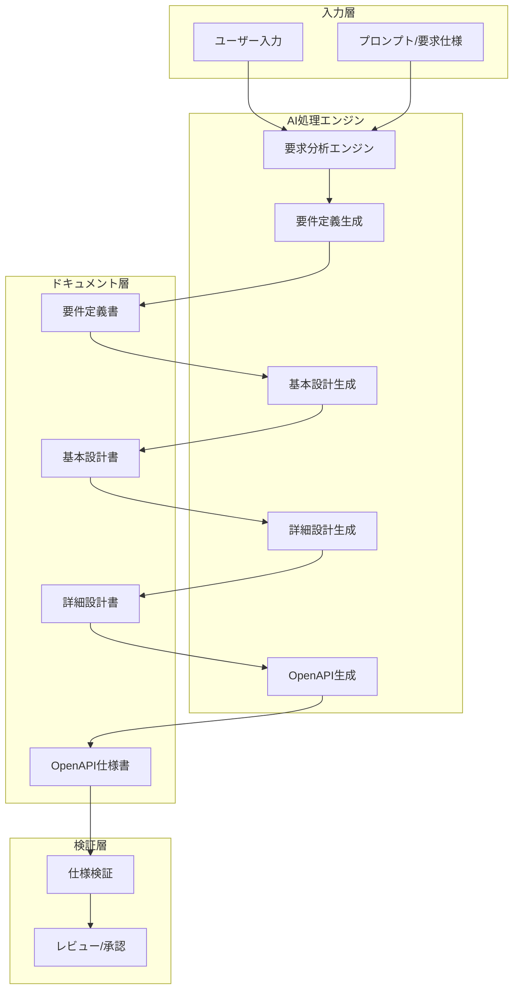
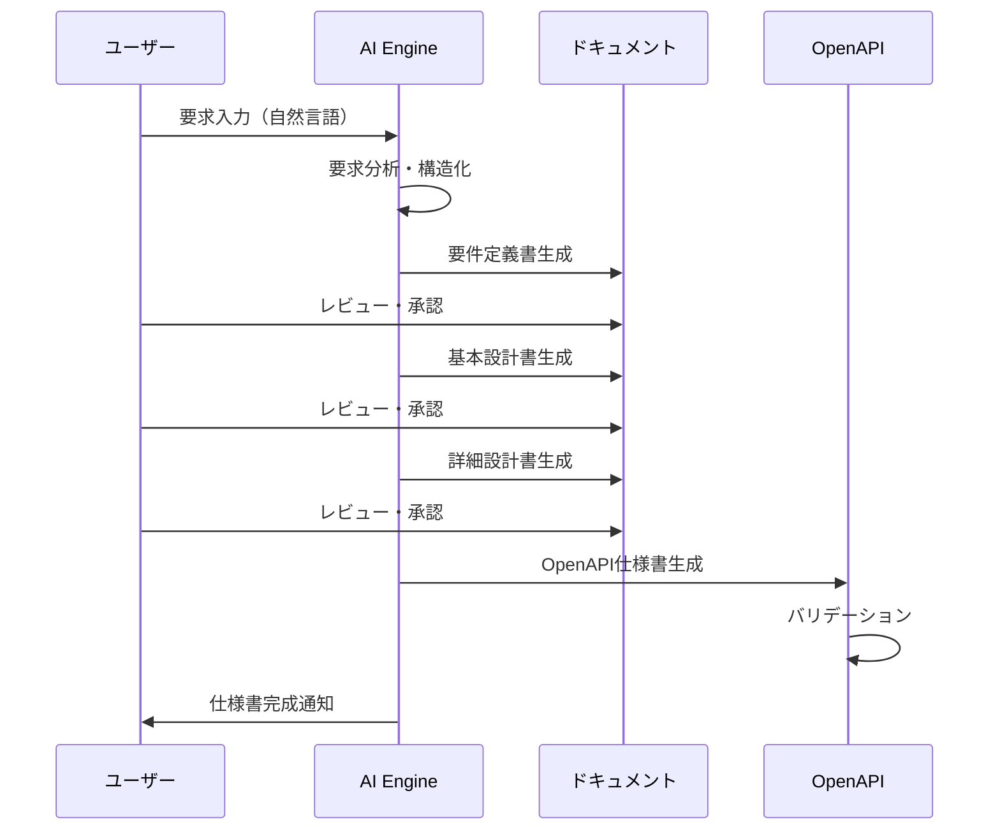
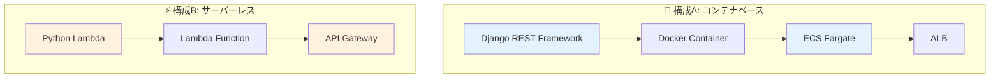
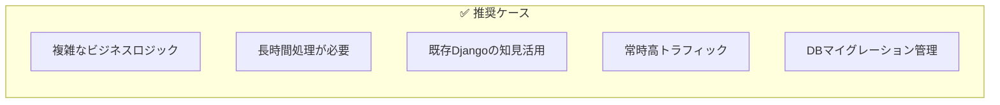
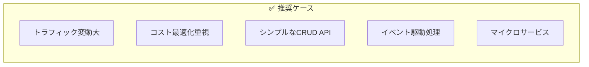
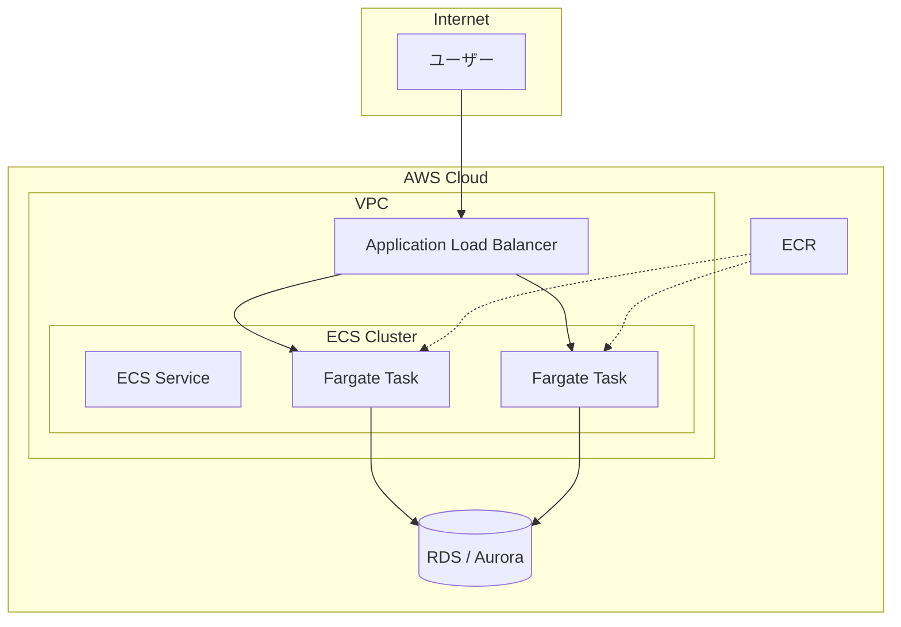
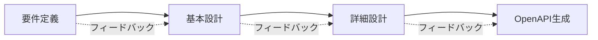
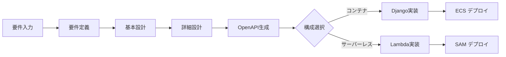

# AI駆動 RESTful API 自動生成システム - 概要

> **ドキュメントバージョン**: 2.1.0  
> **最終更新日**: 2025-12-30  
> **ステータス**: Active

---

## 目次

- [1. システム概要](#1-システム概要)
- [2. システムアーキテクチャ](#2-システムアーキテクチャ)
- [3. 実装・デプロイ構成の選択](#3-実装デプロイ構成の選択)
- [4. ウォーターフォール開発フェーズ](#4-ウォーターフォール開発フェーズ)
- [5. ディレクトリ構造](#5-ディレクトリ構造)
- [6. AI指示フロー](#6-ai指示フロー)
- [7. 成果物の品質基準](#7-成果物の品質基準)
- [8. 関連ドキュメント](#8-関連ドキュメント)
- [9. クイックスタート](#9-クイックスタート)

---

## 1. システム概要

本システムは、ユーザーからの自然言語入力を元に、ウォーターフォール開発のベストプラクティスに従い、要件定義からOpenAPI仕様書の生成、さらにAWSへのデプロイまでを自動化するAI駆動開発システムです。

### 1.1 目的

- ユーザーの要求から自動的にRESTful APIの仕様書を生成
- ウォーターフォール開発プロセスに準拠したドキュメント自動生成
- **複数の実装方式に対応**（Django REST Framework / AWS Lambda）
- **複数のデプロイ方式に対応**（ECS Fargate / API Gateway + Lambda）
- 開発工数の大幅削減と品質の均一化

### 1.2 対象範囲（スコープ）



## 2. システムアーキテクチャ

### 2.1 全体構成図



### 2.2 処理フロー



## 3. 実装・デプロイ構成の選択

本システムでは、要件に応じて2つの実装・デプロイ構成から選択できます。

### 3.1 構成比較



| 項目 | 構成A: Django + ECS | 構成B: Lambda + API Gateway |
|------|---------------------|----------------------------|
| **実装フレームワーク** | Django REST Framework | Python (Powertools for AWS Lambda) |
| **実行環境** | ECS Fargate (コンテナ) | AWS Lambda (サーバーレス) |
| **API管理** | ALB + ECS Service | API Gateway |
| **スケーリング** | ECS Auto Scaling | 自動スケーリング（Lambda） |
| **コールドスタート** | なし | あり（軽減策あり） |
| **料金体系** | 常時稼働課金 | リクエスト課金 |
| **最大実行時間** | 制限なし | 15分（Lambda） |

### 3.2 選択基準

#### 構成A（Django + ECS Fargate）を推奨するケース



- 複雑なデータモデルやリレーションを持つアプリケーション
- Django Admin によるデータ管理が必要
- 処理時間が15分を超える可能性がある
- 常時一定のトラフィックがある
- ORM（Django ORM）を活用した開発効率を重視

#### 構成B（Lambda + API Gateway）を推奨するケース



- トラフィックが不規則または低頻度
- コストを最小限に抑えたい（使った分だけ課金）
- シンプルなCRUD操作が中心
- イベント駆動（S3、SQS等との連携）が必要
- マイクロサービスアーキテクチャ

### 3.3 アーキテクチャ詳細

#### 構成A: Django + ECS Fargate



#### 構成B: Lambda + API Gateway

```mermaid
flowchart TB
    subgraph Internet
        User[ユーザー]
    end
    
    subgraph AWS["AWS Cloud"]
        APIGW[API Gateway]
        subgraph Lambda["Lambda Functions"]
            L1[GET /resources]
            L2[POST /resources]
            L3[GET /resources/{id}]
            L4[PUT /resources/{id}]
            L5[DELETE /resources/{id}]
        end
        DDB[(DynamoDB)]
        RDS[(RDS / Aurora)]
    end
    
    User --> APIGW
    APIGW --> L1
    APIGW --> L2
    APIGW --> L3
    APIGW --> L4
    APIGW --> L5
    L1 --> DDB
    L2 --> DDB
    L3 --> DDB
    L4 --> DDB
    L5 --> DDB
```

## 4. ウォーターフォール開発フェーズ

### 4.1 フェーズ構成

| フェーズ | 成果物 | AI処理内容 |
|---------|--------|-----------|
| 1. 要件定義 | 要件定義書 | 自然言語からの要件抽出・構造化 |
| 2. 基本設計 | 基本設計書 | API構成、データモデル概要設計 |
| 3. 詳細設計 | 詳細設計書 | エンドポイント詳細、スキーマ定義 |
| 4. 仕様書生成 | OpenAPI仕様 | YAML/JSON形式の仕様書生成 |

### 4.2 フェーズ間の依存関係



## 5. ディレクトリ構造

```
auto_deploy/
├── docs/                        # ドキュメント
│   ├── overview.md              # 本ファイル（システム概要）
│   ├── guidelines/              # 開発ガイドライン
│   │   └── index.md             # ガイドラインインデックス
│   └── guides/                  # 実装・デプロイガイド
│       ├── index.md             # ガイドインデックス
│       ├── aws-ecs-deployment.md           # ECS Fargateデプロイ
│       ├── aws-lambda-deployment.md        # API GW + Lambdaデプロイ
│       ├── openapi-to-django.md            # Django実装ガイド
│       ├── openapi-to-django-templates.md  # Djangoテンプレート
│       ├── openapi-to-lambda.md            # Lambda実装ガイド
│       └── openapi-to-lambda-templates.md  # Lambdaテンプレート
├── requirements/                # 要件定義書
│   ├── _template.md             # テンプレート
│   └── projects/                # プロジェクト別要件
├── design/
│   ├── basic/                   # 基本設計書
│   │   ├── _template.md
│   │   └── projects/
│   └── detailed/                # 詳細設計書
│       ├── _template.md
│       └── projects/
├── specs/
│   └── openapi/                 # OpenAPI仕様書
│       ├── _template.yaml
│       └── projects/
├── ai/
│   ├── prompts/                 # AIプロンプトテンプレート
│   │   ├── requirements.md
│   │   ├── basic_design.md
│   │   ├── detailed_design.md
│   │   ├── openapi_gen.md
│   │   ├── openapi_to_django.md
│   │   └── openapi_to_lambda.md
│   └── instructions/            # AI指示ファイル
│       └── workflow.md
├── aws/                         # AWS関連設定
│   ├── cloudformation/          # CloudFormationテンプレート
│   │   ├── ecs-fargate.yaml     # ECS Fargate構成
│   │   └── api-gateway-lambda.yaml  # API GW + Lambda構成
│   ├── sam/                     # SAMテンプレート
│   │   └── template.yaml
│   ├── policies/                # IAMポリシー
│   └── scripts/                 # デプロイスクリプト
├── backend/                     # バックエンドテンプレート（Django用）
│   ├── Dockerfile
│   └── requirements.txt
├── lambda/                      # Lambdaテンプレート
│   ├── src/
│   │   ├── handlers/
│   │   └── shared/
│   └── requirements.txt
├── scripts/                     # 自動化スクリプト
├── CHANGELOG.md                 # 変更履歴
└── README.md                    # プロジェクト説明
```

## 6. AI指示フロー

### 6.1 入力から仕様書生成までのワークフロー


## 7. 成果物の品質基準

### 7.1 要件定義書

- 機能要件・非機能要件の明確な分離
- ユースケースの網羅性
- トレーサビリティの確保

### 7.2 基本設計書

- RESTful設計原則への準拠
- リソース指向の設計
- 適切なHTTPメソッドの選択

### 7.3 詳細設計書

- 全エンドポイントの詳細定義
- リクエスト/レスポンススキーマの完全性
- エラーハンドリングの網羅

### 7.4 OpenAPI仕様書

- OpenAPI 3.0/3.1 準拠
- Swagger Validator によるバリデーション通過
- 適切なセキュリティ定義

## 8. 関連ドキュメント

### 8.1 ガイドドキュメント

| ドキュメント | 説明 | パス |
|-------------|------|------|
| [ガイドインデックス](./guides/index.md) | 全ガイドの一覧 | `docs/guides/index.md` |

#### コンテナベース（Django + ECS）

| ドキュメント | 説明 | パス |
|-------------|------|------|
| [OpenAPI→Django変換ガイド](./guides/openapi-to-django.md) | OpenAPIからDRF実装への変換方法 | `docs/guides/openapi-to-django.md` |
| [Django変換テンプレート集](./guides/openapi-to-django-templates.md) | Django実装用コードテンプレート | `docs/guides/openapi-to-django-templates.md` |
| [AWS ECS デプロイガイド](./guides/aws-ecs-deployment.md) | ECS Fargateへのデプロイ手順 | `docs/guides/aws-ecs-deployment.md` |

#### サーバーレス（Lambda + API Gateway）

| ドキュメント | 説明 | パス |
|-------------|------|------|
| [OpenAPI→Lambda変換ガイド](./guides/openapi-to-lambda.md) | OpenAPIからLambda実装への変換方法 | `docs/guides/openapi-to-lambda.md` |
| [Lambda変換テンプレート集](./guides/openapi-to-lambda-templates.md) | Lambda実装用コードテンプレート | `docs/guides/openapi-to-lambda-templates.md` |
| [API Gateway + Lambda デプロイガイド](./guides/aws-lambda-deployment.md) | サーバーレスAPIのデプロイ手順 | `docs/guides/aws-lambda-deployment.md` |

### 8.2 ガイドラインドキュメント

| ドキュメント | 説明 | パス |
|-------------|------|------|
| [ガイドラインインデックス](./guidelines/index.md) | 開発ガイドラインの一覧 | `docs/guidelines/index.md` |

### 8.3 設計・仕様ドキュメント

| ドキュメント | 説明 | パス |
|-------------|------|------|
| 要件定義テンプレート | 要件定義書のテンプレート | `requirements/_template.md` |
| 基本設計テンプレート | 基本設計書のテンプレート | `design/basic/_template.md` |
| 詳細設計テンプレート | 詳細設計書のテンプレート | `design/detailed/_template.md` |
| OpenAPIテンプレート | OpenAPI仕様書のテンプレート | `specs/openapi/_template.yaml` |

### 8.4 AIプロンプト

| プロンプト | 用途 | パス |
|-----------|------|------|
| 要件定義プロンプト | 要件定義書生成用 | `ai/prompts/requirements.md` |
| 基本設計プロンプト | 基本設計書生成用 | `ai/prompts/basic_design.md` |
| 詳細設計プロンプト | 詳細設計書生成用 | `ai/prompts/detailed_design.md` |
| OpenAPI生成プロンプト | OpenAPI仕様書生成用 | `ai/prompts/openapi_gen.md` |
| Django変換プロンプト | Django実装生成用 | `ai/prompts/openapi_to_django.md` |
| Lambda変換プロンプト | Lambda実装生成用 | `ai/prompts/openapi_to_lambda.md` |

### 8.5 インフラ関連

| ドキュメント | 説明 | パス |
|-------------|------|------|
| ECS Fargate テンプレート | ECS Fargate構築用 | `aws/cloudformation/ecs-fargate.yaml` |
| API GW + Lambda テンプレート | サーバーレスAPI構築用 | `aws/cloudformation/api-gateway-lambda.yaml` |
| SAMテンプレート | SAMによるLambdaデプロイ | `aws/sam/template.yaml` |
| IAMポリシー | 各種IAMポリシー定義 | `aws/policies/` |

---

## 9. クイックスタート

### 9.1 新規プロジェクト作成の流れ



### 9.2 構成A: Django + ECS Fargate

```bash
# 1. Django プロジェクト作成
django-admin startproject config ./backend
cd backend && python manage.py startapp api

# 2. テスト実行
pytest api/tests/ -v

# 3. Dockerイメージビルド
docker build --platform linux/amd64 -t <app-name>:latest ./backend

# 4. AWS ECS へデプロイ
aws cloudformation create-stack \
  --stack-name <app-name> \
  --template-body file://aws/cloudformation/ecs-fargate.yaml \
  --capabilities CAPABILITY_NAMED_IAM \
  --parameters ParameterKey=ContainerImage,ParameterValue=<ECR_IMAGE_URI>
```

### 9.3 構成B: Lambda + API Gateway

```bash
# 1. Lambda プロジェクト初期化
cd lambda
pip install -r requirements.txt -t ./src/

# 2. ローカルテスト
pytest tests/ -v

# 3. SAM ビルド
sam build

# 4. SAM デプロイ
sam deploy --guided
# または CloudFormation
aws cloudformation create-stack \
  --stack-name <app-name>-serverless \
  --template-body file://aws/cloudformation/api-gateway-lambda.yaml \
  --capabilities CAPABILITY_NAMED_IAM
```

### 9.4 参照すべきドキュメント

#### コンテナベース開発時
1. **実装時**: [OpenAPI→Django変換ガイド](./guides/openapi-to-django.md)
2. **コード生成時**: [Django変換テンプレート集](./guides/openapi-to-django-templates.md)
3. **デプロイ時**: [AWS ECS デプロイガイド](./guides/aws-ecs-deployment.md)

#### サーバーレス開発時
1. **実装時**: [OpenAPI→Lambda変換ガイド](./guides/openapi-to-lambda.md)
2. **コード生成時**: [Lambda変換テンプレート集](./guides/openapi-to-lambda-templates.md)
3. **デプロイ時**: [API Gateway + Lambda デプロイガイド](./guides/aws-lambda-deployment.md)

---

## 変更履歴

| バージョン | 日付 | 変更内容 |
|-----------|------|----------|
| 2.1.0 | 2025-12-30 | 実装・デプロイ構成の選択セクション追加（Lambda + API Gateway対応） |
| 2.0.0 | 2025-12-30 | ドキュメント構造の整理、関連ドキュメントリンクの追加、クイックスタートセクション追加 |
| 1.1.0 | 2024-12-30 | システムアーキテクチャ図の追加 |
| 1.0.0 | 2024-12-29 | 初版作成 |

---

**作成日**: 2024-12-29  
**最終更新日**: 2025-12-30  
**メンテナー**: auto_deploy プロジェクトチーム
