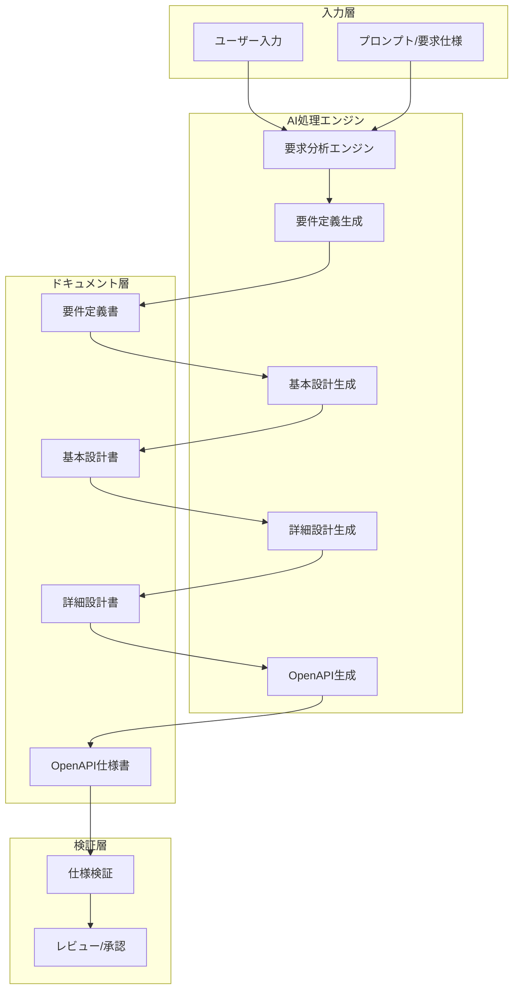
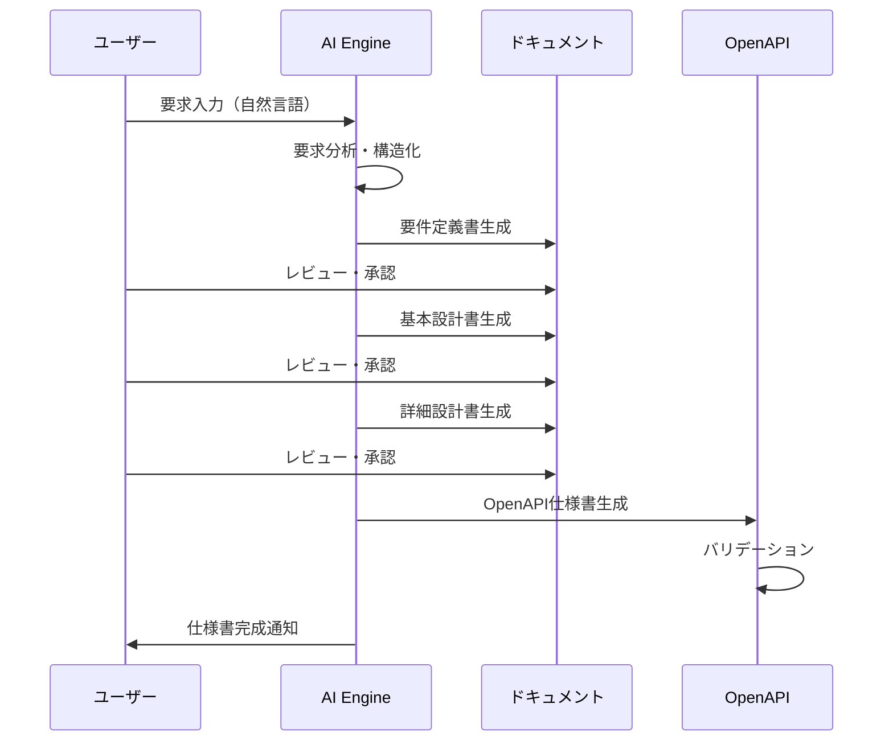
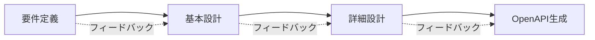

# AI駆動 RESTful API 自動生成システム - 概要

## 1. システム概要

本システムは、ユーザーからの自然言語入力を元に、ウォーターフォール開発のベストプラクティスに従い、要件定義からOpenAPI仕様書の生成までを自動化するAI駆動開発システムです。

### 1.1 目的

- ユーザーの要求から自動的にRESTful APIの仕様書を生成
- ウォーターフォール開発プロセスに準拠したドキュメント自動生成
- 開発工数の大幅削減と品質の均一化

### 1.2 対象範囲（今回のスコープ）

```
ユーザー入力 → 要件定義 → 基本設計 → 詳細設計 → OpenAPI仕様書生成
```

## 2. システムアーキテクチャ

### 2.1 全体構成図



### 2.2 処理フロー



## 3. ウォーターフォール開発フェーズ

### 3.1 フェーズ構成

| フェーズ | 成果物 | AI処理内容 |
|---------|--------|-----------|
| 1. 要件定義 | 要件定義書 | 自然言語からの要件抽出・構造化 |
| 2. 基本設計 | 基本設計書 | API構成、データモデル概要設計 |
| 3. 詳細設計 | 詳細設計書 | エンドポイント詳細、スキーマ定義 |
| 4. 仕様書生成 | OpenAPI仕様 | YAML/JSON形式の仕様書生成 |

### 3.2 フェーズ間の依存関係



## 4. ディレクトリ構造

```
auto_deploy/
├── docs/
│   ├── overview.md          # 本ファイル（システム概要）
│   └── guidelines/          # 開発ガイドライン
├── requirements/            # 要件定義書
│   ├── _template.md         # テンプレート
│   └── projects/            # プロジェクト別要件
├── design/
│   ├── basic/              # 基本設計書
│   │   ├── _template.md
│   │   └── projects/
│   └── detailed/           # 詳細設計書
│       ├── _template.md
│       └── projects/
├── specs/
│   └── openapi/            # OpenAPI仕様書
│       ├── _template.yaml
│       └── projects/
├── ai/
│   ├── prompts/            # AIプロンプトテンプレート
│   │   ├── requirements.md
│   │   ├── basic_design.md
│   │   ├── detailed_design.md
│   │   └── openapi_gen.md
│   └── instructions/       # AI指示ファイル
│       └── workflow.md
├── scripts/                # 自動化スクリプト
├── CHANGELOG.md            # 実績ログ
└── README.md               # プロジェクト説明
```

## 5. AI指示フロー

### 5.1 入力から仕様書生成までのワークフロー

```mermaid
flowchart TD
    START([開始]) --> INPUT[ユーザー要求入力]
    INPUT --> PHASE1{Phase 1: 要件定義}
    
    PHASE1 --> REQ_ANALYZE[要求分析]
    REQ_ANALYZE --> REQ_STRUCT[要件構造化]
    REQ_STRUCT --> REQ_DOC[要件定義書生成]
    REQ_DOC --> REQ_REVIEW{レビュー}
    REQ_REVIEW -->|承認| PHASE2
    REQ_REVIEW -->|修正| REQ_ANALYZE
    
    PHASE2{Phase 2: 基本設計} --> API_DESIGN[API構成設計]
    API_DESIGN --> DATA_MODEL[データモデル設計]
    DATA_MODEL --> BASIC_DOC[基本設計書生成]
    BASIC_DOC --> BASIC_REVIEW{レビュー}
    BASIC_REVIEW -->|承認| PHASE3
    BASIC_REVIEW -->|修正| API_DESIGN
    
    PHASE3{Phase 3: 詳細設計} --> ENDPOINT[エンドポイント詳細]
    ENDPOINT --> SCHEMA[スキーマ定義]
    SCHEMA --> DETAIL_DOC[詳細設計書生成]
    DETAIL_DOC --> DETAIL_REVIEW{レビュー}
    DETAIL_REVIEW -->|承認| PHASE4
    DETAIL_REVIEW -->|修正| ENDPOINT
    
    PHASE4{Phase 4: OpenAPI生成} --> OPENAPI[OpenAPI仕様書生成]
    OPENAPI --> VALIDATE[バリデーション]
    VALIDATE --> FINAL_REVIEW{最終レビュー}
    FINAL_REVIEW -->|承認| COMPLETE([完了])
    FINAL_REVIEW -->|修正| OPENAPI
```



## 6. 成果物の品質基準

### 6.1 要件定義書

- 機能要件・非機能要件の明確な分離
- ユースケースの網羅性
- トレーサビリティの確保

### 6.2 基本設計書

- RESTful設計原則への準拠
- リソース指向の設計
- 適切なHTTPメソッドの選択

### 6.3 詳細設計書

- 全エンドポイントの詳細定義
- リクエスト/レスポンススキーマの完全性
- エラーハンドリングの網羅

### 6.4 OpenAPI仕様書

- OpenAPI 3.0/3.1 準拠
- Swagger Validator によるバリデーション通過
- 適切なセキュリティ定義

## 7. 次のステップ

1. 各ドキュメントテンプレートの作成
2. AIプロンプトテンプレートの整備
3. 自動化スクリプトの開発
4. サンプルプロジェクトでの検証

---

**作成日**: 2024-12-29  
**バージョン**: 1.0.0  
**ステータス**: Draft
