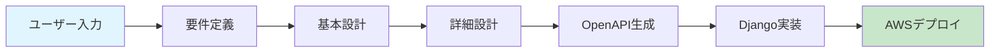

# AI駆動 RESTful API 自動生成システム - 概要

> **ドキュメントバージョン**: 2.0.0  
> **最終更新日**: 2025-12-30  
> **ステータス**: Active

---

## 目次

- [1. システム概要](#1-システム概要)
- [2. システムアーキテクチャ](#2-システムアーキテクチャ)
- [3. ウォーターフォール開発フェーズ](#3-ウォーターフォール開発フェーズ)
- [4. ディレクトリ構造](#4-ディレクトリ構造)
- [5. AI指示フロー](#5-ai指示フロー)
- [6. 成果物の品質基準](#6-成果物の品質基準)
- [7. 関連ドキュメント](#7-関連ドキュメント)
- [8. クイックスタート](#8-クイックスタート)

---

## 1. システム概要

本システムは、ユーザーからの自然言語入力を元に、ウォーターフォール開発のベストプラクティスに従い、要件定義からOpenAPI仕様書の生成、さらにAWSへのデプロイまでを自動化するAI駆動開発システムです。

### 1.1 目的

- ユーザーの要求から自動的にRESTful APIの仕様書を生成
- ウォーターフォール開発プロセスに準拠したドキュメント自動生成
- Django REST Framework によるAPI実装の自動化支援
- AWS ECS Fargate へのデプロイ自動化
- 開発工数の大幅削減と品質の均一化

### 1.2 対象範囲（スコープ）



## 2. システムアーキテクチャ

### 2.1 全体構成図


### 2.2 処理フロー


## 3. ウォーターフォール開発フェーズ

### 3.1 フェーズ構成

| フェーズ | 成果物 | AI処理内容 |
|---------|--------|-----------|
| 1. 要件定義 | 要件定義書 | 自然言語からの要件抽出・構造化 |
| 2. 基本設計 | 基本設計書 | API構成、データモデル概要設計 |
| 3. 詳細設計 | 詳細設計書 | エンドポイント詳細、スキーマ定義 |
| 4. 仕様書生成 | OpenAPI仕様 | YAML/JSON形式の仕様書生成 |

### 3.2 フェーズ間の依存関係


## 4. ディレクトリ構造

```
auto_deploy/
├── docs/                        # ドキュメント
│   ├── overview.md              # 本ファイル（システム概要）
│   ├── guidelines/              # 開発ガイドライン
│   │   └── index.md             # ガイドラインインデックス
│   └── guides/                  # 実装・デプロイガイド
│       ├── index.md             # ガイドインデックス
│       ├── aws-ecs-deployment.md
│       ├── openapi-to-django.md
│       └── openapi-to-django-templates.md
├── requirements/                # 要件定義書
│   ├── _template.md             # テンプレート
│   └── projects/                # プロジェクト別要件
├── design/
│   ├── basic/                   # 基本設計書
│   │   ├── _template.md
│   │   └── projects/
│   └── detailed/                # 詳細設計書
│       ├── _template.md
│       └── projects/
├── specs/
│   └── openapi/                 # OpenAPI仕様書
│       ├── _template.yaml
│       └── projects/
├── ai/
│   ├── prompts/                 # AIプロンプトテンプレート
│   │   ├── requirements.md
│   │   ├── basic_design.md
│   │   ├── detailed_design.md
│   │   ├── openapi_gen.md
│   │   └── openapi_to_django.md
│   └── instructions/            # AI指示ファイル
│       └── workflow.md
├── aws/                         # AWS関連設定
│   ├── cloudformation/          # CloudFormationテンプレート
│   ├── policies/                # IAMポリシー
│   └── scripts/                 # デプロイスクリプト
├── backend/                     # バックエンドテンプレート
│   ├── Dockerfile
│   └── requirements.txt
├── scripts/                     # 自動化スクリプト
├── CHANGELOG.md                 # 変更履歴
└── README.md                    # プロジェクト説明
```

## 5. AI指示フロー

### 5.1 入力から仕様書生成までのワークフロー


## 6. 成果物の品質基準

### 6.1 要件定義書

- 機能要件・非機能要件の明確な分離
- ユースケースの網羅性
- トレーサビリティの確保

### 6.2 基本設計書

- RESTful設計原則への準拠
- リソース指向の設計
- 適切なHTTPメソッドの選択

### 6.3 詳細設計書

- 全エンドポイントの詳細定義
- リクエスト/レスポンススキーマの完全性
- エラーハンドリングの網羅

### 6.4 OpenAPI仕様書

- OpenAPI 3.0/3.1 準拠
- Swagger Validator によるバリデーション通過
- 適切なセキュリティ定義

## 7. 関連ドキュメント

### 7.1 ガイドドキュメント

| ドキュメント | 説明 | パス |
|-------------|------|------|
| [ガイドインデックス](./guides/index.md) | 全ガイドの一覧 | `docs/guides/index.md` |
| [AWS ECS デプロイガイド](./guides/aws-ecs-deployment.md) | ECS Fargateへのデプロイ手順 | `docs/guides/aws-ecs-deployment.md` |
| [OpenAPI→Django変換ガイド](./guides/openapi-to-django.md) | OpenAPIからDRF実装への変換方法 | `docs/guides/openapi-to-django.md` |
| [Django変換テンプレート集](./guides/openapi-to-django-templates.md) | 実装用コードテンプレート | `docs/guides/openapi-to-django-templates.md` |

### 7.2 ガイドラインドキュメント

| ドキュメント | 説明 | パス |
|-------------|------|------|
| [ガイドラインインデックス](./guidelines/index.md) | 開発ガイドラインの一覧 | `docs/guidelines/index.md` |

### 7.3 設計・仕様ドキュメント

| ドキュメント | 説明 | パス |
|-------------|------|------|
| 要件定義テンプレート | 要件定義書のテンプレート | `requirements/_template.md` |
| 基本設計テンプレート | 基本設計書のテンプレート | `design/basic/_template.md` |
| 詳細設計テンプレート | 詳細設計書のテンプレート | `design/detailed/_template.md` |
| OpenAPIテンプレート | OpenAPI仕様書のテンプレート | `specs/openapi/_template.yaml` |

### 7.4 AIプロンプト

| プロンプト | 用途 | パス |
|-----------|------|------|
| 要件定義プロンプト | 要件定義書生成用 | `ai/prompts/requirements.md` |
| 基本設計プロンプト | 基本設計書生成用 | `ai/prompts/basic_design.md` |
| 詳細設計プロンプト | 詳細設計書生成用 | `ai/prompts/detailed_design.md` |
| OpenAPI生成プロンプト | OpenAPI仕様書生成用 | `ai/prompts/openapi_gen.md` |
| Django変換プロンプト | Django実装生成用 | `ai/prompts/openapi_to_django.md` |

### 7.5 インフラ関連

| ドキュメント | 説明 | パス |
|-------------|------|------|
| CloudFormationテンプレート | ECS Fargate構築用 | `aws/cloudformation/ecs-fargate.yaml` |
| IAMポリシー | 各種IAMポリシー定義 | `aws/policies/` |

---

## 8. クイックスタート

### 8.1 新規プロジェクト作成の流れ


### 8.2 主要コマンド

```bash
# 1. Django プロジェクト作成
django-admin startproject config ./backend
cd backend && python manage.py startapp api

# 2. テスト実行
pytest api/tests/ -v

# 3. Dockerイメージビルド
docker build --platform linux/amd64 -t <app-name>:latest ./backend

# 4. AWS ECS へデプロイ
aws cloudformation create-stack \
  --stack-name <app-name> \
  --template-body file://aws/cloudformation/ecs-fargate.yaml \
  --capabilities CAPABILITY_NAMED_IAM \
  --parameters ParameterKey=ContainerImage,ParameterValue=<ECR_IMAGE_URI>
```

### 8.3 参照すべきドキュメント

1. **新規API開発時**: [OpenAPI→Django変換ガイド](./guides/openapi-to-django.md)
2. **デプロイ時**: [AWS ECS デプロイガイド](./guides/aws-ecs-deployment.md)
3. **コード生成時**: [Django変換テンプレート集](./guides/openapi-to-django-templates.md)

---

## 変更履歴

| バージョン | 日付 | 変更内容 |
|-----------|------|----------|
| 2.0.0 | 2025-12-30 | ドキュメント構造の整理、関連ドキュメントリンクの追加、クイックスタートセクション追加 |
| 1.1.0 | 2024-12-30 | システムアーキテクチャ図の追加 |
| 1.0.0 | 2024-12-29 | 初版作成 |

---

**作成日**: 2024-12-29  
**最終更新日**: 2025-12-30  
**メンテナー**: auto_deploy プロジェクトチーム
