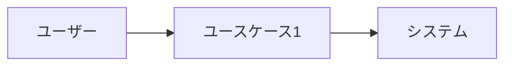
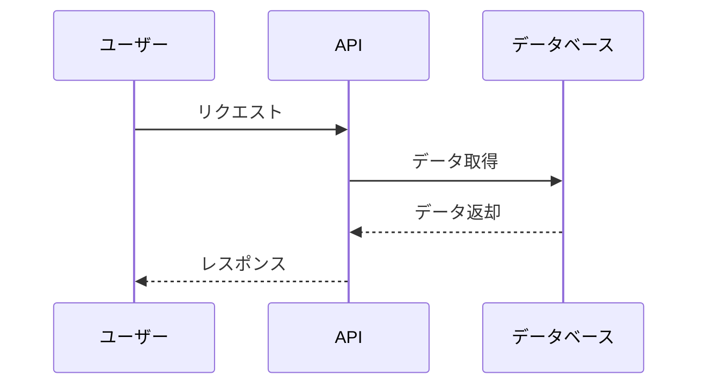
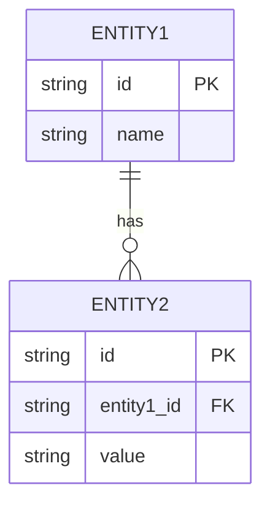

# 要件定義書テンプレート

## 文書情報

| 項目 | 内容 |
|------|------|
| プロジェクト名 | {{PROJECT_NAME}} |
| 文書バージョン | {{VERSION}} |
| 作成日 | {{CREATED_DATE}} |
| 最終更新日 | {{UPDATED_DATE}} |
| 作成者 | {{AUTHOR}} |
| ステータス | Draft / Review / Approved |

---

## 1. プロジェクト概要

### 1.1 背景・目的

{{PROJECT_BACKGROUND}}

### 1.2 スコープ

#### 対象範囲

- {{IN_SCOPE_ITEM_1}}
- {{IN_SCOPE_ITEM_2}}

#### 対象外

- {{OUT_OF_SCOPE_ITEM_1}}
- {{OUT_OF_SCOPE_ITEM_2}}

### 1.3 用語定義

| 用語 | 定義 |
|------|------|
| {{TERM_1}} | {{DEFINITION_1}} |
| {{TERM_2}} | {{DEFINITION_2}} |

---

## 2. 機能要件

### 2.1 機能一覧

| ID | 機能名 | 概要 | 優先度 |
|----|--------|------|--------|
| F-001 | {{FUNCTION_NAME_1}} | {{FUNCTION_DESC_1}} | High/Medium/Low |
| F-002 | {{FUNCTION_NAME_2}} | {{FUNCTION_DESC_2}} | High/Medium/Low |

### 2.2 機能詳細

#### F-001: {{FUNCTION_NAME_1}}

**概要**: {{FUNCTION_OVERVIEW}}

**ユースケース**:

**入力**:
- {{INPUT_1}}
- {{INPUT_2}}

**出力**:
- {{OUTPUT_1}}
- {{OUTPUT_2}}

**処理フロー**:

**ビジネスルール**:
1. {{BUSINESS_RULE_1}}
2. {{BUSINESS_RULE_2}}

**エラー条件**:
| エラーコード | 条件 | メッセージ |
|-------------|------|-----------|
| E001 | {{ERROR_CONDITION_1}} | {{ERROR_MESSAGE_1}} |

---

## 3. 非機能要件

### 3.1 性能要件

| 項目 | 要件 |
|------|------|
| レスポンスタイム | {{RESPONSE_TIME}} |
| スループット | {{THROUGHPUT}} |
| 同時接続数 | {{CONCURRENT_USERS}} |

### 3.2 可用性要件

| 項目 | 要件 |
|------|------|
| 稼働率 | {{AVAILABILITY}} |
| 計画停止 | {{PLANNED_DOWNTIME}} |
| 障害復旧時間 | {{RTO}} |

### 3.3 セキュリティ要件

| 項目 | 要件 |
|------|------|
| 認証方式 | {{AUTH_METHOD}} |
| 認可方式 | {{AUTHZ_METHOD}} |
| 通信暗号化 | {{ENCRYPTION}} |
| データ保護 | {{DATA_PROTECTION}} |

### 3.4 拡張性要件

| 項目 | 要件 |
|------|------|
| スケーラビリティ | {{SCALABILITY}} |
| 保守性 | {{MAINTAINABILITY}} |

---

## 4. データ要件

### 4.1 データエンティティ

| エンティティ名 | 概要 | 主要属性 |
|---------------|------|----------|
| {{ENTITY_1}} | {{ENTITY_DESC_1}} | {{ENTITY_ATTRS_1}} |
| {{ENTITY_2}} | {{ENTITY_DESC_2}} | {{ENTITY_ATTRS_2}} |

### 4.2 ER図（概念）

---

## 5. 外部インターフェース要件

### 5.1 システム間連携

| 連携先 | 連携方式 | 概要 |
|--------|---------|------|
| {{EXTERNAL_SYSTEM_1}} | REST API | {{INTEGRATION_DESC_1}} |

### 5.2 API要件概要

| エンドポイント | メソッド | 概要 |
|---------------|---------|------|
| /api/v1/{{resource}} | GET | {{API_DESC_1}} |
| /api/v1/{{resource}} | POST | {{API_DESC_2}} |
| /api/v1/{{resource}}/{id} | GET | {{API_DESC_3}} |
| /api/v1/{{resource}}/{id} | PUT | {{API_DESC_4}} |
| /api/v1/{{resource}}/{id} | DELETE | {{API_DESC_5}} |

---

## 6. 制約条件

### 6.1 技術的制約

- {{TECH_CONSTRAINT_1}}
- {{TECH_CONSTRAINT_2}}

### 6.2 ビジネス上の制約

- {{BUSINESS_CONSTRAINT_1}}
- {{BUSINESS_CONSTRAINT_2}}

---

## 7. 前提条件

- {{ASSUMPTION_1}}
- {{ASSUMPTION_2}}

---

## 8. リスクと対策

| リスク | 影響度 | 発生確率 | 対策 |
|--------|--------|---------|------|
| {{RISK_1}} | High/Medium/Low | High/Medium/Low | {{MITIGATION_1}} |

---

## 9. 承認

| 役割 | 氏名 | 承認日 | 署名 |
|------|------|--------|------|
| プロジェクトマネージャー | | | |
| 技術リード | | | |
| ステークホルダー | | | |

---

## 変更履歴

| バージョン | 日付 | 変更者 | 変更内容 |
|-----------|------|--------|---------|
| 1.0.0 | {{DATE}} | {{AUTHOR}} | 初版作成 |
