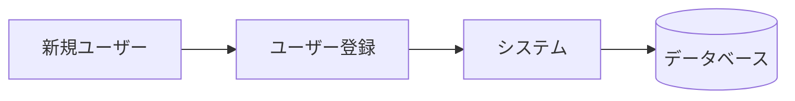
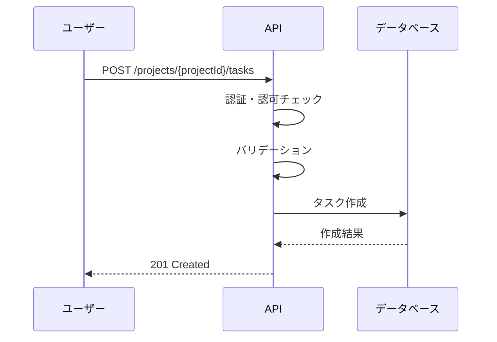
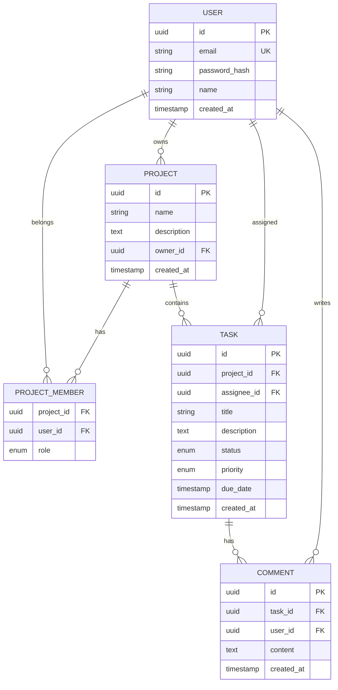

# 要件定義書 - タスク管理API

## 文書情報

| 項目 | 内容 |
|------|------|
| プロジェクト名 | タスク管理API |
| 文書バージョン | 1.0.0 |
| 作成日 | 2024-12-29 |
| 最終更新日 | 2024-12-29 |
| 作成者 | AI Assistant |
| ステータス | Approved |

---

## 1. プロジェクト概要

### 1.1 背景・目的

チーム内でのタスク管理を効率化するため、RESTful APIを構築する。
ユーザーはタスクの作成・更新・削除・一覧取得ができ、プロジェクト単位でタスクを管理できる。

### 1.2 スコープ

#### 対象範囲

- ユーザー認証（登録・ログイン・ログアウト）
- プロジェクト管理（CRUD操作）
- タスク管理（CRUD操作）
- タスクへのコメント機能

#### 対象外

- ファイル添付機能
- リアルタイム通知
- 外部サービス連携（Slack、Jira等）

### 1.3 用語定義

| 用語 | 定義 |
|------|------|
| ユーザー | システムを利用する個人 |
| プロジェクト | タスクをグループ化する単位 |
| タスク | 実行すべき作業項目 |
| コメント | タスクに対する補足情報や議論 |

---

## 2. 機能要件

### 2.1 機能一覧

| ID | 機能名 | 概要 | 優先度 |
|----|--------|------|--------|
| F-001 | ユーザー登録 | 新規ユーザーアカウントを作成する | High |
| F-002 | ログイン | メールとパスワードで認証しトークンを取得 | High |
| F-003 | プロジェクト作成 | 新規プロジェクトを作成する | High |
| F-004 | プロジェクト一覧取得 | ユーザーが参加するプロジェクト一覧を取得 | High |
| F-005 | プロジェクト詳細取得 | プロジェクトの詳細情報を取得 | High |
| F-006 | プロジェクト更新 | プロジェクト情報を更新する | Medium |
| F-007 | プロジェクト削除 | プロジェクトを削除する | Low |
| F-008 | タスク作成 | プロジェクト内にタスクを作成する | High |
| F-009 | タスク一覧取得 | プロジェクト内のタスク一覧を取得 | High |
| F-010 | タスク詳細取得 | タスクの詳細情報を取得 | High |
| F-011 | タスク更新 | タスク情報を更新する | High |
| F-012 | タスク削除 | タスクを削除する | Medium |
| F-013 | コメント作成 | タスクにコメントを追加する | Medium |
| F-014 | コメント一覧取得 | タスクのコメント一覧を取得 | Medium |
| F-015 | コメント削除 | コメントを削除する | Low |

### 2.2 機能詳細

#### F-001: ユーザー登録

**概要**: 新規ユーザーがメールアドレスとパスワードでアカウントを作成する

**ユースケース**:

**入力**:
- メールアドレス（必須、一意）
- パスワード（必須、8文字以上）
- 名前（必須）

**出力**:
- ユーザーID
- メールアドレス
- 名前
- 作成日時

**ビジネスルール**:
1. メールアドレスは一意でなければならない
2. パスワードは8文字以上、英数字を含む必要がある
3. メールアドレスの形式チェックを行う

**エラー条件**:
| エラーコード | 条件 | メッセージ |
|-------------|------|-----------|
| E001 | メールアドレス重複 | このメールアドレスは既に登録されています |
| E002 | パスワード形式不正 | パスワードは8文字以上で、英字と数字を含めてください |

---

#### F-008: タスク作成

**概要**: プロジェクト内に新しいタスクを作成する

**ユースケース**:

**入力**:
- タイトル（必須、最大100文字）
- 説明（任意、最大1000文字）
- ステータス（任意、デフォルト: todo）
- 優先度（任意、デフォルト: medium）
- 期限（任意）
- 担当者ID（任意）

**出力**:
- タスクID
- タイトル
- 説明
- ステータス
- 優先度
- 期限
- 担当者情報
- 作成日時
- 更新日時

**ビジネスルール**:
1. タスクは必ずプロジェクトに紐づく
2. 担当者はプロジェクトメンバーである必要がある
3. ステータスは todo, in_progress, done のいずれか
4. 優先度は low, medium, high のいずれか

---

## 3. 非機能要件

### 3.1 性能要件

| 項目 | 要件 |
|------|------|
| レスポンスタイム | 95%ile で 200ms 以内 |
| スループット | 100 req/s |
| 同時接続数 | 1000ユーザー |

### 3.2 可用性要件

| 項目 | 要件 |
|------|------|
| 稼働率 | 99.5% |
| 計画停止 | 月1回、深夜2時間以内 |
| 障害復旧時間 | 4時間以内 |

### 3.3 セキュリティ要件

| 項目 | 要件 |
|------|------|
| 認証方式 | JWT Bearer Token |
| 認可方式 | RBAC（Role-Based Access Control） |
| 通信暗号化 | TLS 1.2以上 |
| データ保護 | パスワードはbcryptでハッシュ化 |

### 3.4 拡張性要件

| 項目 | 要件 |
|------|------|
| スケーラビリティ | 水平スケーリング対応 |
| 保守性 | APIバージョニング対応 |

---

## 4. データ要件

### 4.1 データエンティティ

| エンティティ名 | 概要 | 主要属性 |
|---------------|------|----------|
| User | システム利用者 | id, email, password_hash, name |
| Project | タスクのグループ | id, name, description, owner_id |
| ProjectMember | プロジェクト参加者 | project_id, user_id, role |
| Task | 作業項目 | id, project_id, title, description, status, priority |
| Comment | タスクへのコメント | id, task_id, user_id, content |

### 4.2 ER図（概念）

---

## 5. 外部インターフェース要件

### 5.1 システム間連携

| 連携先 | 連携方式 | 概要 |
|--------|---------|------|
| なし | - | 外部連携なし（将来拡張予定） |

### 5.2 API要件概要

| エンドポイント | メソッド | 概要 |
|---------------|---------|------|
| /api/v1/auth/register | POST | ユーザー登録 |
| /api/v1/auth/login | POST | ログイン |
| /api/v1/projects | GET | プロジェクト一覧取得 |
| /api/v1/projects | POST | プロジェクト作成 |
| /api/v1/projects/{id} | GET | プロジェクト詳細取得 |
| /api/v1/projects/{id} | PUT | プロジェクト更新 |
| /api/v1/projects/{id} | DELETE | プロジェクト削除 |
| /api/v1/projects/{projectId}/tasks | GET | タスク一覧取得 |
| /api/v1/projects/{projectId}/tasks | POST | タスク作成 |
| /api/v1/tasks/{id} | GET | タスク詳細取得 |
| /api/v1/tasks/{id} | PUT | タスク更新 |
| /api/v1/tasks/{id} | DELETE | タスク削除 |
| /api/v1/tasks/{taskId}/comments | GET | コメント一覧取得 |
| /api/v1/tasks/{taskId}/comments | POST | コメント作成 |
| /api/v1/comments/{id} | DELETE | コメント削除 |

---

## 6. 制約条件

### 6.1 技術的制約

- REST API設計原則に準拠
- JSON形式でのデータ交換
- UTF-8エンコーディング

### 6.2 ビジネス上の制約

- 開発期間: 1ヶ月
- 初期リリースは基本機能のみ

---

## 7. 前提条件

- ユーザーは事前登録が必要
- インターネット接続環境が必要
- モダンブラウザまたはAPIクライアントからのアクセス

---

## 8. リスクと対策

| リスク | 影響度 | 発生確率 | 対策 |
|--------|--------|---------|------|
| 認証トークン漏洩 | High | Low | トークン有効期限の短縮、リフレッシュトークン採用 |
| データ損失 | High | Low | 定期バックアップ、レプリケーション |

---

## 9. 承認

| 役割 | 氏名 | 承認日 | 署名 |
|------|------|--------|------|
| プロジェクトマネージャー | AI PM | 2024-12-29 | ✓ |
| 技術リード | AI Tech Lead | 2024-12-29 | ✓ |
| ステークホルダー | AI Stakeholder | 2024-12-29 | ✓ |

---

## 変更履歴

| バージョン | 日付 | 変更者 | 変更内容 |
|-----------|------|--------|---------|
| 1.0.0 | 2024-12-29 | AI Assistant | 初版作成 |
